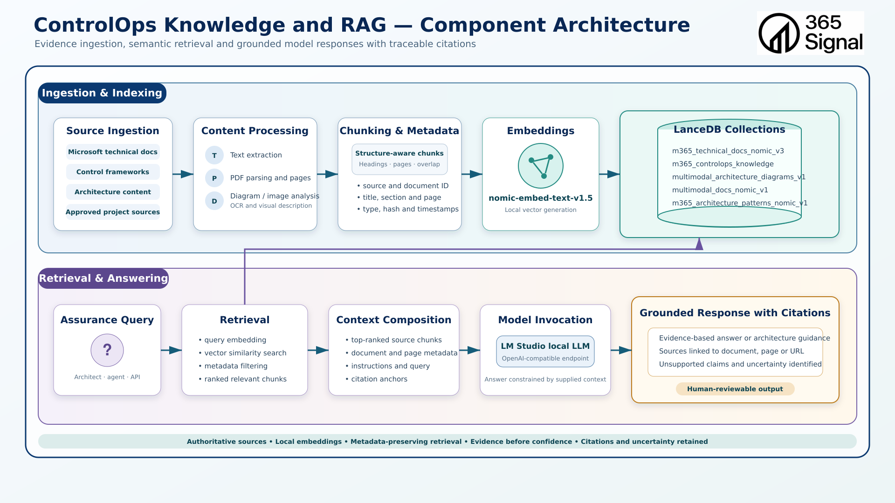

# ControlOps Knowledge and RAG — Component Architecture

## Document Control

| Field | Value |
| --- | --- |
| Status | Draft — repository-grounded baseline |
| Version | 0.1.1 |
| Last updated | 16 August 2026 |
| Intended audience | ControlOps architects, internal maintainers, security architects, technical stakeholders and prospective technical partners |
| Diagram filename | `02-ControlOps-Knowledge-and-RAG-Component-Architecture.png` |
| Repository commit | `c33603808fb70e071ce97c92cd55770036afc80e` |
| Repository working-tree baseline | Dirty — tracked modifications and untracked files were present during review |
| Runtime verification date | 16 August 2026 |
| Diagram revision | Not specified |
| Document owner | 365signal / Jon Bruce |
| Document purpose | Preserve the internal ControlOps Knowledge and RAG architecture and repository-grounded implementation record; secondarily support technical due diligence and partner discussions |

## Part I — Partner Architecture Overview

### 1. Purpose and Audience

This document is primarily the internal architecture and implementation record
for the ControlOps Knowledge and retrieval-augmented generation (RAG)
component. It explains how relevant, authoritative and traceable technical
knowledge should be made available to ControlOps agents and records what
actually existed at the verification date. It supports internal architectural
continuity and future design decisions, and may also inform technical due
diligence and partner discussions. Separate presentation material can be
derived from this record without weakening its qualifications.

Part I describes the architectural proposition. Part II qualifies that
proposition against the ControlOps repository, a separately maintained local
RAG repository, Git history, the live LanceDB store and read-only runtime
checks. A component shown in the diagram is not, by itself, evidence that the
capability is implemented or operational.

### 2. Executive Summary

The Knowledge and RAG component turns approved technical material into
searchable semantic knowledge, retrieves source passages relevant to an
assurance question, and supplies those passages and their provenance to a local
model. Its purpose is not generic “chat with documents”. It is to help bounded
ControlOps agents find applicable Microsoft, control-framework, architecture
and approved project knowledge while retaining enough source context for a
human to inspect the resulting answer.

The assurance boundary is fundamental:

- retrieval provides context, not proof;
- LanceDB is not the governed assurance record;
- semantic similarity is not evidence sufficiency;
- model confidence is not evidence;
- citations must point back to retrievable source material; and
- human judgement remains responsible for material assurance conclusions.

Current local assets demonstrate ingestion, local embeddings, populated
LanceDB tables, multi-corpus retrieval code, prompt composition and local model
integration. They remain a proof of concept with uneven provenance, incomplete
validation and no operational ControlOps RAG service. The CLI answering path
was not verified end to end in this review, and the present FastAPI query path
contains a confirmed interface mismatch.

### 3. Why the Knowledge and RAG Component Matters

Assurance work depends on locating the right source, understanding its scope
and version, and preserving the route from a conclusion back to material a
reviewer can inspect. Large technical collections make that slow and
inconsistent when every analyst or agent researches from the beginning.

The component can reduce repeated manual research, provide consistent access
to curated Microsoft and control knowledge, preserve source and citation
context, help agents work across large technical collections, and support more
repeatable assurance analysis. Separating fast semantic retrieval from
governed decision-making also permits experimentation with retrieval without
silently changing evidence, classifications or approved assurance state.

RAG does not eliminate hallucination or guarantee accuracy. It narrows and
exposes the material available to a model. Source approval, corpus freshness,
retrieval quality, prompt discipline, citation verification and human review
remain necessary controls.

### 4. Architecture Diagram

The upper path represents ingestion and indexing: sources are processed,
divided into retrievable units, embedded and stored. The lower path represents
query-time retrieval and answering: an assurance question is embedded,
relevant rows are selected, grounded context is assembled, and a local model
produces a reviewable response. The diagram is an architectural view containing
both current and intended behaviour; Part II records the qualifications.

### 5. Component Boundary and Responsibilities

Inside the Knowledge and RAG component are source intake controls; text, PDF
and diagram processing; chunk and metadata construction; local embedding
generation; LanceDB semantic storage; query embedding and similarity search;
retrieval filtering and ranking; context and prompt construction; local model
invocation; and assembly of source-aware output.

The following responsibilities remain outside it:

- **source systems and owners** approve authoritative inputs and their permitted
  use;
- **agent workflows** define the assurance question, limits, tools and output
  contract;
- **platform evidence collection** observes the customer or Microsoft platform;
- **governed PostgreSQL assurance state** retains controlled evidence
  relationships, classifications, reviews and decisions when implemented;
- **human reviewers** assess sufficiency, resolve ambiguity and approve material
  conclusions; and
- **LM Studio** is an externally managed local model service rather than a
  ControlOps-owned knowledge store.

LanceDB holds retrieval-oriented semantic knowledge. It does not own platform
evidence, assurance decisions or publication approval. The component supports
ControlOps agents but does not own assurance decisions.

### 6. Ingestion and Indexing Flow

The architectural ingestion path has seven stages:

1. **Approve and stage sources.** Source owners determine whether Microsoft
   documentation, frameworks, architecture content or project material is
   eligible for ingestion and under what authority and usage conditions.
2. **Extract content.** Type-appropriate processors turn text, PDF pages and
   diagram or image content into inspectable textual and structural forms.
3. **Create retrievable units.** Content is divided into chunks or domain
   records that are small enough to retrieve while retaining useful page,
   heading, section or diagram context.
4. **Attach provenance and lifecycle metadata.** Each knowledge object should
   remain attributable to its source and processing history.
5. **Generate embeddings locally.** A local embedding service converts the
   retrievable text and later queries into vectors in a compatible vector
   space.
6. **Store semantic knowledge.** LanceDB retains vectors, retrievable content
   and corpus-specific metadata for similarity search and filtering.
7. **Retain processing outcomes.** Successful, partial and failed processing
   should remain inspectable rather than silently disappearing.

These stages describe the intended component. The present handlers, exact
chunking behaviour, model identifiers, table-write semantics and artefact
paths are recorded in Part II.

#### Source Authority

Semantic relevance and source authority are independent. A highly similar
internal draft must not automatically outrank current authoritative Microsoft
documentation when the question concerns supported Microsoft product
behaviour. Conversely, an approved ControlOps design may be the appropriate
source when the question asks what ControlOps previously decided.

The architecture therefore requires an authority classification capable of
distinguishing, for example, authoritative vendor documentation, control or
regulatory frameworks, approved ControlOps architecture patterns, approved
project material, reference material, and draft or working material. This list
is illustrative: no final production taxonomy has been approved. Existing
architecture-pattern fields such as `approval_status` and
`authoritative_scope` demonstrate part of the concept but do not provide a
common authority contract across all corpora.

#### Knowledge Freshness and Lifecycle

A useful knowledge object should ultimately make its lifecycle assessable:
source identity, applicable source version, retrieval or ingestion date,
source hash, approval status, superseded state, embedding model, parser or
pipeline version, and current retrieval eligibility should be available where
relevant. These fields are not universally implemented today; current corpora
have heterogeneous subsets.

Freshness is an assurance concern rather than housekeeping. A technically
similar but obsolete Microsoft document can support a plausible and incorrect
conclusion. The future lifecycle contract should therefore make supersession,
re-approval, re-ingestion and exclusion from retrieval explicit without
treating LanceDB as the governed assurance record.

### 7. Retrieval, Context Composition and Answering Flow

The intended query-time path is:

1. accept a scoped assurance or architecture question;
2. determine the appropriate lookup and source classes;
3. embed conceptual queries and retrieve ranked source chunks with authority,
   lifecycle and provenance metadata;
4. select relevant material within an explicit context budget;
5. compose instructions, the question, retrieved content and citation anchors
   without allowing retrieved text to become trusted control instructions;
6. invoke a local model through an OpenAI-compatible LM Studio endpoint; and
7. return the answer, sources, unsupported claims and uncertainty for review.

#### Deterministic Lookup and Semantic Retrieval

Semantic retrieval is valuable when wording varies, the relevant source is not
already known, the question is conceptual, or supporting context must be
discovered across unstructured material. It is not the preferred mechanism for
every question. When a caller already knows a canonical control ID, permission
ID, document ID, configuration key or equivalent identifier, exact structured
lookup may be more reliable and explainable than vector similarity.

The component should combine these modes where necessary. LanceDB does not
replace PostgreSQL, source catalogues or other structured systems that can
answer deterministic questions directly.

#### Query-Aware Corpus Routing

The target architecture should be able to route or weight retrieval according
to the question and required authority. A question about official Microsoft
support should favour current authoritative Microsoft material; a question
about a prior ControlOps design should favour approved architecture patterns;
a control-interpretation question may require framework sources; and some
questions intentionally require several source classes. Such routing is
Planned. The current query path searches a fixed group of corpora and no
classifier or general corpus router was verified.

### 8. Traceability and Human Review

A human-reviewable response should expose the question, selected source
chunks, rank or distance, source identity, page or section where available,
model answer, unsupported claims, assumptions and uncertainty. Reviewers must
be able to reopen the underlying approved source—not merely see a plausible
filename generated in prose.

#### Future Machine-Resolvable Citation Contract

The intended citation design should reduce dependence on a model inventing or
formatting its own source references. Retrieval should assign stable citation
identifiers to selected records; the model should reference those identifiers;
and the application or agent should resolve them back to the exact retrieved
records and verify that they support the associated claims.

An eventual citation object may need fields such as `citation_id`,
`document_id`, `chunk_id`, `source_uri_or_path`, `page`, `section`,
`source_hash`, `retrieval_timestamp` and `authority_class`. These fields are
illustrative architectural requirements, not an approved schema. Current
metadata provides useful inputs, but machine resolution and claim-to-source
validation remain incomplete and the implementation status remains
Experimental.

### 9. Security, Governance and Operating Principles

The intended controls are approved-source ingestion, local-first processing,
least-privilege filesystem access, explicit source provenance, separation of
retrieved content from trusted instructions, bounded retrieval, inspectable
processing failures, citation verification and human approval. Local execution
reduces an external processing boundary but does not establish source authority
or answer correctness.

Retrieved documents, OCR and metadata are untrusted content. They must not be
allowed to override agent policy or become executable instructions. Source
licensing, confidentiality, retention, deletion, freshness, malicious-document
handling, backup and restoration require explicit operational controls before
production use. The inspected filesystem store is mounted read-write into the
Hermes gateway; concurrency, locking and write authority were not validated.

## Part II — Implementation and Verification Record

### 10. Evidence Basis and Status Method

This record was reconciled on 16 August 2026 against the ControlOps repository
at commit `c33603808fb70e071ce97c92cd55770036afc80e`, its material uncommitted
files, the architecture diagram, relevant repository history, the separately
maintained RAG repository at commit
`ef6a918d8a7c8f819ed73107dac8123a3453432f`, that repository's materially dirty
worktree, the live filesystem-backed LanceDB store and safe LM Studio and
process checks.

The status terms used below mean:

- **Implemented** — present in code or configuration and operationally observed.
- **Validated** — tested against explicit acceptance criteria or repeatable
  validation.
- **Experimental** — functioning proof-of-concept capability with material
  limitations.
- **Planned** — intended architecture without implemented capability.
- **Not verified** — some evidence exists, but effective operation was not
  confirmed.

### 11. Current Implementation Status

| Capability | Status | Evidence and qualification |
| --- | --- | --- |
| Filesystem source routing and processed/failed handling | Experimental | Text, PDF and stub image routing code exists; 18 processed and four failed files were observed, but no acceptance suite or source-approval gate was found |
| Text and Markdown extraction and chunking | Experimental | Handler reads UTF-8, creates overlapping character chunks and metadata, embeds them and writes LanceDB; the configured live text table has only one legacy-shaped row, so the current handler schema was not operationally demonstrated |
| PDF page extraction, chunking and metadata | Implemented | PyMuPDF handler and 8,806 live v3 rows from four PDFs were observed with filename, hash, page, heading, chunk and timestamp metadata |
| OCR fallback for image-only PDFs | Planned | No OCR path is called by the PDF handler |
| Diagram OCR, graph extraction and artefacts | Experimental | Dedicated pipeline code, artefact runs and 16 diagram rows were observed; it retains limitations and graph validation, but uses a Windows Tesseract path in current code and is not wired into the universal router |
| Multimodal vision analysis | Planned | The current image description is OCR-derived; no vision-model image input path was found |
| Structure-aware chunking across headings and sections | Experimental | PDF chunks preserve page and inferred heading; framework and pattern rows preserve domain structure, but general text/PDF chunking is fixed character-window processing |
| Local Nomic embeddings | Implemented | LM Studio exposed `text-embedding-nomic-embed-text-v1.5@q8_0`; live tables contained 768-dimensional vectors |
| LanceDB semantic knowledge store | Implemented | Eleven readable tables with populated rows and multiple corpus schemas were observed |
| Ingestion lineage and freshness control | Not verified | Some corpora retain hashes, timestamps, versions and source paths; no common manifest, freshness policy or end-to-end lineage validation was found |
| Vector retrieval | Experimental | CLI functions implement searches across PDF, architecture-pattern and diagram tables; stored search indexes were present for some tables, but retrieval relevance was not tested against acceptance criteria |
| Metadata filtering | Experimental | Architecture-pattern retrieval filters `retrieval_enabled = true`; no general filter for approval, source type, version, tenant or date was implemented |
| Common source-authority classification | Planned | Architecture patterns retain `approval_status` and `authoritative_scope`, but no authority taxonomy or cross-corpus enforcement was found |
| Query-aware corpus routing | Planned | The CLI searches a fixed set of corpora using caller-supplied limits; no question classifier or authority-aware router was verified |
| Combined deterministic and semantic lookup policy | Planned | Exact identifiers can be served by structured systems, but no common selection policy or combined query path was found in this component |
| Context and prompt construction | Experimental | Source-adjacent context blocks and grounded prompt rules exist; token budgeting and deterministic citation anchors are incomplete |
| `rag_query.py` answering CLI | Not verified | A complete multi-corpus code path exists and imports, but no end-to-end query was executed during this review and no repeatable test result was found |
| `rag_server.py` retrieval and answering API | Not verified | FastAPI code imports, but no server process was running and `/query` calls `build_messages` without its now-required architecture-context argument; effective query operation is therefore not confirmed |
| Local chat model invocation through LM Studio | Not verified | `/v1/models` responded and exposed multiple chat models, but a chat completion was not invoked during this review and the configured `local-model` alias was not resolved |
| Traceable model citations | Experimental | Source metadata is retained and the prompt requests sources, but claim-level citation validation and resolvable citation anchors are absent |
| Human-reviewable RAG output | Experimental | CLI output and API models expose answer and source concepts; no integrated ControlOps review workflow or acceptance criteria were found |
| Persistence of RAG results as governed assurance state | Planned | No RAG-to-PostgreSQL evidence or decision workflow was identified; this separation is intentional until governed contracts exist |

No capability is classified as Validated in this component review. Schema
validation exists for extracted diagram graphs and a repository operational
doctor passed, but neither constitutes explicit, repeatable acceptance of the
complete ingestion, retrieval, citation or answering behaviour.

### 12. Current Ingestion, Retrieval and Citation Mechanics

The verified local implementation uses on-demand filesystem batch processing,
not an ingestion API or scheduler. Text and Markdown, PDF, image/diagram,
framework, Microsoft Learn catalogue and architecture-pattern paths have
different schemas and maturity.

- The general router scans a local inbox and classifies file extensions.
  Source approval is not enforced by a general code gate. Separate importers
  process Microsoft Learn API data, NCSC CAF data and curated
  architecture-pattern records.
- The text handler reads UTF-8. The PDF handler uses PyMuPDF to extract text
  page by page and has no OCR fallback for image-only pages.
- Text and PDF handlers normalise whitespace and use overlapping fixed windows
  of 2,500 target characters with 300 characters of overlap. PDF chunks remain
  within a page and retain an inferred heading. They are therefore page-aware
  but not generally heading-boundary- or sentence-aware. Framework and
  architecture-pattern importers produce domain-structured records instead.
- The dedicated diagram pipeline uses local Tesseract OCR, creates a readable
  description, derives a graph through a local model or deterministic
  OCR-keyword fallback, validates the graph schema, and creates one curated
  embedding payload per processed run. Current code contains an explicit
  Windows Tesseract executable path. The universal router uses a separate stub
  image handler and does not call this pipeline.
- Current embedding code calls LM Studio's OpenAI-compatible `/v1/embeddings`
  endpoint using `text-embedding-nomic-embed-text-v1.5@q8_0`.
  Architecture-pattern records name `nomic-embed-text-v1.5`; the Learn importer
  accepts a model argument while its shared embedding helper uses runtime
  configuration. Historic model attribution is incomplete.
- Most general handlers append rows. The diagram writer deletes an existing
  internally generated ID before adding its replacement, while the Learn
  importer replaces matching IDs unless overwrite is requested. These are
  development behaviours, not a common idempotency or lifecycle contract.
- Routed handlers move successful and failed inputs to type-specific folders
  and write runtime JSON containing status and errors. The older diagram flow
  retains the original image, OCR text, description, graph JSON, Mermaid,
  curated embedding text, metadata and validation artefacts. Generated
  artefacts are intentionally outside Git history. Eighteen processed and four
  failed files were observed at the baseline.

The implemented CLI embeds a question and searches PDF documentation,
architecture patterns and architecture diagrams. Only architecture-pattern
retrieval applies a metadata predicate (`retrieval_enabled = true`). No score
threshold, reranker, deduplication, source-authority filter or general
freshness filter was found. It returns corpus-specific source fields and keeps
metadata adjacent to retrieved content. Architecture-pattern and diagram
payloads are truncated to 5,000 and 4,000 characters respectively; the PDF
block has no equivalent aggregate token budget.

The prompt defines an evidence hierarchy, identifies weak or conflicting
context, distinguishes draft internal designs from Microsoft requirements and
requests a sources-used section. This is grounded prompt construction rather
than deterministic claim-to-source binding. The CLI does not validate every
answer claim against a returned row or emit stable, resolvable citation IDs.
The API schema returns separate PDF and diagram source summaries, but the API
query path is not operationally verified.

Current citation-relevant metadata is uneven. PDF rows retain filenames,
hashes, pages, headings and chunk IDs; framework rows retain source pages;
Learn rows retain canonical and catalogue URLs; architecture patterns retain
document IDs, version, approval status and source paths; and diagram rows
retain filenames and artefact directories. The CLI does not search the Learn
or framework tables, expose PDF source hashes in its context, or construct
canonical links for local sources.

### 13. Live LanceDB Observation

The live database contained the following tables. Counts are point-in-time
observations, not claims of completeness or freshness.

| Table | Rows | Principal content and traceability | Vector dimension |
| --- | ---: | --- | ---: |
| `framework_controls_nomic_v1` | 82 | NCSC CAF 4.0 records; framework hierarchy, source filename and page range | 768 |
| `m365_architecture_patterns_nomic_v1` | 77 | One draft generic Purview Customer Key low-level design; document ID, version, approval status, scope and source path | 768 |
| `m365_controlops_knowledge` | 3 | Legacy general records with opaque metadata | 768 |
| `m365_general_knowledge` | 6,596 | Legacy general records with opaque metadata | 768 |
| `m365_technical_docs_nomic_v1` | 2,501 | PDF chunks using the current PDF-style schema | 768 |
| `m365_technical_docs_nomic_v2` | 2,501 | PDF chunks using the current PDF-style schema | 768 |
| `m365_technical_docs_nomic_v3` | 8,806 | Four PDF sources; filename, source hash, page, heading, chunk and timestamp | 768 |
| `msft_learn_catalog_nomic_v1` | 4,501 | Microsoft Learn modules and learning paths; UID, canonical URL, catalogue URL, last-modified and retrieval time | 768 |
| `multimodal_architecture_diagrams_v1` | 16 | Ten source filenames across 16 runs; diagram type, artefact path and timestamp | 768 |
| `multimodal_docs` | 1 | Legacy text row | 768 |
| `multimodal_docs_nomic_v1` | 1 | Legacy Markdown row with source path and embedding-model metadata | 768 |

The diagram names `m365_technical_docs_nomic_v3`,
`m365_controlops_knowledge`, `multimodal_architecture_diagrams_v1`,
`multimodal_docs_nomic_v1` and `m365_architecture_patterns_nomic_v1`; all five
exist. It omits six other live tables, including the Learn catalogue and
framework controls. Table presence does not establish source approval or
retrieval quality.

Embedding-model association is explicit only in some schemas. The architecture
pattern table records `nomic-embed-text-v1.5`, and the legacy Markdown row
records the LM Studio Nomic Q8 model. Current code and the responsive runtime
use the Q8 LM Studio identifier. Vector dimensional consistency supports, but
does not prove, a common embedding lineage for every table.

### 14. Runtime and Operational Observations

Read-only checks established that LM Studio's models endpoint was responsive
and listed the configured Nomic Q8 embedding model, a Nomic Q4 variant and
multiple chat models. ControlOps gateway and dashboard containers were running,
the dashboard responded, expected bind mounts were present, and the operational
doctor reported 13 passes, two dirty-worktree warnings and no failures.

No `uvicorn`, `rag_server.py` or `rag_query.py` process was observed. Repository
operations correctly describe RAG as a run-on-demand batch/filesystem
capability and explicitly assume no RAG API. A responding LM Studio endpoint
does not prove the configured `CHAT_MODEL = local-model` alias will select the
intended model or that a complete answer will satisfy grounding requirements.

### 15. Diagram, Code, Documentation and Runtime Disagreements

- The initial investigation path in the request omitted the diagram's `02-`
  prefix. The repository and required embed path consistently use
  `02-ControlOps-Knowledge-and-RAG-Component-Architecture.png`.
- The diagram describes text extraction, PDF parsing and diagram/image analysis
  as one coherent content-processing stage. Current code has separate paths;
  the universal router's image handler is a stub while the older dedicated
  diagram pipeline performs the real OCR and graph workflow.
- The diagram labels chunks as structure-aware. Current general text and PDF
  code primarily uses overlapping character windows; only page, inferred
  heading and specialised corpus structures provide partial structural
  awareness.
- The diagram implies metadata filtering throughout retrieval. Current CLI code
  filters only architecture patterns on `retrieval_enabled`.
- The diagram implies grounded responses with traceable citations. Current code
  asks the model for sources and preserves useful metadata, but does not enforce
  claim-level citation binding or verify cited material.
- The diagram shows one end-to-end answering path. The CLI path is not verified;
  the API path is broken by a signature mismatch and no API process is running.
- The local RAG README says LanceDB writing is the next planned step and lists
  only image inputs. Git history and current code show later LanceDB, text, PDF,
  retrieval, API, framework and architecture-pattern work; the README is stale.
- The ControlOps runbook says no RAG API is assumed. That is operationally
  accurate even though the separate repository contains API source code.
- The diagram lists five collections. The live store contains 11 tables, with
  duplicate generations and legacy schemas that the diagram intentionally
  abstracts away.
- The diagram names `nomic-embed-text-v1.5` generically. Runtime code uses an LM
  Studio-specific Q8 identifier, while stored model attribution is incomplete
  and not uniform.
- The diagram subtitle uses “evidence ingestion”. The observed sources are
  principally technical knowledge. Retrieved knowledge must not be treated as
  customer-platform evidence merely because it is indexed.

### 16. Git History and Architectural Evolution

The ControlOps repository added its runtime management and explicit
filesystem-backed RAG operational boundary in commit `fe470db` on 29 July 2026.
The Microsoft Learn catalogue importer is currently untracked, so it has no
ControlOps commit provenance at this baseline.

The separate RAG repository records rapid proof-of-concept evolution: initial
multimodal ingestion on 26 June; local embeddings, validation, diagram LanceDB
writes and graph extraction on 27 June; modular text/PDF ingestion, multi-source
querying and FastAPI on 28 June; NCSC CAF processing on 1 July; Linux path
compatibility on 8 July; and the architecture-pattern corpus on 23 July. Its
current worktree is materially modified, including most handlers and retrieval
files. Line-ending-only changes appear among the differences, but effective
runtime content must still be treated as uncommitted until reconciled.

### 17. Risks, Limitations and Planned Evolution

Material limitations are:

- no general source approval registry or enforced ingestion policy;
- heterogeneous schemas, legacy tables and incomplete embedding lineage;
- append-oriented handlers that can duplicate content across repeated runs;
- no PDF OCR fallback and no integrated universal image-processing path;
- no demonstrated protection against malicious instructions in retrieved
  content beyond prompt wording;
- no evaluated retrieval set, score threshold, reranking or citation accuracy
  test;
- incomplete context budgeting and no deterministic citation resolver;
- no operational RAG API, validated CLI service contract, availability target,
  concurrency test or backup/restore result; and
- no governed path from a RAG response to evidence, review and approved
  assurance state.

Planned evolution should prioritise a common source, authority, lifecycle and
chunk contract; approval, freshness and supersession gates; stable document and
machine-resolvable citation identifiers; idempotent ingestion with explicit
manifests; OCR fallback and properly routed diagram processing; query-aware
corpus routing; a policy for deterministic lookup versus semantic retrieval;
corpus-aware filtering and retrieval evaluation; bounded context selection;
claim-to-source citation validation; an authenticated and tested agent
interface; and an explicit hand-off to human review and governed PostgreSQL
records. Production claims additionally require security testing, licensing
review, retention and deletion controls, backup restoration, observability,
performance testing and defined ownership.

### 18. Related Architecture Documents

- [ControlOps Assurance Intelligence — Contextual Architecture](01-controlops-contextual-architecture.md)
- ControlOps Assurance Data Platform — Logical Data Architecture: explanatory
  document planned; only
  `03-ControlOps-Assurance-Data-Platform-Logical-Data-Architecture.png` exists.
- ControlOps Assurance Workflow — End-to-End Process: explanatory document
  planned; only
  `04-ControlOps-Assurance-Workflow-End-to-End-Process.png` exists.
- ControlOps Deployment Architecture: explanatory document planned; only
  `05-ControlOps-Deployment-Architecture.png` exists.

The existence of a diagram does not imply that its explanatory document or
every depicted capability is implemented.

### 19. Document History

| Version | Date | Description |
| --- | --- | --- |
| 0.1.0 | 16 August 2026 | Draft repository-grounded baseline reconciled with the diagram, both repositories, Git history, live LanceDB state and read-only LM Studio and operational checks |
| 0.1.1 | 16 August 2026 | Targeted remediation: corrected diagram path, improved progressive disclosure, and added source-authority, lifecycle, citation-contract, corpus-routing and deterministic-lookup architecture concepts without changing implementation statuses |
