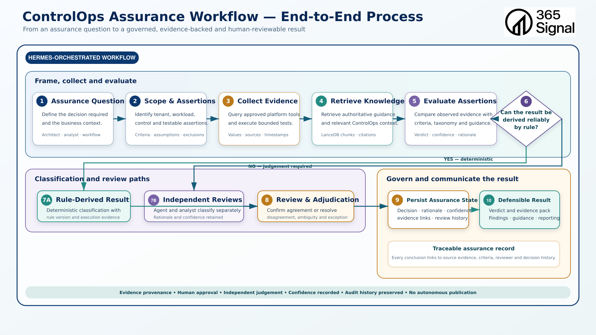
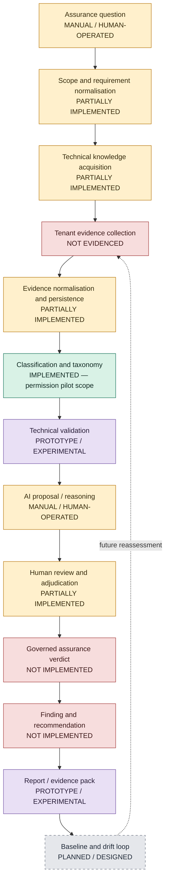

# ControlOps End-to-End Assurance Process and Reality Assessment

## Document Control

| Field | Value |
| --- | --- |
| Status | Draft — internal repository-grounded reality assessment |
| Version | 0.1.0 |
| Assessment date | 16 August 2026 |
| Repository commit | `c33603808fb70e071ce97c92cd55770036afc80e` |
| Working-tree state | Dirty — material tracked modifications and untracked implementation and documentation files were present |
| Intended audience | ControlOps architects, engineers, technical reviewers, security architects and data architects |
| Principal diagram | `04-ControlOps-Assurance-Workflow-End-to-End-Process.png` |
| Purpose | Classify the intended assurance lifecycle against executable, persisted and human-operated evidence in the current repository |

## 1. Executive Summary

ControlOps does not yet implement an end-to-end assurance workflow. It
implements and demonstrates several valuable components: a deployable Hermes
runtime profile and lifecycle tooling; a bounded Microsoft technical validator
with representative generated artefacts; Microsoft Learn and wider local RAG
ingestion assets; a versioned Microsoft Graph permission catalogue; a
relational six-pillar/34-domain taxonomy; and a controlled 36-permission review
pilot with separate analyst and AI records.

The components do not currently form one governed transaction. Assessment
initiation is template- and operator-led. Control frameworks are primarily
source or semantic content rather than mapped, executable controls. Tenant
evidence acquisition is not demonstrated end to end. Validator evidence and
reports remain files, while PostgreSQL `evidence`, `assurance` and `reporting`
schemas contain no tables. Classification review is persisted, but initiated
and advanced through manually selected SQL migrations and external AI/human
work. Verdicts exist in validator documents, not in a reusable assurance
verdict engine. Findings, remediation, case management, publication and drift
detection are not implemented.

The most accurate description is therefore: **ControlOps is an evidence-led
assurance engineering foundation containing repeatable data and runtime
components, plus manually operated prototypes of validation and independent
classification. It is not yet an integrated assurance service or a continuous
assurance platform.**

The smallest increment that would materially change that description is one
narrow, persisted end-to-end assurance slice: structured assessment intake;
authorised evidence collection for one Microsoft control; raw and normalised
evidence persistence; deterministic or explicitly proposed evaluation;
human approval; a persisted verdict/finding; and a reproducible report, all
linked by stable identifiers and executable through one controlled workflow.

## 2. Purpose and Scope

This document answers four questions:

1. What lifecycle does the current ControlOps architecture intend?
2. Which stages work today, at what scope, and with what evidence?
3. Where does a human operator currently initiate, connect, decide or publish
   the work?
4. What engineering is required to make one assurance process repeatable and
   then capable of evolving toward drift-driven assurance?

This is a reality assessment, not a restatement of target architecture. The
workflow diagram is assessed as design intent. Directories, empty database
schemas, templates, prompts and test specifications are not treated as working
capabilities without executable or persisted outcomes.

The document follows terminology established in:

- `docs/architecture/01-controlops-contextual-architecture.md`;
- `docs/architecture/02-controlops-knowledge-rag-component-architecture.md`;
  and
- `docs/architecture/03-controlops-assurance-data-platform-logical-data-architecture.md`.

Implementation claims were independently checked against the repository.

## 3. Assessment Method

### 3.1 Classification vocabulary

Every material capability uses one of these classifications:

| Classification | Meaning in this assessment |
| --- | --- |
| **IMPLEMENTED** | Executable or persisted evidence demonstrates that the bounded capability works. It may still be non-production. |
| **PARTIALLY IMPLEMENTED** | Working elements exist, but scope, integration or operating controls are incomplete. |
| **MANUAL / HUMAN-OPERATED** | A human performs or initiates the substantive step; tools may assist but do not orchestrate it. |
| **PROTOTYPE / EXPERIMENTAL** | Representative execution exists, but it is a development proof, narrow experiment or lacks repeatable acceptance. |
| **PLANNED / DESIGNED** | The repository or architecture describes the intended capability, but working implementation is absent. |
| **NOT IMPLEMENTED** | The required capability is absent from the inspected implementation. |
| **NOT EVIDENCED** | Some prerequisite, configuration or claim exists, but usable operation could not be demonstrated from available evidence. |

`IMPLEMENTED` is scoped. For example, raw snapshot persistence is implemented
for the Graph permission catalogue; that does not implement general tenant
evidence persistence.

### 3.2 Evidence reviewed

The assessment inspected:

- architecture documents and diagrams under `docs/architecture/`;
- agent definition, policy, templates, scripts, runs and tests under
  `agents/controlops-msft-validator/`;
- runtime Compose, lifecycle, diagnostics and smoke tests under `ops/`,
  `scripts/` and `tests/operations/`;
- PostgreSQL Compose, importer, migrations, pilot queries and validations under
  `platform/postgres/`;
- repository Git history through `c336038`; and
- the RAG implementation and live-store observations already independently
  recorded in document 02, together with the in-repository Microsoft Learn
  importer.

The current review ran `bash scripts/controlops doctor`. It validated required
paths, the effective Compose contract, Graph MCP executable presence and the
batch RAG directory. Docker daemon access was denied, and LM Studio and the
dashboard did not respond from the review context. Earlier read-only
observations recorded in documents 01 and 02 saw running Hermes services,
persistent runtime state, populated PostgreSQL and LanceDB. This document does
not convert those point-in-time observations into a current availability
guarantee.

The task context names `/opt/data/workspace` as the container workspace path.
The repository instead configures and documents `/workspace` in
`ops/compose.controlops.yaml`, `docs/operations/service-inventory.md` and
`agents/controlops-msft-validator/agent.yaml`. Runtime mount inspection was
unavailable in this review, so the mismatch is **NOT EVIDENCED** as resolved.

## 4. Intended End-to-End Assurance Lifecycle

The workflow diagram describes this target lifecycle:

1. **Frame the assurance question.** Identify the decision, owner and business
   context.
2. **Define scope and assertions.** Identify tenant, workload, control,
   criteria, assumptions and exclusions.
3. **Collect evidence.** Query approved platform tools or accept controlled
   evidence with values, sources and timestamps.
4. **Retrieve knowledge.** Retrieve authoritative guidance and relevant
   ControlOps context with traceable citations.
5. **Evaluate assertions.** Compare observations with criteria, taxonomy and
   guidance; retain verdict, confidence and rationale.
6. **Choose the decision path.** Use a deterministic rule only when the result
   can be derived reliably; otherwise obtain independent judgement.
7. **Classify and review.** Execute a versioned rule, or retain separate agent
   and analyst proposals.
8. **Review and adjudicate.** Confirm agreement or explicitly resolve
   disagreement, ambiguity or exception.
9. **Persist governed assurance state.** Retain decision, rationale,
   confidence, evidence links and review history.
10. **Communicate a defensible result.** Produce a verdict, evidence pack,
    findings, guidance and reporting without autonomous publication.
11. **Establish a baseline and reassess.** Collect later observations, detect
    material change and reopen the decision when required.

This decomposition preserves the central ControlOps control: observed facts,
derived facts, rules, model proposals, analyst judgement and approved
conclusions are distinct records. The current repository implements fragments
of stages 3, 4, 5 and 7 and manual prototypes of stages 1, 2, 8 and 10. Stages
9 and 11 are not implemented as general assurance capabilities.

## 5. End-to-End Process Architecture



The diagram below is a reality-qualified view. A stage labelled
`IMPLEMENTED` is implemented only at the narrow scope stated elsewhere in this
document.



The linear layout is explanatory, not evidence of an implemented workflow
engine. In practice, knowledge retrieval can precede evidence collection, and
human review can return work to any earlier stage.

## 6. Current Reality Assessment

| Process Stage | Target Capability | Current State | Classification | Repository Evidence | Human Dependency | Principal Gap |
| --- | --- | --- | --- | --- | --- | --- |
| Assessment initiation | Registered assessment with ID, owner, scope and repeatable trigger | Validator task YAML provides task ID, submitter, claim and notes; no assessment registry or workflow service | **PARTIALLY IMPLEMENTED** | `agents/controlops-msft-validator/templates/task-input.yaml`; test-001 input | Operator authors file and invokes workflow | No persisted assessment, target tenant/workload, ownership lifecycle or API |
| Scope and assertions | Machine-readable tenant, workload, controls, criteria, assumptions and exclusions | Agent decomposes a prose claim into bounded assertions; scope remains prose and test-specific | **PROTOTYPE / EXPERIMENTAL** | `agents/controlops-msft-validator/runtime/SOUL.md`; validator reports under `agents/controlops-msft-validator/tests/` | Operator chooses claim and context; model performs decomposition | No canonical scope/control contract |
| Control ingestion | Versioned, normalised controls and mappings from multiple frameworks | CAF content exists in LanceDB per document 02; no relational control register or mappings | **PARTIALLY IMPLEMENTED** | `docs/architecture/02-controlops-knowledge-rag-component-architecture.md`; taxonomy seed in `platform/postgres/init/004-controlops-taxonomy.sql` | Human selects and interprets source content | Stored content is not an executable control |
| Microsoft knowledge acquisition | Approved-source ingestion, retrieval, freshness and resolvable citations | Learn catalogue importer, document/PDF ingestion and populated LanceDB recorded; controls vary by corpus | **PARTIALLY IMPLEMENTED** | `agents/controlops-msft-validator/scripts/ingest_learn_catalog.py`; document 02 | Operator invokes ingestion and selects sources | No common authority, freshness or claim-to-citation contract |
| Live tenant evidence collection | Authenticated least-privilege collection from Graph/Azure/M365 | Graph MCP executable is detected, but permissions and a live request were not verified; Azure connector not found | **NOT EVIDENCED** | `docs/operations/service-inventory.md`; `doctor` implementation in `scripts/controlops` | Human supplies files or runs tools | No demonstrated tenant-scoped collection transaction |
| Static/manual evidence intake | Controlled submission of files, exports, diagrams and documentary evidence | Test files and manually created evidence records exist | **MANUAL / HUMAN-OPERATED** | validator test directories and evidence YAML/Markdown | Human selects, stages and judges evidence | No intake validation, tenant binding or governed store |
| Raw persistence | Append-oriented source snapshots with retrieval metadata and hashes | Implemented for Graph permission catalogue JSON only | **IMPLEMENTED** | `platform/postgres/init/002-catalogue-tables.sql`; `platform/postgres/importer/src/import_graph_permissions.py` | Human supplies input file and executes importer | Not a general evidence landing service |
| Normalisation | Versioned transformation to stable entities and facts | Graph permissions are flattened, hashed, versioned and retired | **IMPLEMENTED** | `platform/postgres/importer/src/import_graph_permissions.py` | Human initiates import | Only Microsoft Graph permission definitions |
| Evidence persistence | First-class evidence linked to assessment, control and finding | Evidence exists as files; PostgreSQL `evidence` schema has no tables | **NOT IMPLEMENTED** | `platform/postgres/init/001-create-database.sql`; `agents/controlops-msft-validator/templates/evidence-record.yaml`; generated test files | Human manages paths and relationships | No governed evidence object or lineage |
| Taxonomy | Controlled pillars, domains and vocabularies | Six pillars and 34 domains with constraints and validation | **IMPLEMENTED** | `platform/postgres/init/004-controlops-taxonomy.sql`; `platform/postgres/validation/004-controlops-taxonomy-validation.sql` | Human owns taxonomy decisions | No taxonomy lifecycle/version policy |
| Permission classification | Structured risk attributes and primary/secondary domains | 36-permission pilot with separate analyst/AI review records; governed classification table intentionally untouched | **PROTOTYPE / EXPERIMENTAL** | `platform/postgres/init/005-graph-permission-classification-pilot.sql` through `platform/postgres/init/012-apply-analyst-chat-manage-human-correction.sql`; `docs/graph-permission-classification-pilot.md` | Codex and analyst work are manually invoked and persisted by SQL | No approved publication path or general classifier |
| Rule-derived result | Versioned deterministic evaluation and evidence | Simple name-based `access_class` and sampling heuristics exist; candidate rules are non-executable | **PARTIALLY IMPLEMENTED** | `platform/postgres/importer/src/import_graph_permissions.py`; `platform/postgres/pilot/graph-permission-candidate-selection.sql`; candidate-rule table in migration `005` | Human reviews suitability | No general rules engine, versions or replay |
| Technical validation | Bounded claim validation against approved Microsoft sources | Two representative scenarios produced evidence, verdicts and reports | **PROTOTYPE / EXPERIMENTAL** | `agents/controlops-msft-validator/tests/test-001-entra-connect/`; `agents/controlops-msft-validator/tests/test-002-expressroute-tenant-isolation/` | Human supplies task, starts agent and reviews output | No automated acceptance suite or integrated persistence |
| AI reasoning | Orchestrated, provenance-rich proposals with controlled context | Local-model and Codex outputs exist, but invocation and transfer between tools and PostgreSQL are operator-led | **MANUAL / HUMAN-OPERATED** | validator configuration/runs; PostgreSQL migrations `008`–`010`; `docs/prompts/` | Operator selects model/task and applies output | No workflow engine or complete model/prompt/context provenance |
| Human review | Assigned review, decision, rationale and state | Human analyst reviews/corrections persisted for pilot; validator publication requires review | **PARTIALLY IMPLEMENTED** | PostgreSQL migrations `007`, `011`, `012`; `agents/controlops-msft-validator/agent.yaml` | Human is the final control | General assignment, identity and approval transitions absent |
| Adjudication | Persist disagreement and governed resolution | Schema and comparison views exist; no disagreement or domain-review rows evidenced | **NOT EVIDENCED** | `platform/postgres/init/005-graph-permission-classification-pilot.sql`; validation SQL protects zero-row state | Would be human-operated | Representational schema without executed case |
| Assurance verdict | Reproducible verdict from evidence and approved criteria | Validator emits `true/false/partially_true/unsupported/unresolved` in Markdown; test-002 uses a different vocabulary | **PROTOTYPE / EXPERIMENTAL** | `agents/controlops-msft-validator/agent.yaml`; reports under `agents/controlops-msft-validator/tests/` | Agent drafts; human approval required | No common verdict service or governed persistence |
| Findings and risks | Structured finding, risk, priority, owner, due date and exception | Repository evidence not found | **NOT IMPLEMENTED** | Repository evidence not found. | Human may write narrative | No data model or lifecycle |
| Recommendations/remediation | Traceable action and closure verification | Occasional narrative explanation only; validator restricts unsupported recommendations | **NOT IMPLEMENTED** | test-002 policy/report | Human authors any action | No remediation or case model |
| Reporting | Approved evidence pack and assessment report from governed records | Templates and generated Markdown exist; architecture documents are manually assembled | **PROTOTYPE / EXPERIMENTAL** | `agents/controlops-msft-validator/templates/`; generated validator outputs; `docs/architecture/` | Operator invokes, edits, reviews and publishes | No governed report build or publication state |
| Reporting consumers | Tenant-aware API, dashboard or Power BI model | `reporting` schema is empty; no assurance API or BI model | **PLANNED / DESIGNED** | `platform/postgres/init/001-create-database.sql`; architecture diagrams | None operational | No read model, authorisation or consumer contract |
| Baseline | Approved assessment state used for later comparison | Catalogue import stores hashes/current versions; pilot stores a sample fingerprint, not a tenant assurance baseline | **PARTIALLY IMPLEMENTED** | `operations.catalogue_import_run` and `permission_pilot.pilot_definition` in `platform/postgres/init/` | Human initiates refresh | No approved customer configuration/control baseline |
| Drift detection | Scheduled recollection, comparison, materiality and reassessment | No general scheduler, drift rules, materiality, alerting or cases | **NOT IMPLEMENTED** | Agent explicitly denies cron; repository search found no drift engine | All comparison would be manual | Entire operational loop absent |
| Runtime operations | Controlled start/status/log/doctor/rebuild and persistent mounts | Lifecycle scripts, config validation and smoke test exist; current runtime access unavailable | **IMPLEMENTED** | `scripts/controlops`; runbook; smoke test | Operator starts services and external LM Studio | Availability and complete dependency health are not managed end to end |

## 7. Capability Maturity Assessment

### 7.1 ControlOps-specific maturity scale

| Level | Name | Practical meaning |
| ---: | --- | --- |
| 0 | Concept only | Intent exists, but no executable or persisted component supports it |
| 1 | Manual or experimental | A person can demonstrate the capability with prototypes, prompts, files or ad hoc execution |
| 2 | Repeatable component | A bounded component has controlled inputs/outputs, persistence or tests and can be rerun |
| 3 | Integrated workflow | Components exchange governed records through one repeatable assessment transaction |
| 4 | Operational assurance | Authorised users can run supported assessments with security, service management and publication controls |
| 5 | Continuous, drift-driven assurance | Scheduled collection and material change detection trigger governed reassessment and action |

The ratings are intentionally not averaged. A Level 2 database component does
not raise the end-to-end process to Level 2 or 3.

### 7.2 Current maturity by capability

| Capability | Current Level | Evidence-based explanation |
| --- | ---: | --- |
| Knowledge/RAG | **2 — Repeatable component** | Ingestion code, local embeddings and populated LanceDB tables were recorded; retrieval quality, common provenance, freshness and an operational ControlOps query contract remain incomplete. Evidence: document 02 and `agents/controlops-msft-validator/scripts/ingest_learn_catalog.py`. |
| Evidence collection | **1 — Manual or experimental** | Documentary evidence and exported Graph catalogue input can be supplied; no verified live tenant collection flow exists. |
| Assurance data platform | **2 — Repeatable component** | PostgreSQL catalogue/import/taxonomy/pilot objects and validations are substantial; general evidence, assurance and reporting stores are empty. |
| Taxonomy/classification | **2 — Repeatable component** | Controlled taxonomy and a reproducible permission pilot exist; production classification publication and general entity coverage do not. |
| Microsoft technical validation | **1 — Manual or experimental** | Two representative scenarios generated evidence and verdict artefacts, but execution is operator-led, narrow and not integrated with governed state. |
| Human review/adjudication | **1 — Manual or experimental** | Named analyst records and corrections exist; adjudication is schema-only and general workflow controls are absent. |
| Reporting | **1 — Manual or experimental** | Templates and generated Markdown prove document shape, not automated assurance reporting. |
| Workflow orchestration | **1 — Manual or experimental** | Hermes runs an agent profile, while humans connect intake, RAG, Codex, SQL and publication. No end-to-end workflow definition or job state exists. |
| Drift detection | **0 — Concept only** | Versioned imports are enabling primitives; no scheduled collection, general comparison, materiality, alert or reassessment implementation exists. |
| Operational governance | **1 — Manual or experimental** | Runtime preflight and agent boundaries are useful; customer isolation, roles, audit, retention, backup restoration and service objectives are unproven. |

No assessed capability reaches Level 3. The platform as a whole is Level 1:
humans can assemble and demonstrate assurance-like work using several Level 2
components, but there is no integrated governed workflow.

## 8. Control and Requirement Ingestion

### 8.1 Assessment initiation and scope

The validator task template captures `task_id`, title, submitter, submitted
time, claim text, prose context, required source class, human-review flag and
optional maximum source age. Test 001 populates this contract. This is useful
structured intake for a single technical assertion, but not an assessment
record. It lacks customer/tenant, workload, control ID, assessment owner,
decision due date, authoritative criteria, evidence plan, exclusions and
lifecycle state. Evidence: `agents/controlops-msft-validator/templates/task-input.yaml`
and `agents/controlops-msft-validator/tests/test-001-entra-connect/input/task.yaml`.

No API, queue, assessment table or repeatable workflow-initiation command was
found. Initiation is **MANUAL / HUMAN-OPERATED** even though the input file is
structured.

### 8.2 Framework and requirement sources

Document 02 records 82 NCSC CAF 4.0 records in
`framework_controls_nomic_v1`. Those records make framework content
semantically retrievable; they do not establish a governed relational control
registry, mapping to ControlOps controls, tenant applicability or executable
test criteria. The ControlOps taxonomy includes a Regulatory and Framework
Management domain, but this is a classification domain rather than framework
coverage.

Repository evidence for normalised CIS Controls, NIST SP 800-53, Cloud Controls
Matrix, customer control overlays or cross-framework mappings was not found.
Microsoft guidance enters through web research, the Learn catalogue and other
RAG document ingestion. Manually authored claims enter validator task files.

The four capabilities remain distinct:

- framework text storage: **PARTIALLY IMPLEMENTED**;
- framework/control mapping: **NOT IMPLEMENTED**;
- evidence evaluation against a registered control: **NOT IMPLEMENTED**; and
- approved assurance verdict for that control: **NOT IMPLEMENTED**.

## 9. Knowledge and RAG

ControlOps has meaningful knowledge components, but they are separate from the
assurance process.

The in-repository Learn importer retrieves the Microsoft Learn catalogue API,
normalises modules and learning paths, records canonical/catalogue URLs,
last-modified and retrieval times, generates local embeddings and upserts
LanceDB records. It labels records `discovery_index`, correctly avoiding a
claim that catalogue metadata is substantive technical evidence. Evidence:
`agents/controlops-msft-validator/scripts/ingest_learn_catalog.py`.

Document 02 records working PDF extraction, page-aware chunks, local Nomic
embeddings, 11 populated LanceDB tables, and experimental retrieval across
technical documentation, architecture patterns and diagrams. It also records:

- heterogeneous corpus schemas and incomplete embedding lineage;
- no universal source-authority or freshness enforcement;
- incomplete metadata filters and context budgeting;
- no deterministic claim-to-source citation resolver;
- a query CLI not verified end to end and an API signature mismatch; and
- no path from RAG output to governed PostgreSQL assurance state.

Validator runs demonstrate authoritative web research and capture URLs,
sections, excerpts/summaries and retrieval timestamps. The historical runs
also demonstrate why the control matters: one reviewed run was substantively
approved but rejected for audit correction because timestamps were inconsistent
and retrieval causes and repository authority were overstated. Evidence:
`agents/controlops-msft-validator/runs/run-2026-07-26_13-39-40_BST/validation-report.md`.

Knowledge acquisition is therefore **PARTIALLY IMPLEMENTED**. Raw document
processing and vector storage exist; assurance-grade source approval,
freshness, citation binding and integration remain incomplete. Vector retrieval
must not be treated as control evidence or tenant observation merely because a
similar passage was returned.

## 10. Evidence Acquisition

### 10.1 Tenant and platform evidence

No repository evidence demonstrates a complete live request against a
customer Microsoft tenant followed by governed persistence. The service
inventory calls Graph MCP an on-demand `stdio` process, and the doctor detects
its executable. Effective Graph permissions, tenant identity, consent scope,
request execution and response persistence were not verified. This is
**NOT EVIDENCED** live tenant retrieval, not implemented evidence collection.

No Azure MCP configuration or collector exists in the inspected ControlOps
repository. The validator denies Azure writes, but a write prohibition does
not prove a read connector. Azure evidence acquisition is **NOT IMPLEMENTED**.

The Graph permission importer consumes a local JSON export representing the
Microsoft Graph service principal. It validates the application ID and loads
catalogue definitions. This is **IMPLEMENTED** catalogue ingestion, not a live
tenant configuration assessment and not continuous collection. Evidence:
`platform/postgres/importer/src/import_graph_permissions.py`.

### 10.2 Other evidence classes

| Evidence type | Current reality | Classification |
| --- | --- | --- |
| Live tenant retrieval | Graph tool presence only; no verified request | **NOT EVIDENCED** |
| Read-only tooling | Policies deny Graph/Azure writes; Graph executable detected | **PARTIALLY IMPLEMENTED** |
| Test evidence | Multiple validator evidence and report artefacts exist | **PROTOTYPE / EXPERIMENTAL** |
| Mock evidence | Static test inputs and expected test dispositions exist; they test behaviour rather than tenant state | **PROTOTYPE / EXPERIMENTAL** |
| Manually supplied evidence | Files, exports, claims and architecture material can be staged by an operator | **MANUAL / HUMAN-OPERATED** |
| Architecture diagrams | Dedicated RAG processing recorded in document 02; not tenant configuration evidence by default | **PROTOTYPE / EXPERIMENTAL** |
| Planned connectors | General Graph/Azure/M365 collection is architectural intent | **PLANNED / DESIGNED** |

## 11. Evidence and Assurance Data Platform

### 11.1 Current PostgreSQL implementation

PostgreSQL provides the strongest controlled persistence in ControlOps today:

| Schema | Physical implementation | Process relevance |
| --- | --- | --- |
| `raw` | `catalogue_snapshot` | Stores Graph catalogue payload, source URI, retrieval time and hash |
| `operations` | `catalogue_import_run` | Stores source/interface, collector/source versions, status, counts, payload hash and errors |
| `catalogue` | source/interface, permission definitions, pillars/domains, classification contracts | Normalised permission catalogue and controlled taxonomy |
| `permission_pilot` | samples, reviews, domain assignments, comparisons, disagreements, domain reviews, schema gaps and candidate rules | Isolated experimental classification/review process |
| `evidence` | No tables | Reserved design namespace only |
| `assurance` | No tables | Reserved design namespace only |
| `reporting` | No tables or views | Reserved design namespace only |

Evidence: `platform/postgres/init/001-create-database.sql` through
`platform/postgres/init/005-graph-permission-classification-pilot.sql`.

The Graph importer provides stable UUIDs, source hashes, raw JSON, valid-from/
valid-to and current-state fields. It preserves changed versions and retires
missing definitions. The pilot uses foreign keys, check constraints, unique
keys, a one-primary-domain constraint, review rounds and explicit statuses.
Validation SQL checks exact counts, fingerprints, isolation of independent
reviewers, controlled vocabularies, idempotent reruns and protection of
unrelated records.

Migrations `010`–`012` are uncommitted at this baseline. They create 28
model-seeded analyst drafts and persist eight human corrections. Their presence
in the working tree and earlier observed database is evidence of active
development, but weaker provenance than committed migrations `001`–`009`.

### 11.2 Process limitation

Validator evidence, assessments and verdicts are not written to PostgreSQL.
There is no general assessment, observation, evidence, control-evaluation,
finding, conclusion or publication entity. The raw Graph snapshot is catalogue
source data, not customer assurance evidence. Backup dump files exist, but no
restore test or production recovery policy is evidenced.

**A robust data schema is an enabling platform capability, not evidence that
the entire assurance lifecycle is automated.** The data platform is a
**repeatable component** with one substantial experimental slice, not an
integrated assurance system.

## 12. Taxonomy and Classification

The taxonomy migration implements six pillars and 34 domains. Permission
classification fields cover:

- capability and access level;
- administrative capability;
- privilege and data sensitivity;
- destructive potential and consent sensitivity;
- tenant-wide impact;
- confidence, source and review status; and
- primary/secondary domain assignment with mapping rationale.

Evidence: `platform/postgres/init/004-controlops-taxonomy.sql`.

The permission pilot makes several useful distinctions:

- Graph `access_class` is a deterministic but simple name-based derivation in
  the importer;
- workload, capability, scope and risk labels in candidate selection are
  sampling heuristics, explicitly not classifications;
- Codex reviews are stored separately as `reviewer_kind = 'codex'`;
- analyst reviews have a distinct reviewer identity and status;
- 28 analyst drafts were copied from AI reviews and therefore are proposals,
  not human judgement;
- submitted analyst values and later human corrections represent accountable
  analyst decisions; and
- disagreement and candidate-rule tables can represent future workflow but do
  not prove it has occurred.

Evidence: `docs/graph-permission-classification-pilot.md`, migrations
`006`–`012`, and their validations.

The governed `catalogue.permission_classification` table remains intentionally
unpopulated by the pilot. This is a sound experimental boundary. It also means
ControlOps has not implemented publication of an approved classification
state. Taxonomy is **IMPLEMENTED** at pilot scope; classification is
**PROTOTYPE / EXPERIMENTAL**; a general rules engine is **NOT IMPLEMENTED**.

## 13. Microsoft Technical Validation

### 13.1 Demonstrated behaviour

The Microsoft validator has a structured task template and a detailed policy
for assertion extraction, approved Microsoft sources, evidence capture,
verdicts, sufficiency, confidence, fact/inference/assumption separation,
fact-checking and mandatory human review. Its configured local model is
`lmstudio-community/qwen3.6-35b-a3b`. Evidence:
`agents/controlops-msft-validator/agent.yaml`,
`agents/controlops-msft-validator/runtime/config.yaml` and
`agents/controlops-msft-validator/runtime/SOUL.md`.

Representative artefacts demonstrate:

- **Test 001 — Entra Connect:** a structured task, three extracted assertions,
  two Microsoft sources, YAML evidence, a `true` verdict, sufficiency and
  confidence, fact-check output and pending human review. Evidence:
  `agents/controlops-msft-validator/tests/test-001-entra-connect/output/`.
- **Test 002 — ExpressRoute tenant isolation:** a deliberately false claim was
  challenged and given a `contradicted` verdict with two Microsoft sources,
  identity/network boundary separation, run log and mandatory review. Evidence:
  `agents/controlops-msft-validator/tests/test-002-expressroute-tenant-isolation/`.
- **Review feedback:** an earlier Entra Connect result was substantively
  approved but rejected for audit defects, after which policy was hardened in
  commit `653688f`. This demonstrates learning and human control, not flawless
  automated validation.

### 13.2 Limitations

The repository does not contain an automated test runner that invokes the
agent, asserts output schemas and verdict properties, and proves repeatability.
Generated files are numerous and use several directory conventions. Test 002
uses `supported/partially_supported/contradicted/insufficient_evidence`, while
the agent contract uses `true/false/partially_true/unsupported/unresolved`.
Some test-002 timestamps contain `xx`, so its audit timing is incomplete.
Evidence records can say `citation_verified: false` even when the report says
citations were verified. These are material contract inconsistencies.

The tests demonstrate research and report generation, but not tenant evidence
collection, RAG-to-validator retrieval, PostgreSQL persistence or an assurance
workflow. Invocation was not shown to be scheduled or service-triggered.
Technical validation is therefore **PROTOTYPE / EXPERIMENTAL**.

## 14. AI Reasoning and Human Adjudication

### 14.1 Current AI roles

- **Hermes** hosts the validator profile, local tool execution and persistent
  runtime state. It does not orchestrate the complete assurance lifecycle.
- **LM Studio/local model** is configured for validator reasoning and supported
  recorded runs; it is externally managed. Current endpoint availability was
  not demonstrated in this review.
- **Codex** produced independent permission classifications and later seeded
  analyst drafts through a human-directed process and SQL migrations. Codex is
  not an autonomously scheduled ControlOps service.
- **RAG/local embeddings** support semantic knowledge ingestion and
  experimental retrieval, but no validator run proves an integrated RAG call.
- **Frontier-model fallback/arbitration** appears only as commented
  configuration/design intent and is **NOT IMPLEMENTED**.

AI currently assists research, interpretation, classification and drafting.
There is no evidence of autonomous arbitration, publication or remediation.

### 14.2 Human review and adjudication

Human judgement is structurally necessary because evidence sufficiency,
effective permission scope, materiality and architecture implications are not
always deterministic. The current implementation supports this principle
better than it supports workflow automation.

The permission pilot persists reviewer kind, reviewer identifier, round,
rationale, confidence and submitted/draft status. Human corrections update
specified analyst fields while validation proves unrelated AI and domain rows
remain unchanged. This demonstrates human override and controlled persistence.
The validator requires human review and contains one explicit completed review
that rejected an output for audit correction.

However:

- reviews are populated by migrations rather than a review application;
- blind-review separation is protected in validation snapshots, but no
  identity/access mechanism enforces it operationally;
- `approved` is available in the production classification table but pilot
  reviews use only draft/submitted/superseded;
- no disagreement or domain-review record is evidenced; and
- no general adjudication, exception or publication workflow exists.

Human review is **PARTIALLY IMPLEMENTED** in the pilot and
**MANUAL / HUMAN-OPERATED** in the broader process. Adjudication is
**NOT EVIDENCED** beyond schema design.

## 15. Assurance Verdicts and Findings

### 15.1 Verdicts

The validator contract implements this vocabulary:

```text
true | false | partially_true | unsupported | unresolved
```

It separately records evidence sufficiency (`sufficient`, `partial`,
`insufficient`) and confidence (`high`, `medium`, `low`). Generated reports
show agent-drafted verdicts and rationales. Test 002 uses a different verdict
vocabulary. No `PASS/FAIL/PARTIAL/UNKNOWN/NOT_APPLICABLE` control-evaluation
engine exists.

Verdicts today are generated in an agent-assisted document workflow, checked
by a model-defined fact-check pass and intended for human approval. They are
not persisted in governed assurance tables, programmatically recomputed from
versioned evidence, or reproducibly tied to a registered control. Assurance
verdict generation is **PROTOTYPE / EXPERIMENTAL**.

### 15.2 Findings, risk and remediation

Repository evidence was not found for structured:

- findings or risk records;
- priority/severity and materiality;
- remediation actions, owners or due dates;
- exceptions, risk acceptance or compensating controls;
- case status and closure; or
- verification of remediation.

Validator reports can explain misleading elements and unresolved questions,
but that narrative is not a finding lifecycle. These capabilities are
**NOT IMPLEMENTED**.

## 16. Reporting and Document Production

The validator supplies an evidence YAML template and a Markdown validation
report template. Representative runs created evidence, run logs and reports.
The current architecture documents demonstrate careful human/Codex-assisted
document assembly. These are useful document-production proofs.

They do not demonstrate automated end-to-end report generation. There is no
query from approved PostgreSQL assurance state, versioned report run,
publication approval, disclosure filtering, stable evidence-pack manifest,
dashboard, Power BI model or assurance API. The `reporting` schema is empty.

Current classification:

- validator evidence and validation reports: **PROTOTYPE / EXPERIMENTAL**;
- architecture document production: **MANUAL / HUMAN-OPERATED**;
- assessment/management reporting pipeline: **NOT IMPLEMENTED**;
- dashboards, Power BI and external APIs: **PLANNED / DESIGNED**.

## 17. Continuous Assurance and Drift Detection

ControlOps does not currently implement continuous assurance.

| Loop Step | Current Evidence | Classification |
| --- | --- | --- |
| Establish approved baseline | Catalogue import retains hashes/current versions; pilot stores a catalogue fingerprint. Neither is an approved tenant control baseline. | **PARTIALLY IMPLEMENTED** |
| Scheduled collection | Validator denies cron; no collection scheduler found. | **NOT IMPLEMENTED** |
| Store evidence snapshots | Graph catalogue snapshots exist; general tenant evidence snapshots do not. | **PARTIALLY IMPLEMENTED** |
| Compare snapshots | Importer detects changed/new/retired permission definitions; no tenant configuration or control-state comparison. | **PARTIALLY IMPLEMENTED** |
| Apply drift rules | Repository evidence not found. | **NOT IMPLEMENTED** |
| Determine materiality | Sampling risk labels and classification fields exist, but no drift threshold or impact policy. | **NOT IMPLEMENTED** |
| Scheduled reassessment | Repository evidence not found. | **NOT IMPLEMENTED** |
| Alert/report change | Repository evidence not found. | **NOT IMPLEMENTED** |
| Generate case | Repository evidence not found. | **NOT IMPLEMENTED** |
| Track remediation | Repository evidence not found. | **NOT IMPLEMENTED** |

The versioned Graph catalogue and import metadata are drift-enabling
primitives. They detect evolution in Microsoft's permission definitions, not
material change in a customer environment. ControlOps is presently an
assessment foundation capable of evolving toward continuous assurance, not a
continuous assurance implementation.

## 18. Hermes Runtime — Current Role

### 18.1 Evidence against the original proof-of-concept goals

| Question | Assessment |
| --- | --- |
| 1. Is Hermes deployed and operational? | Deployment configuration, lifecycle tooling and earlier runtime observations support **IMPLEMENTED** deployment. Current operation is **NOT EVIDENCED** in this review because Docker access was denied and the dashboard did not respond. |
| 2. Is persistent state working? | Earlier document-01 inspection observed profiles, sessions and logs under the mounted data tree. Compose persistently mounts `/mnt/Storage/AI/Hermes/data` to `/opt/data`. **IMPLEMENTED**, point-in-time rather than durability-tested. |
| 3. Is LM Studio integration working? | Config and representative reports name the local model; earlier observations saw model endpoints at different times. The endpoint was unavailable in the current doctor run. **PARTIALLY IMPLEMENTED** and externally operated. |
| 4. Are ControlOps working directories available inside the runtime? | Repository contract mounts the workspace at `/workspace`; earlier inspection observed expected mounts. The task's `/opt/data/workspace` statement conflicts with this. **IMPLEMENTED** at `/workspace` per repository; alternate path **NOT EVIDENCED**. |
| 5. Are agent definitions present? | One development agent definition, profile config, behaviour policy and templates exist. **IMPLEMENTED**. |
| 6. Have representative workflows actually been executed? | Entra Connect and ExpressRoute artefacts demonstrate executions. **PROTOTYPE / EXPERIMENTAL** because repeatable automated tests are absent. |
| 7. Is Hermes orchestrating the entire ControlOps process? | No. It runs the validator context; humans connect intake, collection, RAG, Codex, SQL review, decisions and documents. **NOT IMPLEMENTED**. |
| 8. What security controls are demonstrably configured? | Approved write roots; no customer/production data; disabled high-risk toolsets; denied writes, cron, delegation, messaging, Git commit and Docker socket in agent policy; explicit mounts; UID/GID; secret redaction default noted in config; local endpoints; preflight and mount validation. **PARTIALLY IMPLEMENTED** because prompt/config controls are not all enforcement proofs. |
| 9. What proposed controls remain unverified? | Effective Graph/Azure least privilege, runtime enforcement of `agent.yaml`, tenant isolation, authentication/authorisation, network exposure, secret-redaction operation, Tirith availability, audit completeness, backup recovery and external-model governance. |
| 10. How should Hermes be described? | **Adopted with conditions** as the local execution substrate for development workflows; not adopted as an end-to-end assurance orchestrator. Continued use should depend on repeatable workflow tests, dependency health and proven enforcement boundaries. |

### 18.2 Runtime configuration defects and limitations

`agent.yaml` declares `execution_policy:` at the wrong indentation level: the
limits that follow remain under `security`, while `execution_policy` is empty.
The SOUL policy repeats the limits, but repository evidence does not prove
machine enforcement. Host networking reduces network separation; the
dashboard is intended for loopback, but listener exposure needs runtime
verification. LM Studio is a hard startup dependency managed outside the
ControlOps lifecycle.

The lifecycle tooling itself is a strong bounded component. It pins the
ControlOps Compose project and files, validates the rendered model, checks LM
Studio before start/restart/rebuild, waits for container/dashboard readiness,
verifies mounts and provides non-destructive stop and doctor operations.
Evidence: `scripts/controlops`, `scripts/lib/controlops-common.sh`,
`docs/operations/hermes-runbook.md` and `tests/operations/controlops-smoke.sh`.

## 19. Current Automation Boundary

The current boundary is best stated as follows.

### Automated or executable once invoked

- Compose rendering, preflight checks, service start/stop/status/log access and
  mount verification;
- Graph permission JSON validation, flattening, hashing, version comparison,
  transactional persistence and retirement;
- PostgreSQL constraints and validation queries;
- deterministic pilot sample loading and idempotent review migrations;
- Learn catalogue retrieval, normalisation, embedding and LanceDB write when
  its dependencies and command are supplied; and
- bounded agent research, evidence/report drafting and fact-check behaviour
  within an invoked validator session.

### Jon/operator must currently initiate or decide

- start LM Studio and load the model, then start Hermes;
- define the assurance question and scope in a task or prompt;
- choose and stage tenant exports, evidence, diagrams or source documents;
- invoke the validator, RAG scripts, Graph importer and Codex;
- decide which evidence is authoritative and sufficient;
- review agent output and correct audit defects;
- approve or amend permission classifications;
- choose and run database migrations and validation SQL;
- interpret whether a result constitutes a finding or material risk;
- decide architecture and control mappings;
- assemble, edit and approve architecture or assessment documents; and
- publish or share outputs.

There is no scheduler or workflow service linking these operations. A capable
toolchain plus a skilled operator is not an autonomous system. Current
end-to-end orchestration is **MANUAL / HUMAN-OPERATED**.

## 20. Target Process versus August 2026 Reality

1. **The diagram says Hermes-orchestrated; the repository shows
   operator-orchestrated.** Hermes hosts a validator and tools, but no workflow
   definition advances one assessment through collection, review, persistence
   and reporting.
2. **Questions exist as files, not governed assessments.** Stable task/run IDs
   appear in validator artefacts, but no assessment registry, ownership state
   or target-tenant scope exists.
3. **Knowledge capability is ahead of its assurance integration.** LanceDB has
   substantive content and ingestion, yet the validator-to-RAG path and
   RAG-to-evidence hand-off are not demonstrated.
4. **PostgreSQL foundations are ahead of evidence workflow.** Catalogue,
   taxonomy and pilot review are carefully constrained; `evidence`,
   `assurance` and `reporting` remain empty.
5. **Tenant collection is a proposition, not a demonstrated capability.** A
   Graph MCP executable and read-only policies do not prove authenticated,
   scoped retrieval or persistence. Azure collection is absent.
6. **Classification is the deepest assurance experiment.** Independent review,
   corrections and validation exist for 36 permissions, but production
   classification and adjudication have not been completed.
7. **Validator outputs are credible prototypes, not repeatable acceptance.**
   Two scenarios show useful behaviour, while vocabulary, timestamps, path
   conventions and citation flags remain inconsistent.
8. **Human review is real but not productised.** Human correction and audit
   rejection are evidenced; assignment, access control, approval transitions
   and publication are manual.
9. **Reports are documents, not read models.** Templates and generated Markdown
   exist; no governed report generation, dashboard or API consumes approved
   assurance state.
10. **Drift detection remains architectural intent.** Versioned catalogue
    import is a useful primitive, but no tenant baseline-to-alert loop exists.

## 21. What ControlOps Can Credibly Claim Today

- ControlOps has implemented a versioned Microsoft Graph permission catalogue
  import with raw payload hashes, import metadata and change/retirement logic.
- ControlOps has implemented a constrained six-pillar, 34-domain taxonomy and
  demonstrated a controlled 36-permission independent-classification pilot.
- ControlOps has persisted separate analyst and AI review records and human
  corrections without automatically publishing them as governed
  classifications.
- ControlOps has demonstrated a bounded Microsoft technical-validation agent
  producing source-aware evidence, verdict drafts and reports for human review
  in representative Entra and Azure networking scenarios.
- ControlOps currently supports local semantic knowledge ingestion and
  retrieval experiments across Microsoft material, framework content,
  architecture patterns and technical documents.
- ControlOps has implemented local Hermes lifecycle tooling and restrictive
  development-agent policies suitable for controlled experimentation.
- ControlOps is developing an evidence-backed assurance model that explicitly
  separates observations, rules, model proposals and human judgement.
- ControlOps does not yet provide an integrated or continuous assurance
  service.

## 22. What ControlOps Should Not Claim Yet

ControlOps should not yet claim:

- fully autonomous or fully orchestrated assurance;
- continuous Microsoft 365, Entra or Azure monitoring;
- production-scale drift detection or materiality analysis;
- verified live tenant evidence collection across Graph or Azure;
- complete NCSC CAF, CIS, NIST or multi-framework control coverage;
- a fully governed evidence-to-conclusion chain;
- automated control verdicts, findings, remediation or case management;
- production customer/tenant isolation;
- mature analyst adjudication or segregation of duties;
- governed customer reporting, Power BI dashboards or assurance APIs;
- automated remediation or production Microsoft platform changes; or
- production availability, disaster recovery or audit-grade operation.

## 23. Principal Architectural Gaps

The five most material gaps are:

1. **No assessment and assurance transaction model.** There is no governed
   record connecting question, scope, tenant, control, evidence, evaluation,
   review, verdict and report.
2. **No verified tenant evidence acquisition path.** A source catalogue and
   tool executable exist, but not a least-privilege live collection transaction
   with provenance and tenant isolation.
3. **No first-class evidence, evaluation, finding or conclusion persistence.**
   Empty schemas prevent the intended traceability and re-evaluation loop.
4. **No workflow orchestration across components.** Humans transfer work among
   Hermes, RAG, Codex, files, SQL and documents.
5. **No operational drift loop.** Baselines, schedules, comparisons,
   materiality, reassessment, alerts and remediation cases are absent.

Secondary gaps include inconsistent verdict vocabularies and artefact layouts;
incomplete model/prompt/context provenance; no general control registry or
mapping; pilot-only review states; no proven adjudication; no tenant model;
empty reporting structures; and incomplete operational governance.

## 24. Recommended Engineering Priorities

### Horizon 1 — Complete the assurance loop

#### 1. Select one narrow control and define one canonical transaction

Choose a single read-only Microsoft Graph or configuration assertion with an
unambiguous test. Define `assessment`, `scope`, `control`, `collection_run`,
`observation`, `evidence`, `evaluation`, `review_decision`, `verdict`, `finding`
and `report_run` identifiers and states.

- **Why:** it exposes missing contracts without broadening the taxonomy.
- **Builds on:** validator task IDs, Graph import runs, evidence templates and
  pilot review patterns.
- **Completion evidence:** one SQL query can trace a published report verdict
  backward to approved review, evaluation, normalised observation and raw
  collected payload.

#### 2. Implement one authorised live evidence collector

Use a documented least-privilege Graph call against a designated non-customer
test tenant. Record tenant/source identifiers, granted permissions, request,
retrieval time, response hash, collector version and errors.

- **Why:** without a real observation, the process validates documentation
  rather than an environment.
- **Builds on:** Graph MCP presence and raw/import-run schema patterns.
- **Completion evidence:** a repeatable test proves the same bounded read,
  rejected writes, tenant binding and persisted raw/normalised evidence.

#### 3. Persist the verdict and human approval

Create minimal `evidence` and `assurance` tables and a controlled transition
from proposal to approved/rejected/superseded. Preserve model/rule and analyst
records separately.

- **Why:** files cannot support governed lineage or deterministic reporting.
- **Builds on:** pilot reviewer separation, constraints and idempotent SQL.
- **Completion evidence:** an agent cannot overwrite evidence or approve its
  own conclusion; an authorised reviewer can approve and supersede with full
  history.

#### 4. Generate one report from approved records

Render the validator-style report from the persisted transaction rather than
from an unconstrained working directory.

- **Why:** this closes the smallest defensible assurance loop.
- **Builds on:** existing templates and report artefacts.
- **Completion evidence:** rerunning against the same record version produces
  the same factual report and excludes draft/unapproved state.

### Horizon 2 — Make it repeatable

#### 1. Add a workflow runner with explicit state

Provide one command/API that creates an assessment and advances bounded jobs
through collection, normalisation, evaluation, review and reporting. Persist
job attempts, errors and idempotency keys.

- **Why:** removes operator-managed hand-offs and establishes a testable
  process boundary.
- **Builds on:** Hermes profile, lifecycle tooling and import-run patterns.
- **Completion evidence:** automated integration tests execute repeated success,
  retry, failure and human-wait paths without duplicate records.

#### 2. Consolidate contracts and provenance

Adopt one verdict vocabulary, evidence schema and artefact layout. Record rule
version or model, prompt/instruction version, retrieved context IDs and human
decision provenance.

- **Why:** current test vocabularies and audit flags conflict.
- **Builds on:** validator templates and pilot review fields.
- **Completion evidence:** schema validation rejects inconsistent verdicts,
  timestamps, citation states and missing provenance.

#### 3. Implement versioned controls and mappings

Create a relational control registry with explicit criteria and reviewed
framework mappings. Keep source text in documents/LanceDB and exact governed
IDs in PostgreSQL.

- **Why:** framework content is not executable assurance logic.
- **Builds on:** CAF semantic content and ControlOps domains.
- **Completion evidence:** the reference control can be mapped, versioned,
  evaluated and impact-analysed when source or criteria change.

#### 4. Productise review and operating controls

Add authenticated reviewer assignment, roles, segregation of duties,
adjudication, audit events, tenant scoping, retention and backup restoration.

- **Why:** human review is a control only if identity and transitions are
  enforceable.
- **Builds on:** pilot review and disagreement schemas.
- **Completion evidence:** a complete disagreement/adjudication case and restore
  test pass under access-control tests.

### Horizon 3 — Introduce continuous assurance

#### 1. Create approved baselines and scheduled recollection

Version approved observation/evaluation sets and schedule the proven collector
at an authorised cadence.

- **Why:** continuous assurance begins with comparable, scoped observations.
- **Builds on:** collection runs, hashes and approved conclusions.
- **Completion evidence:** two scheduled runs produce immutable, comparable
  snapshots with monitored freshness and failures.

#### 2. Implement deterministic change and materiality rules

Separate raw difference from assurance-relevant drift. Version rules,
thresholds and exceptions and replay them against retained observations.

- **Why:** configuration change is not automatically material assurance drift.
- **Builds on:** permission versioning, controlled taxonomy and future control
  criteria.
- **Completion evidence:** a test matrix distinguishes immaterial, material,
  ambiguous and exception-covered changes reproducibly.

#### 3. Trigger governed reassessment and action

Material drift should create a reassessment or case, retain prior assurance
state, route to an authorised reviewer and update reporting only after approval.

- **Why:** detection without accountable action is monitoring, not assurance.
- **Builds on:** workflow runner, findings and review transitions.
- **Completion evidence:** an injected material test change creates one case,
  preserves the baseline, receives a decision and produces an approved updated
  report/alert.

## 25. Architectural Assessment

### If development stopped today, what exactly is ControlOps?

ControlOps would be a well-structured assurance research and engineering
prototype: a local Hermes execution environment, a narrow technical-validation
agent, a semantic knowledge proof, and a robust PostgreSQL permission catalogue,
taxonomy and independent-review pilot. A knowledgeable operator can use these
parts to conduct and document point-in-time work. ControlOps would not be a
customer-ready assessment system, a governed end-to-end assurance workflow or
a continuous monitoring service.

### What is the smallest additional engineering increment that would materially change that answer?

Implement one operator-triggered but otherwise integrated assurance transaction
for one read-only Microsoft control: registered scope, live test-tenant
observation, raw/normalised evidence, versioned criteria, deterministic or
explicitly proposed evaluation, human approval, persisted verdict/finding and
report generation. This would change ControlOps from a collection of strong
components and prototypes into a demonstrable end-to-end assurance workflow.
It would still be point-in-time and pre-production, but the core architectural
claim would become executable and reviewable.

## 26. Conclusion

The intended lifecycle is fundamentally sound because it separates evidence,
deterministic derivation, independent judgement, human approval and governed
publication. The current implementation has not yet crossed the integration
boundary. Its deepest strengths are controlled data modelling and the explicit
human/AI review distinction. Its weakest link is the absence of a persisted
assessment transaction beginning with real tenant evidence and ending in an
approved conclusion.

Continuous assurance should remain a target term. The immediate engineering
objective is not scheduling more agents or ingesting more frameworks; it is
closing and proving one narrow assurance loop.

### Required Closing Assessment

**Current ControlOps State:** An evidence-led assurance engineering foundation
with repeatable catalogue/taxonomy components and manually operated validation
and classification prototypes.

**Current Strongest Capability:** PostgreSQL-backed Microsoft Graph permission
catalogue, taxonomy and independent-review pilot, including constraints,
versioning and extensive validation SQL.

**Current Weakest Link:** There is no governed transaction connecting a scoped
tenant observation to evidence, control evaluation, approved verdict, finding
and report.

**Current Automation Level:** Component automation inside an operator-led
process; end-to-end orchestration is manual.

**Current Assurance Maturity:** Level 1 — Manual or experimental overall, with
selected Level 2 repeatable knowledge and data components.

**Hermes Assessment:** Adopted with conditions as a local development execution
substrate; not established as the complete ControlOps assurance orchestrator.

**Biggest Architectural Gap:** First-class assessment/evidence/assurance state
and lineage, coupled to verified tenant-scoped collection and enforceable human
approval.

**Next Material Milestone:** Demonstrate one reproducible, read-only,
tenant-scoped assurance transaction from question through approved report with
all state persisted and traceable.

## 27. Related Documents

- [ControlOps Assurance Intelligence — Contextual Architecture](01-controlops-contextual-architecture.md)
- [ControlOps Knowledge and RAG — Component Architecture](02-controlops-knowledge-rag-component-architecture.md)
- [ControlOps Assurance Data Platform — Logical Data Architecture](03-controlops-assurance-data-platform-logical-data-architecture.md)
- [Current end-to-end process diagram](diagrams/04-ControlOps-Assurance-Workflow-End-to-End-Process.png)

## 28. Document History

| Version | Date | Description |
| --- | --- | --- |
| 0.1.0 | 16 August 2026 | Initial repository-grounded end-to-end process and reality assessment |
