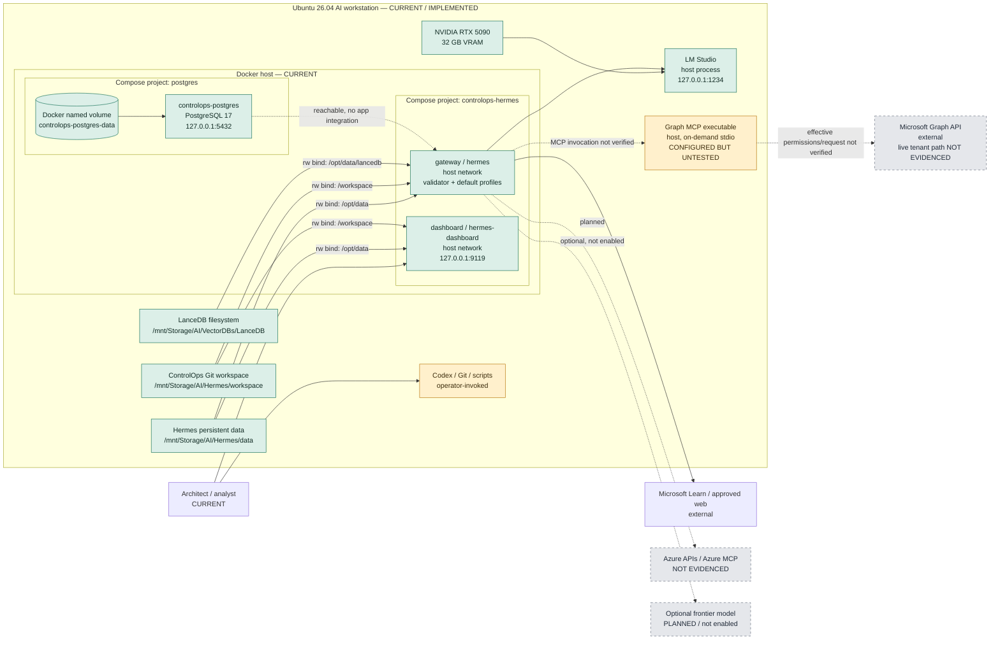

# ControlOps Deployment Architecture — Classification and Reality Assessment

## Document Control

| Field | Value |
| --- | --- |
| Status | Draft — repository- and runtime-grounded internal assessment |
| Version | 0.1.0 |
| Assessment date | 16 August 2026 |
| ControlOps repository commit | `c33603808fb70e071ce97c92cd55770036afc80e` |
| Hermes repository commit | `c998937` on branch `controlops-hermes-poc` |
| Working-tree state | Both repositories were materially dirty during inspection |
| Runtime verification | Read-only inspection on 16 August 2026 |
| Principal diagram | `05-ControlOps-Deployment-Architecture.png` |
| Intended audience | ControlOps architects, engineers, security reviewers, operational owners and technical partners |
| Purpose | Classify the actual workstation deployment, identify its production gaps and describe credible deployment evolution options |

## 1. Executive Summary

ControlOps is deployed today as a **single-developer-workstation controlled
proof of concept**. Its physical architecture is substantial enough to support
engineering work: Ubuntu 26.04, an NVIDIA RTX 5090, host-native LM Studio,
Dockerised Hermes gateway and dashboard, a separate healthy PostgreSQL 17
container, persistent host storage, a 3.8 GB filesystem-backed LanceDB store,
and an on-demand Microsoft Graph MCP executable. Representative agent and data
workflows have run on this environment.

It is not a production deployment architecture. There is one host, one
operator boundary, no environment separation, no workload identity, no
customer/tenant isolation, no central secrets service, no controlled ingress,
no service TLS, no egress policy, no central monitoring or alerting, no tested
disaster recovery, no CI/CD for the ControlOps repository and no resource
limits. Hermes and the dashboard use host networking, have writable root
filesystems and broad writable host mounts, and define no container health
checks. PostgreSQL has a better bounded deployment pattern—loopback-only port,
health check, named data volume, read-only initialisation mount and file-backed
secret—but remains a single local container with manual backup artefacts.

The supported deployment is also different from the supplied path model and
parts of the existing diagram. The active ControlOps Compose invocation mounts
`/mnt/Storage/AI/Hermes/data` at `/opt/data` and the Git workspace at
`/workspace`. It does not use `/home/proteu5/.hermes` as container state or
bind the workspace at `/opt/data/workspace`. A legacy directory exists at the
latter path inside persistent state, and an untracked Hermes override specifies
that older mapping, creating path ambiguity. The diagram additionally depicts
a gateway-to-PostgreSQL connection, a ControlOps RAG API and Azure MCP access
that are not implemented end to end.

The architecture is locally reproducible only with qualifications. Compose
files, lifecycle validation, dependency locks and database migrations exist,
but the build depends on a separate dirty Hermes clone, external LM Studio,
specific absolute host paths, manually managed model state, local secret files
and data stores outside Git. Reproducing the code topology is easier than
reproducing the complete operational state.

The present architecture is a reasonable foundation for a hardened
single-node engineering appliance and for discovering the contracts needed by
ControlOps. Production hosting should not be selected until one end-to-end
assurance workflow, its data boundaries and its tenant/isolation requirements
are stable.

## 2. Purpose, Scope and Classification

This document answers:

> What is the actual deployment architecture of ControlOps today, how
> production-like is it, and what architecture is required to turn the current
> development environment into a supportable ControlOps Assurance platform?

It separates five subjects that must not be collapsed:

1. the physical developer workstation and its host-managed dependencies;
2. the ControlOps logical/component architecture described in documents 01–04;
3. the Hermes application and agent execution runtime;
4. separately deployed data, knowledge and tool services; and
5. candidate future production deployment architectures.

The following status terms are used:

| Status | Meaning |
| --- | --- |
| **Implemented** | Configured capability was directly observed operating at the stated scope. |
| **Partially Implemented** | Useful working elements exist, but integration, scope or operating controls are incomplete. |
| **Experimental** | A proof-of-concept capability has run but is not a supported service boundary. |
| **Configured but Untested** | Configuration exists, but effective behaviour was not exercised or verified. |
| **Planned** | Repository documentation or diagrams establish intended near/medium-term capability without implementation. |
| **Target State** | A future production characteristic or option, not a selected implementation. |
| **Not Evidenced** | Inspection did not establish the claimed capability or connection. |

## 3. Evidence and Verification Basis

The assessment inspected:

- ControlOps deployment definitions and operations in
  `ops/compose.controlops.yaml`, `scripts/controlops`,
  `scripts/lib/controlops-common.sh`, `tests/operations/controlops-smoke.sh`,
  `docs/operations/hermes-runbook.md` and
  `docs/operations/service-inventory.md`;
- PostgreSQL Compose, migrations, validations and backups under
  `platform/postgres/`;
- validator definition, runtime policy, tests and generated artefacts under
  `agents/controlops-msft-validator/`;
- documents 01–04 and all five architecture diagrams;
- the separate Hermes repository at
  `/home/proteu5/AI/Hermes/hermes-agent`, including its Dockerfile, base
  Compose file, ControlOps and untracked overrides, entrypoint/s6 design,
  dependency locks and Git state; and
- live Docker metadata, processes, mounts, listeners, image IDs, PostgreSQL
  inventory, GPU identity, host OS, persistent state and LanceDB layout.

The current runtime contained:

- `hermes` and `hermes-dashboard`, each using the local `hermes-agent` image
  and running for approximately 52 minutes at inspection;
- `controlops-postgres`, using `postgres:17`, healthy and bound to
  `127.0.0.1:5432`;
- dashboard HTTP responding on `127.0.0.1:9119`;
- LM Studio responding on `127.0.0.1:1234` with the configured Qwen chat model
  and Nomic embedding model among several loaded/available models; and
- no Docker socket mounted into any inspected ControlOps container.

These are point-in-time facts, not uptime, supportability or recovery evidence.
No architecture-diagram source convention was found: the repository contains
PNG diagrams but no editable Mermaid/DOT/source files. This document therefore
adds an embedded Mermaid reality diagram and does not modify the existing PNG.

## 4. Actual Physical Deployment

### 4.1 Host

The deployment runs on one `x86_64` Ubuntu 26.04 workstation. Inspection found
approximately 96 GB RAM and an NVIDIA GeForce RTX 5090 with 32,607 MiB VRAM.
The ControlOps workspace and Hermes data/LanceDB paths reside under
`/mnt/Storage`, with the ControlOps workspace observed on an NTFS/FUSE
(`fuseblk`) filesystem. Docker's storage is on the host's ext4 root filesystem.

LM Studio runs directly on the host and uses the GPU. Docker, Git, Codex,
Python virtual environments, document tools and the Graph MCP executable are
also host-managed. None is lifecycle-managed by the Hermes Compose project.

### 4.2 Docker topology

There are two independent Compose projects:

- **`controlops-hermes`** combines the Hermes repository's
  `docker-compose.yml` with the ControlOps repository's
  `ops/compose.controlops.yaml`. It deploys `gateway` (`hermes`) and
  `dashboard` (`hermes-dashboard`).
- **`postgres`** uses `platform/postgres/compose.yaml` and deploys
  `controlops-postgres` on the `controlops-data` bridge network.

The projects have no Compose dependency or shared Docker network. Because the
Hermes services use host networking and PostgreSQL publishes loopback port
5432, a Hermes process could reach PostgreSQL through the host. No ControlOps
agent or service connection to PostgreSQL was found; network reachability is
not application integration.

### 4.3 Hermes image and runtime

Hermes source is copied into the image at `/opt/hermes`; the source repository
is not bind-mounted at runtime. The image uses s6-overlay as PID 1. Container
metadata reports `User=root`, because initialisation and supervisors run as
root, while live Hermes gateway/dashboard and s6-log processes were observed
running as the mapped host account `proteu5`. The image seals copied
`/opt/hermes` source against non-root writes and redirects permitted lazy
packages to persistent `/opt/data/lazy-packages`.

The gateway container runs two supervised profiles: the default gateway and
`controlops-msft-validator`. The dashboard runs as a separate container and
opens the validator profile. This proves agent-profile deployment; it does not
prove end-to-end assurance orchestration.

### 4.4 Data and knowledge services

PostgreSQL 17.10 was healthy and contained 1,562 permission definitions, six
pillars, 34 domains and 72 pilot review rows. It contained zero disagreement
rows. The physical tables remain limited to `raw`, `catalogue`, `operations`
and `permission_pilot`; the `evidence`, `assurance` and `reporting` schemas have
no tables. Evidence: `platform/postgres/init/` and live read-only SQL.

LanceDB is a 3.8 GB host filesystem store at
`/mnt/Storage/AI/VectorDBs/LanceDB`, mounted read/write into only the Hermes
gateway at `/opt/data/lancedb`. It is not a separate container or network
service. Document 02 records populated collections and experimental retrieval.
The runbook explicitly describes RAG as on-demand batch/filesystem capability
and assumes no RAG API.

## 5. Current Deployment Diagram

The existing diagram remains the principal published visual, but contains
target-state connections and stale paths qualified in section 6.

The following deployment view shows verified current placement with dashed
lines for unverified or planned integration.

## 6. Diagram and Configuration Reconciliation

The current PNG is directionally useful but is not an exact as-built diagram.

| Diagram or supplied statement | Verified reality | Assessment |
| --- | --- | --- |
| Hermes persistent data is `/home/proteu5/.hermes` | Supported Compose replaces the base `~/.hermes:/opt/data` bind with `/mnt/Storage/AI/Hermes/data:/opt/data` | Diagram/path statement is stale for the supported deployment |
| Workspace is `/opt/data/workspace` | Active bind is `/mnt/Storage/AI/Hermes/workspace:/workspace`; `/opt/data/workspace` exists only as a directory within persistent data | Active path is `/workspace`; legacy directory creates ambiguity |
| Gateway connects to PostgreSQL | Network reachability exists through `127.0.0.1:5432`; no agent/service persistence integration exists | **Not Evidenced** application connection |
| “ControlOps RAG Services” exposes ingestion, retrieval and context API | LanceDB and batch scripts exist; runbook assumes no RAG API and no RAG service process was established | **Experimental**, not a deployed service |
| Graph API provides tenant evidence retrieval | Graph MCP executable exists; effective permissions and an end-to-end request were not verified | **Configured but Untested** |
| Azure APIs/read-only access | No Azure MCP deployment/configuration was found | **Not Evidenced** |
| Optional frontier API | Validator fallback configuration is commented out; no execution observed | **Planned** |
| “No public ingress” | Current listeners are loopback-bound, but host networking has no network-policy boundary | True at inspection, not technically enforced as an immutable deployment policy |
| Ubuntu 26.04, RTX 5090, 96 GB RAM | Host inspection supports these approximate facts; GPU has 32 GB VRAM | **Implemented** host characteristics |

The Hermes clone contains three possible overrides: committed
`docker-compose.controlops.yml`, untracked `compose.override.yaml`, and the
workspace-owned `ops/compose.controlops.yaml`. Only the last is pinned by
`scripts/controlops` and appears in live container Compose labels. The others
are not part of the supported invocation. This is documented, but duplicated
configuration remains a maintenance and operator-error risk.

## 7. Deployment Component Status

| Component | Current Location | Deployment Method | Persistence | Security Boundary | Current Status | Evidence | Production Gap |
| --- | --- | --- | --- | --- | --- | --- | --- |
| Linux host | Single Ubuntu 26.04 workstation | Physical workstation | Local disks | Host account and OS | **Implemented** | `uname`, `/etc/os-release`, hardware inspection | Single point of failure; no hardened baseline or managed fleet |
| NVIDIA GPU | Host PCIe device | Host driver | N/A | Host | **Implemented** | `lspci`, `nvidia-smi` | No GPU health/capacity monitoring or redundancy |
| LM Studio | Host process, `127.0.0.1:1234` | Manually started desktop/runtime | Host-managed model/config files | Loopback listener | **Implemented** | Live HTTP 200 and model listing | External lifecycle, no service SLO, endpoint auth/TLS or model governance |
| Hermes gateway | Container `hermes` | Base Compose plus workspace override | `/opt/data` bind; workspace/LanceDB binds | Container plus application guardrails; host network | **Implemented** | Live container/process/mount inspection | No health check, caps/resource limits, egress policy or HA |
| Hermes dashboard | Container `hermes-dashboard` | Same Compose project | Shared `/opt/data` and workspace binds | Loopback listener; host network | **Implemented** | HTTP 200 at `127.0.0.1:9119` | Authentication/TLS/support boundary not established; shared sensitive state |
| Validator profile | Gateway-supervised process | Persistent Hermes profile | `/opt/data/profiles/controlops-msft-validator` | Agent config/prompt and filesystem policy | **Experimental** | Live process; agent files and representative runs | Policy enforcement incomplete; no deployment/version promotion process |
| Hermes source | `/home/proteu5/AI/Hermes/hermes-agent` | Separate dirty Git clone; baked into local image | Git checkout | Host filesystem, not runtime mount | **Partially Implemented** | Git state; image/Compose labels | Dirty build input, no immutable release promotion or registry provenance |
| ControlOps workspace | Host `/mnt/Storage/.../workspace`; container `/workspace` | Read/write bind into both Hermes containers | Host NTFS/FUSE filesystem and Git | Broad shared writable mount | **Implemented** | Live mounts and Compose | No per-agent isolation, immutable release artefact or environment promotion |
| Hermes state | Host `/mnt/Storage/AI/Hermes/data`; container `/opt/data` | Read/write bind | Host filesystem; 208 MB observed | Shared by gateway/dashboard | **Implemented** | Profiles, gateway logs and state observed | Local path dependency; backup/restore and corruption recovery untested |
| PostgreSQL | Container `controlops-postgres` | Independent Compose project | Named Docker volume on ext4 | Bridge network; loopback port; secret mount | **Implemented** | Healthy container and SQL query | Single instance; no HA, PITR, monitoring, migration service or tenant isolation |
| Assurance schemas | PostgreSQL | SQL init/migrations | Named volume | Database credentials | **Partially Implemented** | Catalogue/taxonomy/pilot populated; evidence/assurance/reporting empty | Logical platform incomplete; no service access boundary |
| LanceDB | Host `/mnt/Storage/AI/VectorDBs/LanceDB` | Filesystem library/store mounted into gateway | Host filesystem; 3.8 GB observed | Gateway has read/write mount | **Implemented** store, **Experimental** service use | Live tables; document 02 | No server/API, concurrency contract, access isolation, backup/restore or lifecycle control |
| RAG processing | Host scripts/separate local repository | Operator-invoked batch/filesystem | Host sources and LanceDB | Host and gateway filesystem | **Experimental** | Runbook and document 02 | No authenticated service, acceptance tests or operational ownership |
| Graph MCP | Host virtual environment, on-demand `stdio` | Spawned when invoked | Host venv/config | Intended read-only tool boundary | **Configured but Untested** | Doctor detects executable; service inventory | Effective identity, consent, permissions, audit and request path unverified |
| Azure MCP/tooling | Not deployed in ControlOps runtime | Architectural intent | None | Intended read-only | **Not Evidenced** | No configuration/process found | Connector, identity, permission and audit design absent |
| Authoritative web | External Internet | Agent web tooling | Evidence saved as workspace files | Outbound host-network access | **Experimental** | Validator runs | No egress allow-list enforcement, content isolation or central evidence store |
| Codex | Host/operator service | Manually invoked outside Hermes workflow | Provider/session dependent; outputs copied to SQL/docs | Separate external/model boundary | **Experimental** | Pilot prompt/migrations and documents | No orchestrated interface, model provenance or data-processing policy |
| Optional frontier models | External candidate | Commented fallback configuration | None established | External trust boundary | **Planned** | `agents/controlops-msft-validator/runtime/config.yaml` | No approval, routing, minimisation, residency or audit design |
| Backups | Three local PostgreSQL dump files | Apparently manual | Workspace backup directory | Same workstation | **Partially Implemented** | `platform/postgres/backups/` | No schedule, encryption evidence, off-host copy, retention or restore test |

## 8. Security Boundary Assessment

### 8.1 Enforced or directly observed controls

- Containers were not privileged and had no Docker socket mount.
- Hermes source is baked into `/opt/hermes`, not exposed as a writable source
  bind mount.
- Supervised Hermes application processes ran as the mapped non-root host user;
  root is retained for s6 initialisation/supervision.
- Dashboard, LM Studio and PostgreSQL listened on loopback only at inspection.
- PostgreSQL uses `no-new-privileges`, a read-only init mount, a read-only
  file-backed password secret and a secret file with host mode `0600`.
- PostgreSQL has a dedicated bridge network and persistent named volume.
- Agent configuration disables or denies multiple high-risk toolsets and
  operations, including Docker socket, Graph/Azure writes, cron, delegation,
  messaging and Git commit.
- Runtime preflight validates the exact Compose project, services, network
  mode, mounts, UID/GID and LM Studio configuration without printing secrets.

### 8.2 Documented principles or application controls, not proven isolation

- `HERMES_WRITE_SAFE_ROOT=/opt/data:/workspace` is an application filesystem
  control, not a kernel sandbox. Both roots are broad and writable; the
  gateway can modify the entire ControlOps Git workspace and LanceDB.
- The validator's approved write root and “no customer data” policy are agent
  configuration/instructions. Effective enforcement was not tested. Its
  `execution_policy` mapping is empty because the intended limits are
  incorrectly indented under `security`.
- Read-only Graph/Azure philosophy is documented, but effective cloud identity
  and permissions were not verified.
- Human approval before publication/destructive action is policy and observed
  practice in development artefacts, not a central authorisation workflow.
- Local-first processing reduces an external boundary; it does not establish
  source authority, tenant isolation or confidentiality controls.

### 8.3 Material exposures and trust boundaries

Hermes uses host networking. It therefore shares the host network namespace
and receives no Docker bridge isolation or Compose-level egress restriction.
Current services bind to loopback, but a configuration change to `0.0.0.0`
would expose them through the host. No ingress proxy, TLS termination,
certificate management or network policy was found.

Hermes containers have writable root filesystems, default capabilities, no
`no-new-privileges`, no PID limit and no CPU/memory limits. Root supervisors
are expected by the image, but a compromise before privilege drop has a wider
container impact. Containers are not privileged and have no host PID namespace
or Docker socket, which materially limits—but does not eliminate—host risk.

The dashboard shares `/opt/data`, which may contain API credentials and session
state. Base Compose explicitly warns that LAN exposure without authentication
is unsafe. Its observed loopback binding is appropriate for the PoC.

The gateway can execute shell/file/web tools and reads untrusted downloaded
documents. Prompt injection and malicious content remain application risks.
Document 02 found no complete malicious-document control, authority taxonomy
or claim-level citation enforcement. Host networking permits outbound Internet
access; an “approved domains” prompt policy is not an egress allow-list.

No customer data should be admitted. There is no customer/tenant identity,
row-level database boundary, per-customer encryption, data residency policy or
deletion/export control.

## 9. Persistence and State

| State | Physical persistence | Restart/recreation behaviour | Qualification |
| --- | --- | --- | --- |
| Hermes configuration, profiles, sessions and agent state | `/mnt/Storage/AI/Hermes/data` bind at `/opt/data` | Survives container restart/recreation and host reboot if filesystem remains available | Host-path convention; profile sessions were stored deeper than a simple top-level file count |
| Gateway logs | s6 logs under `/opt/data/logs/gateways`; Docker `json-file` logs | s6 logs survive recreation; Docker logs follow container lifecycle | No central aggregation; s6 rotation is local (`n10`, 1 MB files) |
| ControlOps source, agents, tests and generated files | Git workspace bind at `/workspace` | Survives container operations and host reboot | Dirty working tree; generated evidence may be untracked; NTFS/FUSE semantics |
| Hermes application code | Baked image at `/opt/hermes` | Replaced only on image rebuild/recreate | Source updates do not change the running image automatically |
| PostgreSQL database | Docker named volume `controlops-postgres-data` | Survives container restart/recreation and Compose stop | Loss of Docker host/volume is not covered by tested recovery |
| PostgreSQL initialisation/migrations | Read-only workspace bind at `/docker-entrypoint-initdb.d` | Runs automatically only when a fresh database volume is initialised | Ordered init files are not a complete live migration/promotion system |
| PostgreSQL backups | Workspace `platform/postgres/backups/` bind at `/backups` | Survive container recreation | Three small manual dumps; no documented schedule or restore proof |
| LanceDB | Host directory mounted at `/opt/data/lancedb` in gateway | Survives container recreation/reboot | No managed backup, locking/concurrency or corruption recovery evidence |
| Generated validator evidence/reports | ControlOps workspace and/or persistent profile state | Survive if written under mounted paths | No common artefact registry, retention or approved publication state |
| LM Studio models/configuration | Host-managed LM Studio directories | Independent of Docker | Not managed, backed up or versioned by ControlOps deployment |
| Secrets | Postgres password in host config file; Hermes/provider state under `/opt/data` or external environment | Survives according to host files | No central secret rotation, inventory or recovery design |

`/home/proteu5/.hermes` is a separate native Hermes state tree and is not used
by the supported ControlOps Compose deployment. The base Compose default is
overridden. The legacy `/opt/data/workspace` directory should not be treated as
the active ControlOps workspace merely because it exists.

## 10. Operational Architecture

### 10.1 Implemented operations

`scripts/controlops` provides supported `start`, `stop`, `restart`, `status`,
`logs`, `doctor` and explicit `rebuild` commands. It pins both Compose files
and the project name, validates required dependencies and paths, renders and
checks effective Compose configuration, requires LM Studio before disruptive
start/restart/rebuild operations, waits up to 30 seconds for running containers
and dashboard response, and verifies actual mounts. Normal stop preserves
containers and volumes. Evidence: `scripts/controlops`, shared library and
`docs/operations/hermes-runbook.md`.

PostgreSQL has a real container health check using `pg_isready`. Hermes and the
dashboard have no Docker health checks; readiness is inferred from container
state and dashboard HTTP. Both Hermes services and PostgreSQL use
`restart: unless-stopped`. Dashboard `depends_on` gateway but not on gateway
health. PostgreSQL is a separate project with no declared dependency.

The Hermes Dockerfile uses pinned digests for its uv and Node source stages,
`uv.lock` with `uv sync --frozen`, and `package-lock.json`. Its final base is
`debian:13.4` without a digest, and local builds use a dirty source checkout.
PostgreSQL uses the floating major tag `postgres:17`, although the current
image is 17.10. ControlOps has no CI workflow or image registry/promotion
definition.

### 10.2 Missing or immature operations

- no service metrics, central log aggregation, alerts or distributed tracing;
- no agent/tool/model-call audit service joining calls to assurance run IDs;
- no token/cost, GPU, LM Studio or PostgreSQL performance monitoring;
- no CPU, memory, PID or GPU resource controls;
- no availability objectives, on-call model, support runbook or capacity plan;
- no automated backup, off-host copy, encryption evidence, retention or restore
  test for PostgreSQL, LanceDB or Hermes state;
- no disaster-recovery environment or documented recovery-time/recovery-point
  objectives;
- no controlled rollback beyond rebuilding/restarting local images and Git
  history;
- no dev/test/prod separation; Hermes profiles share one runtime and storage;
- no configuration promotion or infrastructure-as-code beyond local Compose;
- no ControlOps CI/CD, dependency scanning, SBOM/signing or image promotion;
- no managed patch cadence for the workstation, Docker images, models or local
  virtual environments; and
- no safe production upgrade path for an already populated database.

## 11. Operational Capability Status

| Capability | Implemented | Partially Implemented | Planned | Not Evidenced | Notes |
| --- | :---: | :---: | :---: | :---: | --- |
| Reproducible Compose invocation | ✓ |  |  |  | Exact files/project pinned and effective config checked |
| Service startup ordering |  | ✓ |  |  | LM Studio preflight and dashboard dependency; Postgres independent |
| Hermes health checks |  |  |  | ✓ | Runtime HTTP/state checks exist; no container health check |
| PostgreSQL health check | ✓ |  |  |  | `pg_isready` and healthy at inspection |
| Restart behaviour | ✓ |  |  |  | `unless-stopped` for all three containers |
| Non-root application process | ✓ |  |  |  | Root s6 bootstrap; live app processes run as mapped user |
| Resource limits |  |  |  | ✓ | None configured |
| Local persistent state | ✓ |  |  |  | Host binds and named Postgres volume |
| Automated backup/restore |  |  |  | ✓ | Manual dump artefacts only; restore not tested |
| Central logs/metrics/alerts |  |  |  | ✓ | Local s6 and Docker logs only |
| Execution/model/tool audit |  | ✓ |  |  | Local sessions/run logs; no unified assurance audit trail |
| Secrets outside Git/image |  | ✓ |  |  | Postgres secret file good; broader inventory/rotation absent |
| Network exposure control |  | ✓ |  |  | Loopback listeners currently; host network and no egress policy |
| TLS/certificate management |  |  |  | ✓ | No production ingress or TLS layer |
| Graph MCP availability |  | ✓ |  |  | Executable present; effective use untested |
| Azure integration |  |  | ✓ | ✓ | Desired read-only boundary; no deployment found |
| RAG service/API |  |  | ✓ | ✓ | Filesystem batch capability only |
| Dev/test/prod separation |  |  |  | ✓ | One workstation/runtime/data estate |
| CI/CD and release promotion |  |  |  | ✓ | No ControlOps pipeline; local dirty build inputs |
| Customer/tenant isolation |  |  | ✓ | ✓ | Production requirement; mechanism undecided |
| Disaster recovery |  |  |  | ✓ | No tested recovery architecture |

## 12. Environment Classification

The complete environment is best classified as a **Controlled PoC on a
Developer Workstation**.

It is more controlled than an ad hoc developer setup because it has a pinned
Compose invocation, runtime preflight, persistent mounts, non-root application
processes, loopback service bindings, a Postgres health check, restrictive
agent policies, source-controlled migrations and representative test
artefacts. It is not an integration environment in the usual operational
sense because there is no environment promotion, shared release baseline,
automated deployment pipeline or integrated end-to-end workflow.

Component classifications differ:

- Hermes lifecycle and local PostgreSQL deployment: **Implemented engineering
  components**;
- validator and RAG execution: **Experimental**;
- Graph MCP: **Configured but Untested**;
- assurance data platform: **Partially Implemented**;
- Azure integration, frontier arbitration and production reporting:
  **Not Evidenced/Planned**; and
- a multi-customer production platform: **Target State**.

## 13. Original Hermes Deployment Intent Assessment

| Original principle | Status | Evidence and qualification |
| --- | --- | --- |
| Dockerised runtime | **Implemented** | Gateway and dashboard run from one local image under supported Compose |
| Local LM Studio models | **Implemented** | Loopback API responded with configured chat/embedding models; lifecycle external to Compose |
| Optional frontier models | **Planned** | Commented fallback only; no approved processing path observed |
| Approved filesystem access | **Partially Implemented** | Explicit mounts and safe-root configuration; mounts are broad and read/write |
| ControlOps RAG integration | **Partially Implemented** | LanceDB mounted and batch capability present; no operational query service or validator integration proven |
| Read-only Graph access | **Configured but Untested** | Executable and policy exist; effective credentials/permissions/request absent |
| Read-only Azure access | **Not Evidenced** | Policy denies writes but no Azure MCP/configuration was found |
| Least privilege | **Partially Implemented** | Non-root app processes, no Docker socket, agent denies; default caps, root supervisors, broad mounts and host network remain |
| No unrestricted host access | **Partially Implemented** | No source or root filesystem bind and no Docker socket; host-network access and broad data/workspace mounts remain |
| No Docker socket | **Implemented** | Absent from live mounts |
| Human approval before privileged/destructive actions | **Partially Implemented** | Agent policy and development practice; no enforced approval service |
| Observable actions | **Partially Implemented** | Local gateway logs, sessions, validator run logs; no unified audit/metrics |
| Reproducible configuration | **Partially Implemented** | Pinned Compose command and lockfiles; absolute paths, dirty clones, local models/state and duplicate overrides |
| Bounded workflows | **Experimental** | Validator instruction budgets and tests; structural YAML defect and no orchestration enforcement proof |
| Experiment before production adoption | **Implemented** | Agent status `development`; docs explicitly qualify maturity |

## 14. Architecture Decisions Already Evidenced

The following are sufficiently repeated in configuration, code and operation
to be treated as current architectural decisions, while remaining revisable:

1. **Hermes is the local agent execution runtime.** It hosts the validator
   profile and persistent sessions; it is not yet the complete ControlOps
   workflow engine.
2. **Docker/Compose provides current runtime packaging and separation.** This is
   an engineering deployment decision, not evidence that Compose is the final
   production orchestrator.
3. **Local-first model processing through LM Studio is the default.** External
   frontier processing requires separate explicit governance.
4. **PostgreSQL is the current structured assurance-data system of record.** It
   has the strongest integrity controls, but most assurance schemas are empty
   and final production hosting is not selected.
5. **LanceDB is the current semantic knowledge store.** It is distinct from
   governed assurance state and currently filesystem-backed.
6. **ControlOps source and artefacts live in a separate Git workspace.** Hermes
   source remains a separate dependency/repository and is baked into the
   runtime image.
7. **Microsoft platform access should be read-only and least-privilege.** This
   is a governing principle; effective Graph/Azure implementation is not yet
   proven.
8. **Human approval takes precedence over autonomous publication or production
   change.** The agent denies production writes and requires review.
9. **No Docker socket is exposed to Hermes.** This is both configured and
   verified.

Experimental rather than established decisions include the exact local model,
Hermes profile/workspace conventions, Graph MCP implementation, RAG schemas,
Codex review hand-off and any frontier provider.

## 15. Current Deployment vs Production-Grade ControlOps

### 15.1 Production Readiness

| Domain | Current State | Target Capability | Gap Severity | Recommended Direction |
| --- | --- | --- | --- | --- |
| Compute | One high-spec workstation; no resource limits | Supported, capacity-managed compute with failure domain and lifecycle | **Critical** | Measure workload and select single-node appliance or managed runtime based on requirements |
| Container orchestration | Two local Compose projects | Declarative deployment, health/dependency control, rollout and recovery | **High** | First consolidate service contracts; later choose appliance Compose or managed orchestration |
| Identity | Host user and local DB credential; no workload/customer identity | Workload identities, operator RBAC and tenant-scoped authorisation | **Critical** | Define identity model before customer data or remote APIs |
| Secrets | File-backed Postgres secret; other state/provider credentials local | Central inventory, least privilege, rotation and audit | **High** | Standardise secret references; candidate managed vault only after hosting choice |
| Networking | Hermes host network; services loopback; Postgres bridge/loopback | Explicit ingress/egress, private service paths, segmentation and policy | **Critical** | Document flows, remove unnecessary host networking where feasible, enforce egress and ingress |
| Ingress/TLS/certificates | No supported remote ingress or TLS | Authenticated TLS ingress with certificate lifecycle | **High** | Keep loopback for PoC; design only when remote consumers are approved |
| Data persistence | Local binds plus one Docker volume | Managed durable storage, lifecycle, encryption and tested recovery | **Critical** | Define data classes, backup/restore and volume ownership before scaling |
| PostgreSQL | Healthy single container; populated prototype schemas | Supported database with migrations, HA/PITR, monitoring and tenant model | **Critical** | Establish migration/versioning and restore first; managed PostgreSQL is a candidate, not selected |
| Vector/RAG storage | 3.8 GB writable filesystem LanceDB | Governed source lifecycle, backup, concurrency and access isolation | **High** | Stabilise retrieval contract and evaluate store topology after load/security requirements |
| Monitoring | Local status/doctor/logs | Metrics, logs, traces, alerts, dashboards and SLOs | **Critical** | Add run/service correlation, dependency probes and central collection in the engineering environment |
| Audit | Session, s6 and validator files; DB review records | Tamper-resistant user/agent/tool/model/data-change audit | **Critical** | Define assurance run ID and audit schema across every boundary |
| Resilience | Restart policy on one host | Multi-failure recovery appropriate to service commitments | **Critical** | Prove backup/restore before HA; then set RTO/RPO and failure domains |
| Backups | Three local manual Postgres dumps; none evidenced for other stores | Automated encrypted off-host backups and restore testing | **Critical** | Inventory all state and run scheduled restore exercises |
| Environment isolation | One host/data estate; profiles share runtime | Separate dev/test/prod identities, data, config and deployment promotion | **Critical** | Establish a second clean test estate before production design |
| CI/CD | No ControlOps pipeline; dirty local builds | Tested, signed, traceable builds and controlled promotion | **High** | Add lint/test/schema/image pipeline and immutable version metadata |
| Configuration management | Compose and absolute host paths; duplicate overrides | Versioned environment config with validation and drift control | **High** | Remove legacy override ambiguity; parameterise paths without hiding topology |
| Software supply chain | Some pinned base digests and lockfiles; local image, floating final bases | SBOM, vulnerability policy, signed images/dependencies and provenance | **High** | Pin remaining bases, generate SBOM and publish immutable internal artefacts |
| Dependency management | `uv.lock`, package lock, several host venvs/models | Managed update cadence and compatibility testing | **Moderate** | Inventory host/runtime/model dependencies and test upgrades |
| Customer/tenant isolation | None; customer data explicitly disallowed | Enforced compute/data/query and reporting isolation | **Critical** | Decide isolation model from assurance data requirements before onboarding |
| Data classification/residency | No production policy | Classified flows, minimisation, residency, retention and deletion | **Critical** | Complete data-flow/threat/privacy design before hosting selection |
| Model governance | Local models manually loaded; incomplete provenance | Approved endpoints/models, versions, evaluation, routing and disclosure | **High** | Registry and capture model/prompt/context provenance per run |
| Tool governance | Agent allow/deny policy; Graph untested; shell available | Enforced scoped credentials, audited calls and approval gates | **Critical** | Put tools behind authenticated, narrow service contracts |
| Human approval | Policy and manual practice | Enforced roles, decisions, segregation and publication transitions | **Critical** | Productise review state before customer output |
| Evidence integrity/provenance | File artefacts plus catalogue hashes; general evidence schema empty | Immutable evidence, lineage, signatures/hashes and retention | **Critical** | Implement one end-to-end evidence spine identified in document 04 |
| Disaster recovery/supportability | Not defined | Tested recovery, runbooks, ownership, incident/change management | **Critical** | Set support model and restore tests before availability claims |

### 15.2 What prevents production deployment

The blocking issues are not the absence of Kubernetes or a particular cloud
service. They are missing service and assurance contracts:

- no proven customer/tenant identity and isolation boundary;
- no governed end-to-end evidence/assurance transaction;
- no controlled agent/tool write interface or unified audit trail;
- no supported environment promotion and immutable build provenance;
- no complete secret, network, data classification and model-governance design;
- no monitoring, alerting, service objectives or operational ownership; and
- no automated, off-host, tested recovery for all material state.

Changing the hosting technology without resolving these would reproduce the
prototype's risks at greater scale.

## 16. Future Deployment Options

These are credible options, not approved designs.

### Option A — Enhanced Single-Node ControlOps

Harden the current Linux host into a controlled appliance-style deployment:

- versioned/signed images and a clean, reproducible host baseline;
- consistent Compose topology for Hermes, PostgreSQL and any approved RAG API;
- local LM Studio or a supportable local inference server;
- non-root services, reduced capabilities, read-only roots where compatible,
  resource limits and narrower mounts;
- explicit loopback/private ingress, firewall and egress controls;
- central-on-node monitoring plus off-node alert/backup targets;
- encrypted storage, secret rotation and tested restore; and
- a documented operator, patch and support model.

This option suits internal engineering, isolated demonstrations, a controlled
single-customer appliance or environments requiring local inference/data. It
retains a single failure domain and makes fleet upgrades, remote support,
multi-customer isolation and high availability difficult. It should not be
called production-grade merely because the workstation is hardened.

### Option B — Hybrid ControlOps

Keep selected inference or evidence processing local/private while hosting
governed ControlOps services centrally. Candidate capabilities include a
managed application/runtime tier, managed identity, a secret vault, managed
PostgreSQL, object storage, central monitoring and private connectivity. Azure
Container Apps/AKS, Key Vault, Azure Database for PostgreSQL, Azure Monitor and
private endpoints are examples of candidate technologies, not selections.

Hybrid deployment can preserve local-model or data-residency requirements
while centralising assurance state, review and operations. It introduces hard
problems: reliable site-to-cloud identity, offline/error semantics, evidence
transfer minimisation, version compatibility, customer network deployment and
split observability. It becomes credible only after the assessment/evidence
API and tenant model are stable.

### Option C — Azure-Native ControlOps Platform

A fully managed Azure option would logically require:

- a supported container/application runtime and controlled workflow execution;
- Microsoft Entra workload/operator identity and explicit customer tenancy;
- managed secrets and certificates;
- managed relational and artefact/object persistence with backup/PITR;
- private networking, controlled ingress/egress and policy enforcement;
- central logs, metrics, traces, audit and security monitoring;
- approved model endpoints and model-governance controls;
- a supported vector/retrieval layer with source and tenant isolation; and
- resilience, deployment promotion, incident response and support ownership.

Candidate Azure technologies should be selected through requirements and
threat/data-flow analysis rather than copied from a generic landing-zone list.
Azure-native deployment would not by itself make model output authoritative or
complete the missing assurance workflow.

### Option comparison

| Consideration | Enhanced single-node | Hybrid | Azure-native |
| --- | --- | --- | --- |
| Best fit | Internal/isolated PoC, appliance, local-data use | Mixed residency/inference with central assurance | Multi-customer managed service |
| Change from current estate | Lowest | Moderate/high | Highest |
| Local model support | Natural | Explicit split | Requires approved hosted/private GPU approach |
| High availability | Limited | Central services possible | Designed into managed services/runtime |
| Customer isolation | Difficult, often one node/customer | Central tenant model plus site boundary | Must be designed across identity/data/runtime |
| Operational burden | Host/fleet management | Split local/cloud operations | Cloud platform and service operations |
| Appropriate next decision? | Yes, for stabilising engineering | Explore after API/data contracts | Premature as a detailed solution design |

## 17. Relationship to Architecture Documents 01–04

- **Document 01** defines ControlOps system boundaries and correctly describes
  a local-first PoC. Deployment evidence supports the running Hermes,
  PostgreSQL and LanceDB foundation but not broader agents or cloud connectors.
- **Document 02** separates semantic knowledge from governed assurance state.
  Physically, LanceDB is a writable host mount and batch capability, not a
  production RAG service. Its provenance, concurrency and recovery gaps remain.
- **Document 03** identifies PostgreSQL as the structured system of record.
  Deployment supports catalogue/taxonomy/pilot persistence, but not the empty
  evidence/assurance/reporting layers, tenant isolation or production database
  controls.
- **Document 04** concludes that the operator—not Hermes—joins the assurance
  lifecycle. The physical deployment confirms that finding: tools and stores
  coexist on one host, but no deployed workflow/API connects question,
  collection, evidence, review, verdict and report.

The deployment is adequate to continue engineering the missing contracts. It
does not compensate for them.

## 18. Key Findings

1. **ControlOps has a substantial local engineering foundation, not a
   production platform.** Three healthy/running containers, local inference,
   persistent stores and operational scripts are real capabilities.
2. **The supported as-built topology is clearer than the repository's legacy
   alternatives, but still workstation-specific.** Absolute paths, two dirty
   repositories, an external model runtime and manual data stores constrain
   reproduction.
3. **PostgreSQL is the most production-shaped component.** It has loopback
   binding, health, secret file, named volume and constraints, but remains a
   single unmanaged instance with prototype schemas and manual backups.
4. **Hermes isolation is appropriate only for a controlled PoC.** No Docker
   socket and non-root app processes are strengths; host networking, broad
   writable mounts, root supervisors, default capabilities and absent resource
   controls are material limitations.
5. **RAG is storage and batch code, not an operational service.** The existing
   diagram overstates API/service integration.
6. **Co-location is being mistaken for integration in parts of the target
   diagram.** PostgreSQL, LanceDB, MCP and Hermes are reachable or mounted, but
   the end-to-end assurance data flow remains manual.
7. **Persistence exists; recovery architecture does not.** Local binds and a
   Docker volume survive restarts, but no complete off-host backup and restore
   proof exists.
8. **The largest risk is single-host, single-operator coupling combined with
   missing customer and assurance boundaries.** Hardware failure, operator
   error or host compromise affects runtime, models, workspace, knowledge and
   most state simultaneously.

## 19. Recommended Deployment Roadmap

### Phase 1 — Stabilise the Existing Engineering Environment

1. Declare the workspace-owned override as the only supported ControlOps
   topology and archive/remove ambiguity from legacy overrides when authorised.
   Correct all diagrams/runbooks to `/mnt/Storage/AI/Hermes/data:/opt/data` and
   `/mnt/Storage/AI/Hermes/workspace:/workspace`.
2. Produce an automated, non-secret deployment inventory: host dependencies,
   image IDs/build SHA, model IDs, effective Compose hash, mounts, listeners,
   database migration state and LanceDB schema versions.
3. Pin remaining base/database images and build only from clean commits. Add
   ControlOps CI for shell/YAML/SQL/Python validation, image scanning and SBOM.
4. Add Hermes health checks, resource limits, log rotation and dependency
   probes. Assess removal of host networking and reduction of caps/writable
   mounts without breaking Hermes supervision.
5. Inventory every state path and secret. Automate encrypted off-host backups
   for PostgreSQL, Hermes state, workspace artefacts and LanceDB, then prove
   restore to a clean host.
6. Correct the validator `execution_policy` YAML structure and test actual
   enforcement rather than relying on SOUL text.

**Evidence of completion:** a clean machine can reproduce the declared
engineering environment from versioned artefacts; health and restore tests
pass without undocumented local state.

### Phase 2 — Establish a Repeatable ControlOps Runtime

1. Separate development and clean integration estates, including distinct
   secrets, Postgres volumes, LanceDB data and model configuration.
2. Define explicit service contracts for model inference, RAG retrieval,
   PostgreSQL access and Graph collection. Do not grant agents raw database or
   broad filesystem access where a narrow API can enforce scope.
3. Add authenticated execution identities, immutable run IDs and correlated
   service/agent/tool/model audit records.
4. Containerise or formally manage host dependencies only where doing so
   improves reproducibility; LM Studio may remain external if its lifecycle,
   health, version and security contract is explicit.
5. Add controlled deployment promotion and rollback for Hermes image, agent
   definitions, database migrations and knowledge indexes.

**Evidence of completion:** the same versioned assessment component deploys to
development and integration through an automated promotion path and produces a
correlated audit trail.

### Phase 3 — Build a Controlled Assurance Execution Environment

1. Implement the narrow end-to-end assurance transaction recommended in
   document 04, including scoped live evidence, provenance, evaluation, human
   approval, persisted verdict and generated report.
2. Enforce least-privilege Graph identity and prove denied write operations;
   introduce Azure tooling only against an approved control/use case.
3. Productise review/adjudication, tenant scope, failure/retry semantics and
   publication state.
4. Define data classification, retention, evidence integrity and model/tool
   governance around that executable flow.

**Evidence of completion:** an integration test traces one approved result from
raw tenant evidence through every service and human decision, survives failure
and recovery, and cannot cross tenant or approval boundaries.

### Phase 4 — Design Production Hosting

Only after phases 1–3 establish stable contracts should ControlOps choose
single-node appliance, hybrid or Azure-native hosting. The decision should be
driven by customer isolation, data residency, scale, availability, support and
model-processing requirements. Then design workload identity, private
networking, managed persistence, resilience, observability, CI/CD, incident
response and service ownership for that option.

**Evidence of completion:** an approved production architecture, threat model,
data-flow assessment, service objectives, recovery test and operational
acceptance criteria exist before customer onboarding.

## 20. Assumptions and Unresolved Questions

### Assumptions

- Point-in-time runtime inspection represents the supported local PoC topology,
  not historical availability or a committed production design.
- `/mnt/Storage/AI/Hermes/data` and LanceDB are intended to persist across host
  reboot; mount availability and filesystem recovery were not tested.
- The local architecture is not currently authorised for production customer
  data, consistent with validator configuration.

### Unresolved questions

- What created and still uses the legacy `/opt/data/workspace` directory, and
  can it be retired without losing profile-local state?
- Which component is intended to own the future PostgreSQL service/API
  boundary and database migrations after initialisation?
- What effective Microsoft Graph identity and permissions will be used for the
  first live evidence collector?
- Is LM Studio the supportable long-term local inference runtime or only a PoC
  dependency?
- What customer/data isolation and residency requirements should drive the
  production-hosting choice?
- Which state requires evidential immutability versus operational backup, and
  what RTO/RPO is required?
- Does Hermes host networking remain necessary after the agent/tool contracts
  are stabilised?

## 21. Architecture Verdict

1. **What exists today?** A single Ubuntu AI workstation running host-native
   LM Studio and tooling, a two-container Hermes Compose stack, an independent
   PostgreSQL container, persistent host mounts and a filesystem LanceDB store.
2. **How reproducible is it?** The Compose topology and database structures are
   reasonably repeatable, but the complete estate is only partially
   reproducible because it depends on absolute paths, dirty repositories,
   external model state, host venvs, local secrets and unversioned data.
3. **How secure is it for its PoC purpose?** Reasonable under a trusted local
   operator: loopback listeners, no Docker socket, non-root app processes and
   Postgres secret/health controls are meaningful. It is not suitable for
   untrusted users or customer data because host networking, broad writable
   mounts, default container capabilities and missing identity/audit/isolation
   controls remain.
4. **How operationally mature is it?** Engineering-prototype maturity: useful
   lifecycle/preflight and local persistence, but no central observability,
   environment promotion, capacity controls, tested recovery or support model.
5. **Largest risks?** Single-host failure/compromise, configuration/path drift,
   dirty/untraceable builds, local-state loss, unrestricted outbound/tool
   behaviour and absence of customer/assurance isolation.
6. **What prevents production deployment?** Missing workload/customer identity,
   tenant isolation, governed evidence flow, service APIs, audit, secrets and
   network governance, monitoring, CI/CD and tested disaster recovery.
7. **Is it a reasonable foundation?** Yes. It is a credible controlled PoC and
   an appropriate environment in which to prove service/data contracts. Its
   physical topology should not be promoted unchanged into production.
8. **What should be built next?** Stabilise and reproduce the current estate,
   prove backup/restore and enforcement boundaries, then deploy one integrated
   assurance transaction in a separate clean integration environment.

## 22. Related Documents

- [ControlOps Assurance Intelligence — Contextual Architecture](01-controlops-contextual-architecture.md)
- [ControlOps Knowledge and RAG — Component Architecture](02-controlops-knowledge-rag-component-architecture.md)
- [ControlOps Assurance Data Platform — Logical Data Architecture](03-controlops-assurance-data-platform-logical-data-architecture.md)
- [ControlOps End-to-End Assurance Process and Reality Assessment](04-controlops-end-to-end-assurance-process-and-reality-assessment.md)
- [Current deployment architecture diagram](diagrams/05-ControlOps-Deployment-Architecture.png)

## 23. Document History

| Version | Date | Description |
| --- | --- | --- |
| 0.1.0 | 16 August 2026 | Initial repository- and runtime-grounded deployment architecture classification and production-gap assessment |
