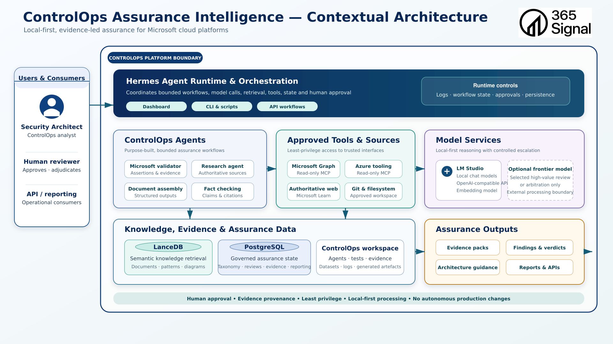

# ControlOps Assurance Intelligence — Contextual Architecture

Independent architecture assessment of the ControlOps system context.

This document is a repository- and runtime-grounded review. It does not treat
existing architecture prose, diagrams or previous assessments as proof that a
capability is implemented.

---

## Document Control

| Field | Value |
| --- | --- |
| Status | Draft — independent repository- and runtime-grounded assessment |
| Version | 0.1.0 |
| Assessment date | 16 August 2026 |
| Intended audience | Prospective partners, security architects, Microsoft specialists, ControlOps analysts and internal maintainers |
| Principal diagram | `docs/architecture/diagrams/01-ControlOps-Assurance-Intelligence-Contextual-Architecture.png` |
| Diagram revision | Not specified on the image |
| Repository root | `/mnt/Storage/AI/Hermes/workspace` |
| Repository commit | `c33603808fb70e071ce97c92cd55770036afc80e` |
| Working-tree state | Dirty — tracked modifications and a large untracked set, including this document, were present during review |
| Hermes source | Separate local repository at `/home/proteu5/AI/Hermes/hermes-agent`, commit `c998937` on branch `controlops-hermes-poc` (working tree also dirty) |
| Runtime verification | Read-only inspection on 16 August 2026 |
| Document owner | 365signal / Jon Bruce |
| Assessment purpose | Explain the ControlOps system context and record what is implemented, experimental, planned or unverified |
| Related Codex assessment | [`01-controlops-contextual-architecture.md`](01-controlops-contextual-architecture.md) — inspected for context only; not treated as authoritative and not modified |

# Part I — Partner Architecture Overview

## 1. Purpose and Intended Audience

This document explains the ControlOps Assurance Intelligence context to
technically sophisticated readers: prospective clients and partners, security
architects, Microsoft specialists and internal maintainers.

It answers four questions:

1. What is ControlOps intended to be?
2. What are the major architectural components and how do they interact?
3. What exists on this workstation today, with evidence?
4. Where are the boundaries, gaps and target-state ideas?

The contextual architecture diagram is the principal visual reference. A box,
arrow, directory, schema name, template or design document is not evidence that
the corresponding capability is implemented. Repository artefacts and
read-only runtime observations take precedence over prose.

## 2. Executive Summary

ControlOps is a local-first, evidence-led proof of concept for Microsoft cloud
assurance. It is intended to help a human analyst test Microsoft 365, Microsoft
Entra and Azure technical claims against authoritative sources, retain
traceable evidence, and eventually hold governed assurance state that can be
compared over time.

What exists today is a set of credible, only loosely joined components:

- a Dockerised Hermes gateway and dashboard, managed by ControlOps lifecycle
  scripts;
- one development-status Microsoft technical validator, with behavioural
  contracts and two representative validation exercises;
- a host-native LM Studio service currently advertising the configured local
  chat model and local embedding models;
- a filesystem-backed LanceDB store and a separately maintained local RAG
  project;
- a PostgreSQL 17 catalogue, taxonomy and Graph-permission classification
  pilot, with validation SQL and live data.

These components do **not** yet form one governed assurance transaction.
Validator evidence is written as workspace files. PostgreSQL holds catalogue
and pilot-review data, not a populated evidence, assurance or reporting store.
There is no operational ControlOps assurance API. Microsoft Graph and Azure
tenant collection were not demonstrated from the Hermes runtime. Human review
is required by contract, but there is no general approval, adjudication or
publication workflow.

The intended outcome is not autonomous compliance. It is faster, more
consistent and more defensible human-led assurance. That proposition is
directionally supported by the contracts and pilots. It is not yet delivered
as an integrated platform.

## 3. Architecture Diagram

The image lives at
`docs/architecture/diagrams/01-ControlOps-Assurance-Intelligence-Contextual-Architecture.png`.
The title on the diagram is “ControlOps Assurance Intelligence — Contextual
Architecture”, with the subtitle “Local-first, evidence-led assurance for
Microsoft cloud platforms”.

The diagram mixes current-state and target-state context. The remainder of
this document qualifies each major block against repository and runtime
evidence.

## 4. What Problem ControlOps Is Intended to Solve

Microsoft cloud assessments are usually labour-intensive and point-in-time.
Evidence is gathered by hand, conclusions live in documents and spreadsheets,
and the link between an observation, a control, a decision and later change is
easy to lose.

ControlOps is intended to make that work repeatable:

- collect evidence in a consistent form;
- evaluate deterministic facts with governed rules where that is possible;
- use bounded specialist agents to accelerate research and analysis;
- keep material decisions under accountable human review;
- retain approved results as governed assurance state; and
- later compare new observations with that approved baseline.

The last of those steps is the “drift” proposition. It is an intended
evolution, not a current general capability.

## 5. Platform Boundary

The diagram draws a **ControlOps platform boundary** around Hermes
orchestration, ControlOps agents, approved tools, model integration, LanceDB,
PostgreSQL, the workspace and assurance outputs.

That boundary is a **system-context line**, not a network security zone.

Observed facts:

- Hermes gateway and dashboard use Docker `network_mode: host`.
- PostgreSQL is a separate Compose project and publishes only
  `127.0.0.1:5432`.
- The Hermes dashboard listens on `127.0.0.1:9119`.
- LM Studio listens on `127.0.0.1:1234`.
- Hermes source, LM Studio, Microsoft cloud services, Microsoft Learn, the
  local RAG project and any optional external model provider sit outside the
  ControlOps Git repository.

Microsoft tenant data is intended to remain in the source platform unless an
approved, least-privilege interface retrieves it. No such live retrieval was
observed from the Hermes container during this review.

Hermes source is deliberately not vendored. Live Hermes profile data is stored
under `/mnt/Storage/AI/Hermes/data` and is not committed to this repository.

## 6. Users and Consumers

| Actor | Intended role | Current evidence |
| --- | --- | --- |
| Security architect | Submits technical assertions; consumes evidence-backed findings | Validator task templates and two test claims exist |
| ControlOps analyst | Curates taxonomy; inspects and corrects classifications | Pilot reviewer `jon_bruce`; SQL-driven drafts and human corrections |
| Human reviewer | Approves, rejects or adjudicates material conclusions | Required by agent contract and report templates; no completed publication record observed |
| API / reporting consumers | Operational consumers of governed outputs | Named on the diagram only; no ControlOps assurance API or populated reporting schema |

The diagram places users outside the platform boundary, which is correct.
There is no implemented identity, role or segregation-of-duties model beyond
string reviewer identifiers in the permission pilot.

## 7. Hermes Runtime and Orchestration

Hermes Agent is the runtime. This repository owns the ControlOps deployment
overlay, lifecycle command, smoke test, runbook and agent contracts. It does
not contain Hermes source.

### What is implemented

- Compose project `controlops-hermes` overlays
  [`ops/compose.controlops.yaml`](../../ops/compose.controlops.yaml) on the
  upstream Hermes `docker-compose.yml`.
- [`scripts/controlops`](../../scripts/controlops) provides `start`, `stop`,
  `restart`, `status`, `logs`, `doctor` and `rebuild`.
- Start, restart and rebuild refuse to proceed if LM Studio
  `http://127.0.0.1:1234/v1/models` does not respond.
- The gateway is bound to three host paths: Hermes data, the ControlOps
  workspace and LanceDB. The dashboard has the first two only.
- No Docker socket is mounted into Hermes. Inspection of `/var/run/docker.sock`
  inside the gateway container confirmed it is absent.
- Runtime profile `controlops-msft-validator` is the active profile.

On 16 August 2026 both `hermes` and `hermes-dashboard` were running (image
`hermes-agent`, host networking, no Docker health check). The dashboard
returned HTTP 200. `bash scripts/controlops doctor` reported
**13 PASS, 2 WARN, 0 FAIL**. The warnings were dirty ControlOps and Hermes
worktrees. The operational smoke test passed.

### What the diagram overstates

- **API workflows.** The upstream Hermes API server remains commented out and
  requires `API_SERVER_KEY`. The ControlOps environment file sets only
  `HERMES_UID` and `HERMES_GID`. No ControlOps assurance API was observed.
- **Approvals as a runtime control.** Hermes persists logs, sessions and
  profile state. There is no implemented approval-state machine spanning
  agent runs, PostgreSQL reviews and publication.
- **Orchestration of multiple agents.** Only one ControlOps agent profile is
  defined and active.

Hermes profile `config.yaml` restricts toolsets and points the default model
at LM Studio. ControlOps [`agent.yaml`](../../agents/controlops-msft-validator/agent.yaml)
is a ControlOps-owned contract. A search of the Hermes source tree found no
consumer of `agent.yaml`. Behavioural limits are therefore primarily
instructional (`SOUL.md`) plus Hermes toolset disablement, not a verified
Hermes-native policy engine for that YAML file.

## 8. ControlOps Agents

The diagram shows four agent boxes: Microsoft validator, research agent,
document assembly and fact checking.

### Microsoft technical validator — experimental, present

The only defined ControlOps agent is `controlops-msft-validator`.

| Field | Value |
| --- | --- |
| Agent ID | `controlops-msft-validator` |
| Version | `0.1.0` |
| Status | `development` |
| Mission | Validate Microsoft 365, Entra, Azure and Microsoft security claims against approved sources |
| Human review | Mandatory before publication |

The contract tells the agent to extract a small number of assertions, search
approved Microsoft sources, inspect the pages, write evidence records, give
assertion-level and overall verdicts, run a lightweight fact-check pass, and
stop. Allowed verdicts are `true`, `false`, `partially_true`, `unsupported`
and `unresolved`. Model confidence is explicitly not evidence.

Two representative exercises exist:

- **Test 001 — Entra Connect.** Committed input only
  (`tests/test-001-entra-connect/input/task.yaml`). Generated reports and
  evidence are untracked. One completed report (`run-20260726-113827`) judged
  the claim true against two Microsoft Learn pages, recorded a fact-check
  pass, and left human review **Pending**.
- **Test 002 — ExpressRoute tenant isolation.** The committed artefact is the
  test brief (`test.md`). Untracked run files record a high-confidence
  contradiction of the claim from two Microsoft Learn sources. The run log
  uses partial `xx` timestamps, which does not meet the agent’s own
  exact-runtime-timestamp rule.

The validator is an evidence assistant, not an assurance authority. That
wording is in the agent’s own instructions.

### Research, document assembly and fact checking — not separately deployed

These diagram boxes are architectural roles, not separately defined agents.
No other `agents/*` directory exists. The validator embeds bounded research,
uses output templates, and requires a fact-check reread. Hermes tool
delegation is disabled in the validator profile. There is no multi-agent
handoff.

### Contract caveats

The working-tree `agent.yaml` appends execution limits after
`security.customer_data_allowed`. `execution_policy:` is an empty mapping
under `security`; `max_tool_calls` and related keys sit at document root.
Whether Hermes would honour those keys if it did parse the file was not
verified. The same limits are stated in `SOUL.md`, which is present in both
the repository and the deployed profile (418 lines each at inspection).

Empty agent directories (`schemas/`, `prompts/`, `runbooks/`, `tasks/`,
`evidence/`, `logs/`, `outputs/`) are scaffolding, not implemented subsystems.

## 9. Approved Tools and Sources

The diagram states “least-privilege access to trusted interfaces”.

| Diagram box | Intended use | Evidence | Status |
| --- | --- | --- | --- |
| Microsoft Graph, read-only MCP | On-demand `stdio` Graph access | Host executable `/home/proteu5/.venvs/controlops-graph-mcp/bin/controlops-mcp` exists; doctor reports it; **the Hermes container cannot see that path**; no Graph request was issued | Configured on the host; **not verified in the runtime** |
| Azure tooling, read-only MCP | Read-only Azure collection | No Azure MCP configuration, inventory entry, container executable or process. Host has `/usr/bin/az`; the Hermes container does not. Validator policy denies `azure_write` | **Not evidenced** |
| Authoritative web / Microsoft Learn | Claim validation | Validator source policy; test artefacts cite Learn URLs; web toolset is enabled | Experimental, demonstrated in test artefacts |
| Git and filesystem | Inspect and write approved artefacts | Workspace and Hermes data mounts; validator write root is the agent directory; `git_commit` is denied | Implemented as mounts and policy text |

Additional tool facts:

- The validator allow-list includes web search/extract, terminal, process and
  file tools. It denies browser automation, code execution, memory, task
  delegation, cron, computer use, Graph/Azure writes, Docker socket, Git
  commit, email and external messaging.
- Search snippets are not to be treated as evidence.
- Enabling MCP servers is forbidden by `SOUL.md`.
- Host networking means a process that did obtain Graph or Azure credentials
  would not be confined by a Compose network.

Graph MCP presence on the host is not the same thing as a working,
least-privilege, container-invoked collection path.

## 10. Model Services

The diagram shows local-first reasoning with optional external escalation.

### LM Studio — configured and currently available

Validator and Hermes profile configuration:

- provider: `lmstudio`
- model: `lmstudio-community/qwen3.6-35b-a3b`
- base URL: `http://127.0.0.1:1234/v1`

On 16 August 2026 `GET /v1/models` returned HTTP 200 and advertised 11
models, including the configured chat model and
`text-embedding-nomic-embed-text-v1.5` variants. A `llama-server` process was
listening locally. This review did not send a chat completion or independently
score model quality.

The separately maintained RAG project uses the same loopback OpenAI-compatible
endpoint for embeddings (`text-embedding-nomic-embed-text-v1.5@q8_0`).

Local execution does not confer evidential authority. Source provenance,
deterministic query results and human decisions remain distinct from model
output.

### Optional frontier model — planned / not enabled

The diagram’s dashed “optional frontier model” box matches commented
`fallback_model` examples in the validator `runtime/config.yaml`. No external
provider is enabled. Any future use would cross an information-processing
boundary and needs an explicit data-classification, minimisation and approval
decision. That decision is not present as an implemented control.

## 11. Knowledge, Evidence and Assurance Data

The most important architectural distinction in the diagram is this:

**Retrieval is not governed assurance evidence.**

A semantic match can help an analyst investigate a question. It does not
become an assurance decision because a model found it relevant.

### LanceDB — experimental retrieval store

LanceDB is mounted read/write into the Hermes gateway at `/opt/data/lancedb`
from `/mnt/Storage/AI/VectorDBs/LanceDB` (about 3.8 GB). Observed tables
include Microsoft Learn catalogue, technical-document versions, architecture
patterns, framework controls, general knowledge and multimodal diagram
stores. The largest table, `m365_general_knowledge.lance`, is about 2.0 GB.

Ingestion is not implemented inside Hermes. It depends on:

- the untracked ControlOps script
  [`agents/controlops-msft-validator/scripts/ingest_learn_catalog.py`](../../agents/controlops-msft-validator/scripts/ingest_learn_catalog.py),
  which labels Learn catalogue rows as `evidence_classification: discovery_index`;
- the separately maintained project at `/mnt/Storage/AI/RAG/MultimodalIngest`.

That RAG project’s default `LANCEDB_PATH` is
`/run/media/proteu5/Storage/AI/VectorDBs/LanceDB`, which is not the path
ControlOps mounts. Whether live ingestion currently writes to the mounted
store was not revalidated. No RAG HTTP API is assumed by the ControlOps
runbook. Retrieval quality and source freshness were not independently
measured.

**LanceDB is not the governed assurance record.**

### PostgreSQL — implemented catalogue and pilot; planned broader record

PostgreSQL 17 runs as `controlops-postgres`, healthy, on an isolated
`controlops-data` network, published only on loopback. The password is a
Docker secret from `/home/proteu5/.config/controlops/postgres/postgres_password`,
not from the repository. The example environment file contains no password.

Read-only inspection on 16 August 2026:

| Object | Observation |
| --- | --- |
| Schemas | `catalogue`, `raw`, `operations`, `permission_pilot`, plus empty `evidence`, `assurance`, `reporting` |
| Current Graph permissions | 1,562, all marked current |
| Taxonomy | 6 pillars, 34 domains |
| Import runs | 2 successful catalogue imports on 2 August 2026 |
| Pilot | `MSGRAPH_PERMISSION_CLASSIFICATION_FINAL_36`, status `approved`, 36 selections |
| Reviews | 72 rows: 8 analyst submitted, 28 analyst draft, 36 Codex submitted |
| `catalogue.permission_classification` | 0 rows — pilot reviews have not been promoted |
| `disagreement`, `schema_gap`, `candidate_classification_rule` | tables exist, 0 rows |
| `evidence`, `assurance`, `reporting` | schemas only; no tables |

The six pillars are Identity and Access; Data Protection and Governance;
Security Operations; Infrastructure and Platform; Applications and Workloads;
and Governance, Risk and Compliance.

The Graph permission pilot is the strongest governed-data demonstration in
the repository. Analyst and independent AI (`reviewer_kind = 'codex'`) records
are stored separately. Uncommitted migrations `010`–`012` match the live
analyst-draft and human-correction state; those files do not yet have commit
provenance.

Dump files exist under `platform/postgres/backups/` (latest
`controlops-before-pilot-20260803-230001.dump`). No restore test was
performed.

PostgreSQL is a separate Compose stack from Hermes. This review found no
application connection from the validator or Hermes profile to PostgreSQL.

### ControlOps workspace

The Git workspace holds agent definitions, templates, tests, SQL, operational
scripts, documentation and generated artefacts. An artefact is not governed
merely because it sits in the workspace. Most generated validator outputs are
untracked.

## 12. Assurance Outputs

| Diagram box | Current evidence | Status |
| --- | --- | --- |
| Findings and verdicts | Validator report template and test reports | Experimental file artefacts |
| Evidence packs | Evidence-record template and per-run YAML/Markdown | Experimental; not a reusable pack product |
| Architecture guidance | No dedicated guidance product | Planned / not implemented |
| Reports and APIs | Markdown reports only; reporting schema empty; no API | Reports experimental; APIs planned |

Test 001 still shows human review pending. Nothing observed in this review
should be presented as a published assurance opinion.

## 13. How ControlOps Is Intended to Operate End to End

The intended contextual flow is:

1. A user defines an assurance question and its scope.
2. Hermes starts a bounded agent with approved tools.
3. Platform or documentary evidence is collected without changing production.
4. Relevant authoritative knowledge is retrieved with provenance.
5. Rules derive deterministic facts; agents assess judgement-led questions.
6. A human reviews or adjudicates material judgement.
7. Governed evidence, decisions and assurance state are persisted.
8. A traceable pack, finding, verdict, guidance item or report is issued to
   an authorised consumer.

What actually happens today is narrower and split across two manual tracks:

**Track A — documentary claim validation.** An operator prepares a task file,
runs the Microsoft validator in Hermes, and receives Markdown/YAML evidence
and a report that still requires human review. Those files are not loaded
into PostgreSQL.

**Track B — Graph permission classification pilot.** Catalogue JSON is
imported by a Python loader. SQL migrations and validation scripts load a
fixed 36-permission sample and persist separate analyst and Codex reviews.
Human corrections are applied by further SQL. Comparison and adjudication
structures exist, but no disagreement rows and no publication into
`catalogue.permission_classification` were observed.

There is no single workflow engine connecting those tracks.

# Part II — Implementation and Verification Record

## 14. Evidence Basis

This assessment was reconciled against:

- commit `c33603808fb70e071ce97c92cd55770036afc80e` and the material
  uncommitted tree;
- the contextual architecture diagram;
- Git history from the validator scaffold (`26632a6`) through the latest
  committed permission-pilot classification (`c336038`);
- ControlOps Compose, lifecycle scripts, smoke test, runbook and service
  inventory;
- the validator `agent.yaml`, `SOUL.md`, `runtime/config.yaml`, templates and
  recorded test artefacts;
- PostgreSQL init/validation SQL, the Graph importer and the pilot document;
- the untracked Learn-catalogue ingest script;
- read-only Docker, HTTP, filesystem and SQL observations on 16 August 2026;
- a limited read of the separately maintained Hermes and RAG trees, used only
  to verify integration claims.

The existing Codex contextual document was read after the primary repository
pass, for comparison of structure only. Its conclusions were not adopted
unless independently confirmed.

SQL validation scripts that re-invoke persistent migrations were **not**
rerun. Live database state was inspected with read-only queries.

## 15. Current Implementation-Status Assessment

Status meanings used below:

- **Implemented** — present, configured and observed operating for its stated
  narrow purpose.
- **Validated** — implemented and checked by repository tests or live
  invariant queries during this review.
- **Experimental** — real artefacts exist, but scope is a proof of concept.
- **Scaffolding** — directories, empty schemas, templates or commented config
  only.
- **Configured, not verified** — files or binaries exist; effective use was
  not demonstrated.
- **Planned** — named in the diagram or docs, not delivered.
- **Not evidenced** — insufficient proof that the capability exists.

| Capability | Status | Repository evidence | Runtime evidence | Notes |
| --- | --- | --- | --- | --- |
| Hermes gateway and dashboard | Implemented | `ops/compose.controlops.yaml`, `scripts/controlops` | Both containers running; dashboard HTTP 200; expected mounts present | Hermes source is an external dependency |
| Operational lifecycle checks | Validated | `tests/operations/controlops-smoke.sh`, runbook | Smoke test passed; doctor 13/2/0 | No Docker health checks; readiness is script-based |
| Microsoft technical validator | Experimental | `agent.yaml`, `runtime/SOUL.md`, templates | Active profile and matching `SOUL.md` deployed | Metadata status is `development` |
| Validator evidence and fact-check pass | Experimental | Test 001/002 artefacts | Generated files on disk | Untracked; human review still pending on test 001 |
| Separate research agent | Planned | Diagram only | None | Role is embedded in the validator |
| Separate document-assembly agent | Planned | Output templates only | None | No separate agent definition |
| Separate fact-checking agent | Planned | Fact-check section in `SOUL.md` | None | Behaviour inside the validator, not a second agent |
| Microsoft Graph MCP | Configured, not verified | Service inventory; doctor check | Host executable present; **not visible in the Hermes container**; no process running | Effective identity, consent and a live request were not tested |
| Azure MCP / read-only Azure collection | Not evidenced | Validator denies `azure_write` only | Host `az` present; absent from container; no MCP config | Absence of evidence is not proof of a planned connector |
| Authoritative Microsoft web research | Experimental | Source policy; test reports | Not re-exercised in this review | Tests record Microsoft Learn use |
| Local chat model via LM Studio | Implemented as a local service; inference quality not verified | `runtime/config.yaml` | `/v1/models` HTTP 200; configured model advertised | No chat completion was sent |
| Local embeddings and LanceDB | Experimental | Untracked ingest script; RAG project | 3.8 GB store; multiple `.lance` tables | Depends on a separately maintained RAG tree; freshness not revalidated |
| PostgreSQL catalogue and taxonomy | Validated | `platform/postgres/init/001`–`004` | 1,562 permissions, 6 pillars, 34 domains | Validation SQL exists; this review used read-only counts |
| Graph permission classification pilot | Validated as a bounded pilot | Pilot SQL `005`–`009` (committed), `010`–`012` (untracked), `docs/graph-permission-classification-pilot.md` | 36 selections, 72 reviews | Not a complete assurance system; classifications not promoted |
| Governed evidence / assurance / reporting stores | Scaffolding | Empty schemas in `001-create-database.sql` | Schemas present, no tables | Diagram shows the target record |
| Hermes runtime logs and profile persistence | Implemented | Compose mounts; runbook | Profile state, sessions and logs present | Not an assurance workflow-state schema |
| Pilot human review data | Validated as data | Review tables and migrations | 8 submitted + 28 draft analyst rows; 36 Codex rows | Reviewer identity is a string |
| General adjudication and publication | Planned | Disagreement tables; validator review section | 0 disagreement rows; catalogue classifications empty | No end-to-end approval flow |
| Drift Engine | Planned, with experimental foundations | Versioned imports, hashes, `is_current` | Catalogue and import metadata present | Validator denies cron; no general drift job |
| Evidence packs, architecture guidance, APIs | Experimental / planned | Templates and test reports | Workspace files only | No API listener for ControlOps assurance |
| Optional external frontier-model arbitration | Planned | Commented fallback examples; dashed diagram box | Not enabled | Requires an explicit processing-boundary decision |
| No Docker socket in Hermes | Validated | Agent deny list; Compose mounts | Socket absent in container | Applies to the inspected deployment |

## 16. Intended Principles versus Enforcement

| Principle | Supported? | What actually enforces it |
| --- | --- | --- |
| Human approval over unchecked autonomy | Partially | Policy text and report fields. No mechanical publication gate. Test 001 remains pending |
| Local-first processing | Largely, in current config | LM Studio is the configured and currently reachable chat/embedding service. External fallback is commented out |
| Authoritative sources over web consensus | Partially | Written source policy. Web search is still a live tool; domain restriction is instructional |
| Retrieval and evidence before model confidence | Partially | Templates and `SOUL.md`. Not a platform-level evidence service |
| Least privilege | Partially | Tool denylist, no Docker socket, loopback PostgreSQL and dashboard. Host networking and unverified Graph/Azure access weaken the claim |
| Reproducible configuration | Partially | Compose overlay, lifecycle scripts and SQL migrations. Dirty worktrees and live state outside Git |
| Traceable agent actions | Partially | Run logs, evidence records, Hermes logs. Test 002 timestamps are incomplete |
| Retrieved knowledge ≠ governed assurance state | Architecturally intended | LanceDB and PostgreSQL are separate. No write-back from retrieval or validator files into governed tables |
| Deterministic facts ≠ AI/analyst judgement | Demonstrated in the pilot | Separate reviewer kinds and comparison views. Not a general engine. Importer `access_class` is a name heuristic |
| Bounded agent execution | Partially | `SOUL.md` limits and Hermes disabled toolsets. `agent.yaml` execution block is malformed; Hermes consumption of that file was not found |

Documented principles should not be described to partners as technically
enforced controls unless the enforcement mechanism is identified.

## 17. Planned Evolution / Target Architecture

The diagram and repository support the following as **target-state**, not
current-state:

- separately controlled research, assembly and fact-checking responsibilities
  where independent control is useful;
- PostgreSQL tables for evidence, assurance state and reporting, populated
  from governed processes rather than left as empty schemas;
- a general human adjudication and publication workflow, including identity
  and segregation of duties;
- reusable evidence packs and architecture-guidance products;
- authenticated APIs only after publication states exist;
- general configuration, permission, control and evidence drift detection on
  an approved cadence;
- selected external-model review behind an explicit processing boundary.

The repository does not commit dates, production scale, a customer-tenancy
model or a named external model provider.

## 18. Assumptions, Limitations and Unverified Claims

- This is a single-workstation proof of concept. It is not evidence of a
  multi-tenant, highly available or disaster-recovered service.
- Runtime observations are point-in-time. They do not prove historical uptime
  or future configuration.
- A responding dashboard is an operational signal, not an end-to-end
  assurance transaction test.
- LM Studio model advertisement was observed; a live validation inference was
  not re-run during this review.
- Graph MCP: host binary only; container path missing; permissions, consent
  and a live request unverified.
- Azure access: not configured in the ControlOps runtime.
- LanceDB ingestion lineage, default RAG path alignment, source freshness and
  retrieval quality were not independently validated.
- PostgreSQL validation scripts that re-apply migrations were not rerun.
- Backup restore was not tested. Existing dumps pre-date later pilot reviews.
- No customer-data processing, production Microsoft tenant access, performance
  test, threat model or external-model data-flow assessment was verified.
- Hermes structural enforcement of ControlOps `agent.yaml` was not found in
  Hermes source and should not be assumed.
- Uncommitted migrations `010`–`012` and untracked architecture documents
  describe live or proposed work that does not yet have commit provenance.

## 19. Missing or Ambiguous Architectural Concepts

These concepts matter to this architecture and are absent, thin or ambiguous
in the current implementation.

| Concept | Why it matters | Current state |
| --- | --- | --- |
| Unified orchestration / workflow state | The diagram implies one coordinated assurance flow | Two manual tracks; Hermes session state is not assurance workflow state |
| Evidence promotion | File evidence and pilot reviews never become the governed record | Empty `evidence` schema; empty `catalogue.permission_classification` |
| Source authority vs retrieval rank | Partners will ask what “approved source” means operationally | Policy text; no shared authority service |
| Tenant and customer isolation | Microsoft assurance is tenant-scoped | No tenancy model; `customer_data_allowed: false` |
| Reviewer identity and SoD | Adjudication needs accountable people | String identifiers; same operator environment |
| Publication state | Human review is otherwise only a field on a file | No published/withdrawn/superseded lifecycle outside the pilot’s draft/submitted/superseded statuses |
| Connector identity and secrets for Graph/Azure | Least privilege cannot be claimed without them | Not verified; Graph binary not in the container |
| Outbound network control | Host networking plus web tools | Conceptual platform boundary only |
| Observability and audit of assurance decisions | Distinct from container logs | Doctor/smoke/logs exist; no assurance audit trail product |
| Model and prompt provenance | Reproducible verdicts | Model name recorded on reports; no pinned model digest or prompt-version store |
| Source freshness and drift | Catalogue hashes are a start | No scheduled refresh; cron denied to the validator |
| Environment separation | PoC vs any future customer environment | One workstation |
| API and reporting contracts | Diagram consumers | Not implemented |
| Backup and recovery as a control | Governed data needs a restore story | Dumps exist; restore untested |
| Integration between Hermes and PostgreSQL | Otherwise the “platform” is two stacks | No observed application connection |

## 20. Engineering Discrepancies

- The entire `docs/architecture/` tree, including the Codex contextual
  document and this assessment, was untracked at review time.
- The diagram filename used in some prose
  (`ControlOps-Assurance-Intelligence-Contextual-Architecture.png`) does not
  match the file on disk
  (`01-ControlOps-Assurance-Intelligence-Contextual-Architecture.png`).
- `agent.yaml` execution-limit keys are not nested under a populated
  `execution_policy` object.
- Doctor reports Graph MCP as available by testing a **host** path that the
  Hermes container cannot access.
- RAG default LanceDB path and the ControlOps bind mount are not the same
  string.
- Test 002 run-log timestamps use `xx` seconds, contrary to the audit-clock
  rule in `SOUL.md`.
- Test 001 recorded eight HTTP 404s on an expected Learn path before finding
  working pages. Retrieval fragility is a real operational issue.
- Hermes profile `config.yaml` in the repository and the deployed profile are
  close but not identical (the live profile has additional onboarding state
  and a slightly different disabled-toolset list).
- PostgreSQL `init/` scripts apply only on first database initialisation.
  Later migrations have been applied operationally; that process is not a
  Hermes-managed migration runner.

## 21. Overall Architectural Assessment

ControlOps is best described, on present evidence, as a **controlled
workstation proof of concept with several strong components**, not as an
integrated assurance platform.

The strongest implemented pieces are:

1. Repeatable Hermes deployment and operational checks, with an explicit LM
   Studio dependency and no Docker-socket exposure.
2. A carefully bounded Microsoft documentary validator, with sceptical source
   rules and representative (if still ungoverned) test artefacts.
3. A serious PostgreSQL catalogue and taxonomy, plus a 36-permission
   classification pilot that actually separates analyst judgement from
   independent AI review.

The largest gaps are:

1. No end-to-end assurance transaction from question → evidence → review →
   governed state → published output.
2. Diagram components that are still roles, empty schemas or unverified host
   binaries (separate agents, Graph/Azure collection, APIs, drift engine,
   reporting store).
3. Principles that are mostly written into contracts rather than enforced by
   platform controls.
4. A dirty working tree and material live state that is not yet in Git.

That is a credible foundation for a local-first Microsoft assurance product.
It is not, today, a production assurance service, a continuous-assurance
platform or an autonomous decision system. Those phrases should be reserved
for a later architecture if and when the missing controls exist.

For partner conversations, the accurate claim is:

> ControlOps is building a human-led, evidence-first way to test Microsoft
> cloud assertions and to retain governed classification decisions. The
> present system demonstrates the runtime, a bounded validator and a
> permission-classification pilot. It does not yet operate as one governed
> assurance platform.

## 22. Related Architecture Documents

The following working-tree documents and diagrams exist under
`docs/architecture/`. None of them were committed at the time of this review.
Their presence does not make every depicted capability current-state.

| Document | Diagram |
| --- | --- |
| [01 — Contextual architecture (Codex assessment)](01-controlops-contextual-architecture.md) | [01 contextual diagram](diagrams/01-ControlOps-Assurance-Intelligence-Contextual-Architecture.png) |
| This document (independent Cursor-named assessment) | Same diagram |
| [02 — Knowledge and RAG component architecture](02-controlops-knowledge-rag-component-architecture.md) | [02 knowledge/RAG diagram](diagrams/02-ControlOps-Knowledge-and-RAG-Component-Architecture.png) |
| [03 — Assurance data platform logical architecture](03-controlops-assurance-data-platform-logical-data-architecture.md) | [03 data-platform diagram](diagrams/03-ControlOps-Assurance-Data-Platform-Logical-Data-Architecture.png) |
| [04 — End-to-end assurance process and reality assessment](04-controlops-end-to-end-assurance-process-and-reality-assessment.md) | [04 process diagram](diagrams/04-ControlOps-Assurance-Workflow-End-to-End-Process.png) |
| [05 — Deployment architecture](05-controlops-deployment-architecture.md) | [05 deployment diagram](diagrams/05-ControlOps-Deployment-Architecture.png) |

Those sibling documents were opened only to confirm they exist and to record
their titles. This assessment does not rely on their conclusions.

Operational companions:

- [`docs/operations/hermes-runbook.md`](../operations/hermes-runbook.md)
- [`docs/operations/service-inventory.md`](../operations/service-inventory.md)
- [`docs/graph-permission-classification-pilot.md`](../graph-permission-classification-pilot.md)

## 23. Document History

| Version | Date | Description |
| --- | --- | --- |
| 0.1.0 | 16 August 2026 | Independent contextual-architecture assessment against the repository, diagram and read-only runtime. Existing Codex document inspected but not modified. |
