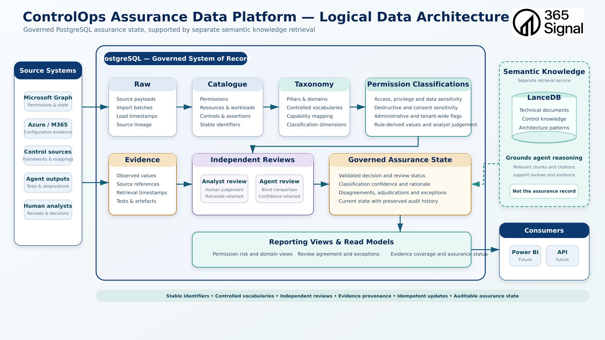

# ControlOps Assurance Data Platform — Logical Data Architecture

Independent architecture assessment of the governed PostgreSQL data platform.

This review is based on live database queries, SQL migrations, importer code
and validation scripts. Existing architecture prose, diagrams and previous
assessments are not treated as implementation proof.

---

## Document Control

| Field | Value |
| --- | --- |
| Status | Draft — independent repository- and runtime-grounded assessment |
| Version | 0.1.0 |
| Assessment date | 16 August 2026 |
| Intended audience | Data architects, ControlOps engineers, security architects, Microsoft specialists and technical reviewers |
| Principal diagram | `docs/architecture/diagrams/03-ControlOps-Assurance-Data-Platform-Logical-Data-Architecture.png` |
| Diagram revision | Not specified on the image |
| ControlOps commit | `c33603808fb70e071ce97c92cd55770036afc80e` (dirty working tree; migrations `010`–`012` untracked) |
| Runtime verification | Read-only SQL against `controlops-postgres` on 16 August 2026 |
| Document owner | 365signal / Jon Bruce |
| Related Codex assessment | [`03-controlops-assurance-data-platform-logical-data-architecture.md`](03-controlops-assurance-data-platform-logical-data-architecture.md) — inspected after the database pass; not treated as authoritative and not modified |

# Part I — Architecture Overview

## 1. Purpose and Intended Audience

This document answers one question:

> Does the current ControlOps data architecture provide a sound and extensible
> foundation for governed Microsoft-platform assurance, and which parts of
> that architecture actually exist today?

It is written for people who will challenge the model: data architects,
assurance engineers and Microsoft specialists. It is not a catalogue of every
table column, and it is not a proposal for a universal enterprise model.

The diagram is architecture intent. Empty schemas, SQL comments and reserved
names are not implemented subsystems.

## 2. Executive Summary

PostgreSQL is the right type of system for governed ControlOps assurance
state, and the current implementation is a **credible, narrowly executed
foundation** — not an assurance data platform.

What genuinely exists:

- a Microsoft Graph **permission catalogue** (1,562 current definitions) with
  raw payload snapshots, import-run lineage, source hashes and a versioning
  pattern (`valid_from` / `valid_to` / `is_current`);
- a **six-pillar / 34-domain** taxonomy with referential integrity;
- a **production-named** classification schema that is intentionally empty;
- an isolated **`permission_pilot`** sidecar with 36 selections and 72 review
  rows that keep analyst and Codex records in separate rows;
- unusually strict **validation SQL** for a proof of concept.

What does not exist, despite appearing on the diagram:

- a governed **evidence** store (`evidence` schema: comment only, no tables);
- a governed **assurance-state** store (`assurance`: no tables);
- a **reporting / API read model** (`reporting`: no tables, no materialised
  views);
- tenant, customer, scope, observation, control, finding or verdict entities;
- an executable **rules engine**;
- persisted **disagreement** or **adjudication** rows;
- any Hermes / validator write path into PostgreSQL.

The Graph catalogue is **Microsoft’s published permission inventory**, not
tenant evidence. Pilot reviews are **not** published ControlOps
classifications. The 28 analyst `draft` rows are **field-identical copies of
Codex reviews**, not human judgements.

The direction — structured PostgreSQL state, separate LanceDB knowledge,
isolated pilot, controlled vocabularies, source hashes — is sound. The next
increment should close one thin assurance transaction, not generalise the
model.

## 3. Architecture Diagram

The current file is
`docs/architecture/diagrams/03-ControlOps-Assurance-Data-Platform-Logical-Data-Architecture.png`.
No older similarly named file exists in this tree. Architecture documents
reference this image.

The subtitle states “Governed PostgreSQL assurance state, supported by
separate semantic knowledge retrieval.” That separation is the correct
principle. Several inner boxes overstate current maturity. Qualifications
are in §27 and §32.

## 4. Data-Platform Boundary

**Inside the governed record (intended):** PostgreSQL schemas for raw
payloads, catalogue, taxonomy, classifications, reviews, evidence, assurance
state and publication-safe read models.

**Observed inside that boundary today:** `raw`, `catalogue`, `operations` and
`permission_pilot`. `evidence`, `assurance` and `reporting` are empty
namespaces.

**Outside the governed record:**

- LanceDB / RAG — semantic technical knowledge;
- Hermes profile state and validator Markdown/YAML;
- Microsoft Graph and Azure as source systems;
- future Power BI / API consumers.

The PostgreSQL stack is a separate Compose project
(`platform/postgres/compose.yaml`), image `postgres:17`, published only on
`127.0.0.1:5432`, password via Docker secret
`/home/proteu5/.config/controlops/postgres/postgres_password`. The repository
example environment contains no password. There is one database login:
`controlops_admin` (superuser).

## 5. Architectural Principles

These distinctions are not interchangeable:

| Concept | Meaning | Present in PostgreSQL today? |
| --- | --- | --- |
| Observation | Something obtained from a source | Catalogue snapshot / permission payload only. No tenant observation |
| Derived fact | Reproducible transformation of observations | Importer `access_class` heuristic; sampling labels in preview SQL |
| Deterministic rule result | Versioned rule applied to known inputs | `candidate_classification_rule` table exists; **0 rows**; no engine |
| Model proposal | AI classification with provenance | Codex `reviewer_kind='codex'` submitted rows |
| Analyst judgement | Accountable human interpretation | 8 `submitted` analyst rows (later updated in place) |
| Adjudicated decision | Authorised resolution of disagreement | Tables/views exist; **0 disagreement / domain_review rows** |
| Assurance conclusion | Approved statement about a scoped control or assertion | **Not evidenced** |

An LLM output is a proposal. A human acceptance or correction should be a
distinct record or a clearly attributable state transition. The current
pilot **does** keep Codex and analyst rows separate. It **does not** keep
model-seeded analyst drafts distinguishable except by `review_status='draft'`
and migration history. Human corrections **overwrite** the same analyst row.

# Part II — Implementation Record

## 6. Physical PostgreSQL Inventory

Live inspection on 16 August 2026 (`controlops` / `controlops_admin`).

### Schemas

| Schema | Comment in database | Objects | Role today |
| --- | --- | --- | --- |
| `raw` | Immutable source imports and unprocessed evidence metadata | 1 table | Populated implementation for Graph catalogue snapshots |
| `catalogue` | Source systems, interfaces, permissions, capabilities and taxonomies | 7 tables | Populated catalogue + taxonomy; empty production classification tables |
| `operations` | Collector executions, failures, freshness and catalogue changes | 1 table | Populated implementation for catalogue import runs |
| `permission_pilot` | *(no comment)* | 8 tables, 4 views | Experimental sidecar; populated reviews |
| `evidence` | Normalised Microsoft 365 evidence records | **none** | Target namespace / schema contract only |
| `assurance` | Control assessments, findings, risks and remediation records | **none** | Target namespace |
| `reporting` | Curated views and materialised views for Power BI and evidence packs | **none** | Target namespace |
| `public` | standard public schema | extensions only | Hosts `pgcrypto` |

No materialised views. Sequences are implicit identity defaults
(`gen_random_uuid()`). Extension `pgcrypto` is installed.

### Row counts that matter

| Object | Rows |
| --- | --- |
| `catalogue.permission_definition` (current / retired / all) | 1,562 / 0 / 1,562 |
| Application / Delegated / RSC | 707 / 797 / 58 |
| `catalogue.source_system` / `interface` | 1 / 1 (`MSGRAPH` / `MSGRAPH_V1`) |
| `catalogue.controlops_pillar` / `controlops_domain` | 6 / 34 |
| `catalogue.permission_classification` | **0** |
| `catalogue.permission_classification_domain` | **0** |
| `operations.catalogue_import_run` | 2 (both `success`) |
| `raw.catalogue_snapshot` | 2 (same payload hash) |
| `permission_pilot.pilot_definition` | 1 (`approved`) |
| `permission_pilot.permission_selection` | 36 (`final` only) |
| `permission_pilot.classification_review` | 72 |
| `permission_pilot.review_domain_assignment` | 107 |
| `disagreement` / `domain_review` / `schema_gap` / `candidate_classification_rule` | **0** |

### Review population

| reviewer_kind | reviewer_identifier | status | n |
| --- | --- | --- | --- |
| analyst | `jon_bruce` | submitted | 8 |
| analyst | `jon_bruce` | draft | 28 |
| codex | `codex_independent_batch_1` | submitted | 8 |
| codex | `codex_remaining_28` | submitted | 28 |

An independent field-by-field compare of the 28 drafts against
`codex_remaining_28` showed **28/28 identical** on the classification
attributes and rationale. Those drafts are model-seeded working copies.

`permission_pilot.review_comparison` (submitted pairs only) yields 88 field
comparisons across 8 permissions, of which **32 disagree**. None of those
disagreements are persisted in `disagreement`.

## 7. Raw Source Preservation

`raw.catalogue_snapshot` stores, per import:

- `import_run_id` (FK to the operations run);
- a constructed Graph `source_uri` for the Microsoft Graph service
  principal `00000003-0000-0000-c000-000000000000`;
- `retrieved_at`;
- full JSON `payload`;
- SHA-256 `payload_hash`;
- nullable `http_status` / `response_headers` (unused by the file importer).

Both live snapshots are JSON objects containing `appRoles`,
`oauth2PermissionScopes` and `resourceSpecificApplicationPermissions`. They
share one payload hash: the second import was an unchanged replay.

This pattern is **sound for a single published catalogue source**:
append-oriented snapshots, hashable, correlated to an import run and to
normalised rows via `source_hash` on each permission definition.

It is **not** tenant evidence. It is not a live Graph collection. `http_status`
is empty because the importer reads a file
(`platform/postgres/importer/input/microsoft-graph-permissions.json`). There
is no immutability trigger; “immutable” is a comment, not a database control.
The pattern is narrow and generalisable, but it has only been exercised for
this one interface.

## 8. Import Operations and Lineage

`operations.catalogue_import_run` records source/interface, start/complete
times, `collector_version` (`0.1.0`), `source_version` (`v1.0`), status,
received/added/changed/retired counts, payload hash and optional
`error_details`.

Importer behaviour (`import_graph_permissions.py`):

1. Unwrap the Graph service-principal export; reject the wrong `appId`.
2. Flatten three source properties into Application / Delegated / RSC rows.
3. Derive `access_class` from the permission **name** (heuristic).
4. Insert a `running` import run and a raw snapshot in one transaction.
5. For each permission: skip if current hash matches; otherwise close the
   current row (`valid_to`, `is_current=false`) and insert a new version.
6. Retire current rows not seen in this payload.
7. Mark the run `success` with counts.

Live data: first run added 1,562; second added/changed/retired 0. Retirement
and change-versioning are implemented in code and **unexercised** against
this database (0 retired rows).

Lineage that is queryable today:

`file payload` → `raw.catalogue_snapshot` → `operations.catalogue_import_run`
→ `catalogue.permission_definition` (`source_hash`, `raw_payload`)
→ optional `permission_pilot` selection/review.

Lineage that stops there. Nothing connects a review to a published
classification, an observation, a control evaluation or a conclusion.

## 9. Catalogue and Entity Model

Canonical entities that exist:

- `source_system` (one row: Microsoft Graph);
- `interface` (one row: Graph v1.0 REST, OAuth2, collector adapter
  `graph_service_principal`);
- `permission_definition` (versionable catalogue fact);
- `controlops_pillar` / `controlops_domain`;
- `permission_classification` and `permission_classification_domain`
  (**schema only**, 0 rows).

Entities that do **not** exist: customer, tenant, environment, subscription,
workload, identity, user, service principal (as an assessed object),
application, group, resource, configuration item, observation, assertion,
technical control, control implementation, assessment, test, evidence object,
finding.

Do not invent them all. For the next assurance slice the missing abstractions
that actually matter are: **scope**, **observation**, **evidence object**,
**human decision**, and **verdict**. Workload/tenant/identity can wait until
a collector needs them.

The catalogue’s `permission_definition.raw_payload` plus `source_hash` is a
good per-entity grain. `access_class` should remain labelled as a derived
heuristic, never as a governed classification.

Delegated `display_name` is null for all 797 delegated rows — a source-shape
fact, not a modelling error.

## 10. Temporal and Version Model

Permission definitions have:

- a new UUID per version;
- unique `(interface_id, permission_type, permission_name, valid_from)`;
- `valid_from` / `valid_to` / `is_current`;
- `source_hash` of the raw permission object;
- `created_at` only (no `updated_at` on the definition row — versions are
  inserted, not updated, except the close-out of `valid_to` / `is_current`).

This is **uni-temporal effective dating** of catalogue facts, not bitemporal.
Source change and local judgement change are not yet on the same object:
catalogue versions track source hash; reviews live in another schema.

Reviews have `review_round`, `review_status`
(`draft` / `submitted` / `superseded`), `created_at` / `updated_at`, and a
unique key on
`(selection_id, reviewer_kind, reviewer_identifier, review_round)`.
Supersession is representable. It was **not** used for the 15 August human
corrections: those `UPDATE`d the existing submitted row (`created_at`
unchanged, `updated_at` moved). The original submitted (mostly-null)
analyst state is gone from the table.

Do not add bitemporal modelling everywhere. Add an append/supersede rule
for **reviews and published classifications** before anything else. Catalogue
versioning is already the right shape for source change.

## 11. Taxonomy

Verified live: **6 pillars, 34 domains**, FK from domain to pillar, unique
codes, unique display order, `is_active`.

| Pillar | Domains |
| --- | --- |
| Identity and Access | 7 |
| Data Protection and Governance | 6 |
| Security Operations | 5 |
| Infrastructure and Platform | 5 |
| Applications and Workloads | 6 |
| Governance, Risk and Compliance | 5 |

There is no domain-to-domain parent/child beyond pillar. Tenant-wide impact
is a classification field, not a taxonomy flag. Primary-domain semantics
exist as:

- production: unique partial index
  `ux_permission_classification_one_primary_domain` (`is_primary = true`);
- pilot: `ux_pilot_review_one_primary_domain` on
  `assignment_kind = 'primary'`.

The taxonomy is **usable, internally consistent and assurance-general**
rather than Microsoft-product-specific. It is slightly broad for a
permission-only pilot (e.g. `REGULATORY_FRAMEWORK_MANAGEMENT`) and that is
acceptable if it stays a **navigation/assignment taxonomy**, not a control
register and not a framework map.

Keep it independent from Microsoft product names, NCSC/CIS/NIST content and
technical-control identifiers. A domain is not a control.

## 12. Permission-Classification Architecture

Two layers must not be collapsed.

### Production-named tables — schema contract, empty

`catalogue.permission_classification` holds one row per permission
definition (unique on `permission_definition_id` — **no version history**).
Dimensions and CHECKs:

- `access_level`: none / limited / owned / selected / all / unknown
- `capability`: read / write / read_write / execute / manage / consent / unknown
- `administrative_capability` boolean
- `privilege_level`: low / moderate / high / critical / unknown
- `data_sensitivity`: none / low / moderate / high / restricted / unknown
- `destructive_potential`: none / low / moderate / high / critical / unknown
- `tenant_wide_impact` boolean
- `consent_sensitivity`: low / moderate / high / critical / unknown
- `classification_confidence`: low / medium / high
- `classification_source`: analyst / microsoft / rule / imported / other
- `review_status`: draft / in_review / approved / rejected / needs_review
- `analyst_notes`

These dimensions are **sufficient for Graph permission classification** and
should stay **permission-specific**. Do not copy them onto evidence or
control objects.

The 1:1 unique constraint is an early trap: an approved classification
cannot be versioned without a schema change. The pilot, by contrast, versions
on `review_round`.

### Pilot tables — populated, not published

Pilot reviews use the same value vocabularies (minus
`classification_source` / production `review_status`). Domain mappings allow
one primary and many secondary per review.

**No automatic promotion.** Migration `005` comments and the empty production
tables support reading this as an intentional safety boundary.

## 13. Independent Review Model

Design:

- `reviewer_kind` CHECK `analyst` | `codex`;
- free-text `reviewer_identifier`;
- `review_round`;
- independent rows (unique per selection/kind/identifier/round);
- export views that present **blank** input columns to both reviewers
  (`analyst_review_export` / `codex_review_export` are identical empty
  worksheets);
- `review_comparison` over **submitted** rows only;
- `disagreement` and `domain_review` for later resolution.

What the live data shows:

- Codex and analyst rows are physically independent. Good.
- 36 Codex submissions exist as model proposals.
- 8 analyst submissions exist as human-attributed rows, subsequently
  overwritten by `011` / `012`.
- 28 analyst drafts are **indistinguishable in content** from
  `codex_remaining_28`. There is no `seeded_from_review_id`, no
  `proposal_origin` flag, and `reviewer_kind='analyst'` on a machine copy.
  Status `draft` is the only in-row signal. That distinction **can** be
  reconstructed from migration `010` plus a content compare; it is **not**
  first-class.

Free-text reviewer identity is adequate for this PoC. Governed operation
needs a principal (person or service), authentication, and segregation of
duties so the same operator cannot be the sole analyst, adjudicator and
publisher.

## 14. Fact, Rule, Proposal, Judgement, Conclusion

Applied to Graph permissions:

| Attribute | Best current classification |
| --- | --- |
| Permission name, type, description, external id, admin-consent flag | Observation / catalogue fact (from Microsoft’s published inventory) |
| `source_hash`, payload | Observation metadata |
| Importer `access_class` | Derived heuristic, not a rule result |
| Sampling labels in `pilot/graph-permission-candidate-selection.sql` | Sampling aid; explicitly not a classification |
| Capability, access_level, privilege, sensitivity, destructive potential, tenant-wide, consent, administrative, domain assignment | Judgement (sometimes partly rule-derivable later) |
| Codex review row | Model proposal |
| Analyst `draft` copied from Codex | Still a model proposal, mis-attributed as analyst |
| Analyst `submitted` after human edit | Analyst judgement (current values); prior values not retained |
| `candidate_classification_rule` | Representational capability only |
| Production `permission_classification` | Intended approved classification — empty |
| Assurance conclusion | Not evidenced |

Attributes that can reasonably become deterministic later, with exceptions:
name-suffix capability (`Read` / `ReadWrite`), Application vs Delegated vs
RSC as a type fact, admin-consent for Application, some `.Selected` /
`.All` scope hints. These still fail on RSC, delegated-as-user, and
grant-dependent reach — which is why judgement remains required.

## 15. Candidate Deterministic Rules

`permission_pilot.candidate_classification_rule` can store `rule_code`,
`match_expression` (text), `proposed_assignments` JSON, supporting and
exception selection arrays, confidence and
`proposed` / `accepted` / `rejected` / `needs_testing`.

There is **no engine**, no replay, no version beyond `updated_at`, and
**0 rows**. Sampling SQL that ranks UUID hashes is not a classification
rule.

Classify this as **Representational Capability Only**.

## 16. Disagreement and Adjudication

**Representational capability:** yes. Field-level `disagreement` with
`open` / `resolved` / `accepted_difference`, plus `domain_review` decisions
`analyst` / `codex` / `different` / `needs_evidence`. Comparison view
computes `disagrees` for submitted pairs.

**Demonstrated workflow:** no. Zero persisted disagreements despite 32
computed field disagreements on the eight dual-reviewed permissions. Many
“disagreements” are analyst nulls versus Codex booleans
(`administrative_capability`, `tenant_wide_impact`) — comparison treats
NULL as distinct, which is correct and noisy.

No segregation-of-duties constraint exists beyond separate row types.

## 17. Governed Evidence Model

`evidence` contains **no tables**. State that plainly.

Validator YAML/Markdown files are not a data-platform evidence model.

Smallest sufficient model for the next real assurance transaction:

1. **`collection_run`** — who/what collected, when, source system, scope
   reference, status, payload hash.
2. **`raw_artefact`** — append-only payload or object reference (URI, hash,
   media type). The current `catalogue_snapshot` is a special case of this.
3. **`observation`** — a normalised statement taken from a source (“this
   permission exists”; later “this tenant grant exists”), with effective
   time, retrieval time, and FK to the raw artefact.
4. **`evidence_use`** — links an observation (or documentary reference) to
   a specific evaluation, with
   `accepted` / `rejected` / `superseded` and a human actor.

That is enough to distinguish:

- raw source material;
- normalised observation;
- derived fact (computed column or child row, not a new subsystem);
- documentary support (URI + hash, optionally pointing at Learn/RAG);
- evidence **accepted for one evaluation**.

Do not add a generic “evidence lake” or copy LanceDB into PostgreSQL.

## 18. Assurance-State Model

`assurance` contains **no tables**. Do not infer assessments, findings or
verdicts from validator reports.

Minimum objects for one governed slice:

- **`scope`** — what is being assured (for the next slice this can be as
  small as “Graph permission catalogue, sample X” or “documentary claim Y”);
- **`assertion`** or **`test_criterion`** — the question asked;
- **`evaluation`** — rule result and/or model proposal;
- **`decision`** — human approve / reject / qualify, with identity;
- **`verdict`** — the current conclusion for that assertion, pointing at the
  decision and accepted evidence.

Publication can be a status on `verdict` (`draft` / `approved` / `published`
/ `withdrawn`) rather than a separate reporting warehouse.

Not every verdict is deterministic. The model must allow “rule says X,
human overrides Y.”

## 19. Framework and Control Model

Four different concepts:

| Concept | PostgreSQL today | Elsewhere |
| --- | --- | --- |
| Framework content | Not present | LanceDB `framework_controls_nomic_v1` (NCSC CAF 4, 82 rows) — **knowledge**, not governed state |
| Framework-to-control mapping | Not present | CIS OSCAL XML in the RAG tree; not loaded here |
| Control evaluation | Not present | Validator verdicts are files |
| Assurance conclusion | Not present | |

A taxonomy domain named `REGULATORY_FRAMEWORK_MANAGEMENT` is **not** a
framework mapping.

Do not build a multi-framework register now. When a control evaluation is
first persisted, add a thin `framework` / `control` pair with version and a
source URI. Until then, a documentary reference on the assertion is enough.

## 20. Knowledge / RAG Relationship

The diagram is right to keep LanceDB outside the governed record and to
label it “not the assurance record.”

That separation is architecturally sound and should be kept.

PostgreSQL may store **stable references** (URL, document id, page, hash,
retrieval time) when a retrieved passage is accepted as documentary
support. It should not ingest the vector corpus.

RAG does not become an observation, an approved mapping, or a conclusion
because an agent used it.

## 21. Reporting and Read Models

`reporting` is empty. No Power BI integration. No API read model. No
publication-safe status beyond pilot `draft` / `submitted` / `superseded`
and unused production `review_status` values.

Pilot views (`analyst_review_export`, `codex_review_export`,
`review_comparison`, `disagreement_resolution_export`) are **worksheet and
comparison aids**. They are not a reporting architecture.

Future consumers (analyst UI, API, partner report) should read only
**approved / published** rows plus explicitly labelled proposals.

## 22. Agent / Database Write Boundary

No agent or validator code in this repository connects to PostgreSQL
(no `psycopg`, no `5432`, no `POSTGRES_*` under `agents/`). Hermes Compose
does not mount or configure the database. Persistence today is:

- Python importer (operator-run);
- `psql` migrations (operator-run).

That absence is correct for the PoC. The future write contract should be
narrow commands, not agent SQL:

- register collection;
- append observation;
- submit classification proposal;
- submit evaluation;
- record human decision;
- publish approved conclusion.

Need: append or supersede (not silent UPDATE), optimistic concurrency on
the current version, CHECK/validation in the same transaction, and a
non-superuser application role. Do not give Hermes `controlops_admin`.

## 23. Tenant / Customer Boundary

No tenant, customer or environment entity exists. The validator contract
says `customer_data_allowed: false`. That is not a defect at this stage.

Multi-tenancy is **target-state**. Before any customer tenant data is
admitted, decide identity, authorisation boundary, isolation grain
(database / schema / row), retention, export, deletion, legal hold and
encryption. Do not pick a tenancy pattern now; the current model has
nothing to partition.

The Graph catalogue is a **vendor publication**, logically global, and
should remain outside customer tenancy even later.

## 24. Audit, Integrity and Data Governance

| Topic | Evidence | Class |
| --- | --- | --- |
| Logical identifiers | UUIDs, unique codes, hashes | Sound |
| Controlled vocabularies | Extensive CHECKs | Sound |
| Referential integrity | FKs on all current relationships | Sound |
| Application roles | Single superuser login | Deployment/governance gap |
| Migration runner | Init-on-first-boot plus manual `psql` | Operational gap |
| Immutable history | Comment only; reviews updated in place | Logical gap |
| Audit logging of who ran SQL | Not evidenced | Operational |
| Backup | Three dumps, latest 3 August 2026 (pre later reviews) | Partial |
| Restore test | Not evidenced | Operational |
| Encryption / TLS | Not assessed here (deployment concern) | — |
| Secret management | Password file outside Git | Sound for PoC |

Logical architecture requires append/supersede and non-superuser roles
before the data can be called an audit-grade assurance record. Backup
restore is a deployment issue that still affects integrity claims.

## 25. Validation and Data-Quality Discipline

This is the strongest engineering pattern in the data platform.

Observed properties of `platform/postgres/validation/`:

- exact counts and catalogue fingerprints;
- uniqueness and FK expectations;
- one-primary-domain rules;
- independent-review isolation (Codex must not rewrite analyst rows);
- idempotent reruns;
- preservation of unrelated rows;
- exact permission ID/type/name triples for the sample.

`005` is `BEGIN READ ONLY`. `006`–`012` **re-invoke the corresponding
init migration** and then assert; they are not safe to run as a casual
read-only check. This review inspected them and used live SELECTs instead.

Gaps: no CI gate observed in this repository, no runtime monitoring, no
schema-compatibility test, no rollback test, no central migration runner.
The **pattern** (fingerprint + isolation + idempotency) should be reused
for the first evidence/verdict tables.

## 26. Production-Named Tables versus Pilot Sidecar

Pilot data lives only under `permission_pilot`. Production classification
tables are empty. The 36-permission pilot status is `approved` as a
**sample definition**, not as published classifications.

There is no promotion job, no approval workflow into
`catalogue.permission_classification`, and no defined publication
semantics beyond unused CHECKs on that empty table.

**Do not describe the 72 review rows as ControlOps classification state.**

## 27. Current Implementation-Status Matrix

| Capability | Status | Evidence |
| --- | --- | --- |
| Graph catalogue import (file) | Implemented / Validated for this source | Importer + 1,562 current rows + 2 successful runs |
| Raw snapshot + payload hash | Implemented for Graph catalogue only | `raw.catalogue_snapshot` |
| Catalogue versioning / retirement code | Implemented; retirement **not exercised** live | Importer; 0 retired rows |
| Source system / interface seed | Implemented (one source) | `MSGRAPH` / `MSGRAPH_V1` |
| Six-pillar / 34-domain taxonomy | Validated | Live counts + CHECKs + validation SQL |
| Production classification schema | Scaffolding (contract only) | 0 rows; 1:1 unique |
| Pilot sample + independent reviews | Validated as a bounded pilot | 36 selections, 72 reviews |
| Model vs human row isolation | Implemented in the table design | Separate `reviewer_kind` |
| Model-seeded draft attribution | Partially Implemented / unsafe | 28 drafts identical to Codex; stored as analyst |
| Human correction history | Partially Implemented | In-place UPDATE on 8 submitted rows |
| Disagreement / adjudication | Representational Capability Only | Views yes; 0 rows |
| Deterministic rules engine | Representational Capability Only | Empty rule table |
| Governed evidence store | Scaffolding | Empty `evidence` schema |
| Governed assurance state | Scaffolding | Empty `assurance` schema |
| Framework/control register | Not Evidenced in PostgreSQL | CAF lives in LanceDB |
| Control evaluation / verdict store | Not Evidenced | |
| Reporting / API read model | Scaffolding | Empty `reporting`; 0 matviews |
| Tenant / customer partition | Planned / target-state | No entities |
| Agent persistence | Not Evidenced | No DB client in agents |
| End-to-end source-to-conclusion lineage | Partially Implemented | Stops after catalogue/review |
| LanceDB as governed state | Not applicable — correctly out of scope | |

## 28. Architectural Strengths

1. Right store for governed state (PostgreSQL), right exclusion of LanceDB.
2. Real raw-payload + hash + import-run pattern, not a spreadsheet dump.
3. Catalogue versioning designed before it was needed.
4. Taxonomy is small, constrained and not product-named.
5. Pilot isolated from production classification tables.
6. Independent review rows and blank dual export views.
7. Validation culture: fingerprints, isolation, idempotency.
8. Secrets kept out of the example environment file.

## 29. Architectural Gaps and Risks

1. Empty evidence and assurance namespaces while the diagram shows a full
   assurance platform.
2. No promotion path; pilot can be mistaken for published state.
3. Model-seeded drafts stored as `reviewer_kind='analyst'`.
4. Human corrections overwrite submitted rows.
5. Production classification is 1:1 with permission — cannot history-track
   an approval.
6. Comparison disagrees are not persisted; adjudication untested.
7. `access_class` looks official and is a name heuristic.
8. Single superuser; no migration runner; backups predate later reviews.
9. No scope/tenant/observation objects for an actual assurance transaction.
10. Diagram boxes for Azure/M365 configuration evidence, agent outputs and
    Power BI have no relational counterpart.

## 30. Dangerous or Premature Abstractions to Avoid

- A universal canonical model (customer/tenant/identity/resource/control
  ontology) before one transaction exists.
- Event sourcing, CQRS, Kafka, or a data lake for 1,562 permissions.
- Copying permission dimensions onto every future object.
- Treating taxonomy domains as controls or frameworks.
- Giving agents SQL write access.
- Promoting drafts or Codex rows into production tables automatically.
- Calling LanceDB CAF a ControlOps control register.
- Bitemporal modelling on every table.
- Building Power BI models on empty `reporting`.

## 31. Recommended Next Engineering Increments

In order. Do not expand the entity catalogue first.

1. **Repair review provenance (days, not months).** Add
   `seeded_from_review_id` (nullable FK). Stop in-place UPDATE of submitted
   reviews; insert `review_round+1` or mark `superseded`. Persist the 32
   computed disagreements for the eight dual-reviewed permissions.
2. **Define promotion, then promote nothing automatically.** A single
   function: copy an **adjudicated** review into
   `catalogue.permission_classification` with `classification_source`,
   `review_status='approved'`, and FKs back to the winning review ids.
   Change the production table to allow history (drop the 1:1 unique, or
   add `valid_from` / `is_current`).
3. **One governed assurance slice.** Persist: scope, one observation (even
   a documentary or catalogue observation), one evidence_use, one human
   decision, one verdict. Reuse the validation-fingerprint pattern. Do not
   wait for live Azure/Graph tenant collection if a documentary assertion
   can exercise the chain first.
4. Only then consider a least-privilege application role and a narrow
   command API for Hermes.

The material step toward an **assurance** platform is increment 3. Increment
1–2 make the existing pilot honest.

## 32. Recommended Diagram Changes

- Mark Raw / Catalogue (permissions) / Taxonomy / Independent Reviews as
  current; mark Evidence, Governed Assurance State, Reporting, Power BI and
  API as target.
- Relabel “Permission Classifications” as “classification schema
  (unpublished); working data in permission_pilot.”
- Relabel Catalogue “resources & workloads / controls & assertions” — those
  entities do not exist.
- Show the pilot sidecar explicitly, outside production classification.
- Keep LanceDB dashed and “not the assurance record.”
- Add a legend: implemented / sidecar / empty namespace / future consumer.
- Source Systems: only Microsoft Graph catalogue import is evidenced;
  Azure/M365 configuration evidence and agent outputs should be drawn as
  intended, not current.

## 33. Overall Architectural Verdict

### Required answers

1. **What relational capability exists?** Graph permission catalogue with
   raw snapshots, import runs, taxonomy, and an isolated classification
   pilot with independent review rows.
2. **Strongest part?** Import lineage + constrained taxonomy + validation
   discipline + pilot isolation.
3. **What is only scaffolding?** `evidence`, `assurance`, `reporting`, and
   empty production classification tables.
4. **Is the taxonomy usable?** Yes, as a general assignment taxonomy.
5. **Is the classification schema usable?** Yes as a contract; unused as
   state. Pilot schema is usable and populated.
6. **Human vs model separation?** Rows are separate. Drafts blur it.
   Corrections overwrite history.
7. **Rule-derivable attributes?** Type, some name-suffix capability/scope
   hints, Application admin-consent. Not grant-dependent reach.
8. **Judgement-required?** Privilege, sensitivity, destructive potential,
   tenant-wide impact, consent sensitivity, domain assignment, RSC/delegated
   effective authority.
9. **Rules engine?** No. Empty candidate table.
10. **Governed evidence store?** No tables.
11. **Governed assurance store?** No tables.
12. **Framework/control mapping?** Not in PostgreSQL.
13. **Control evaluation?** Not in PostgreSQL.
14. **Verdict engine/store?** No.
15. **Reporting/API read model?** No.
16. **Source-to-conclusion audit?** Only source → catalogue → review.
17. **Multi-tenancy?** No.
18. **Agent persistence?** No.
19. **Is PostgreSQL the right direction?** Yes.
20. **Smallest increment toward an assurance platform?** Persist one scoped
    observation → accepted evidence → human decision → verdict, after
    fixing review provenance so “human” and “model” remain honest labels.

PostgreSQL as the governed system of record, LanceDB as non-governing
knowledge, a constrained taxonomy, hashed raw imports, and an isolated
review sidecar are the right instincts. The implementation is a **catalogue
and classification laboratory**, not yet an assurance data platform. That
is an acceptable PoC stage if the diagram and partner language stay equally
modest.

### Material disagreements with Codex 03

Codex 03 is directionally aligned. Differences from **this** live
inspection:

- Codex 03 could not query Docker and reused earlier documents’ counts.
  This assessment ran independent read-only SQL. Counts matched those
  earlier observations (1,562 / 6 / 34 / 36 / 72) and added: 107 domain
  assignments, 32 computed field disagreements, 28/28 draft-to-Codex
  identity, and in-place updates on all 8 submitted analyst rows.
- Codex 03 treats framework storage as **Partially Implemented** because
  NCSC CAF exists in LanceDB. This assessment treats **PostgreSQL**
  framework/control mapping as **Not Evidenced**. Retrieval content is not
  a relational control register.
- Codex 03’s vocabulary collapses several items as Partially Implemented
  that this review splits into **Scaffolding**, **Representational
  Capability Only**, or **unexercised code**. Retirement logic is the
  main example.
- This review treats in-place human corrections and analyst-labelled
  model drafts as first-class integrity issues, not only as pilot caveats.

## 34. Related Architecture Documents

| Document | Use in this review |
| --- | --- |
| [01 Codex contextual](01-controlops-contextual-architecture.md) | Not used as data-platform evidence |
| [Cursor-01 contextual](Cursor-01-controlops-contextual-architecture.md) | System boundary only; not used for maturity scores |
| [02 Codex RAG](02-controlops-knowledge-rag-component-architecture.md) | Not used as data-platform evidence |
| [Cursor-02 RAG](Cursor-02-controlops-knowledge-rag-component-architecture.md) | Boundary reminder only (LanceDB ≠ governed state) |
| [03 Codex data platform](03-controlops-assurance-data-platform-logical-data-architecture.md) | Compared after independent inspection; not modified |
| This document | Independent logical data architecture assessment |
| [`docs/graph-permission-classification-pilot.md`](../graph-permission-classification-pilot.md) | Pilot process notes; live SQL took precedence |

## 35. Document History

| Version | Date | Description |
| --- | --- | --- |
| 0.1.0 | 16 August 2026 | Independent logical data architecture assessment from live PostgreSQL, SQL contracts and importer behaviour. Codex 03 and Cursor-01/02 not modified. |
