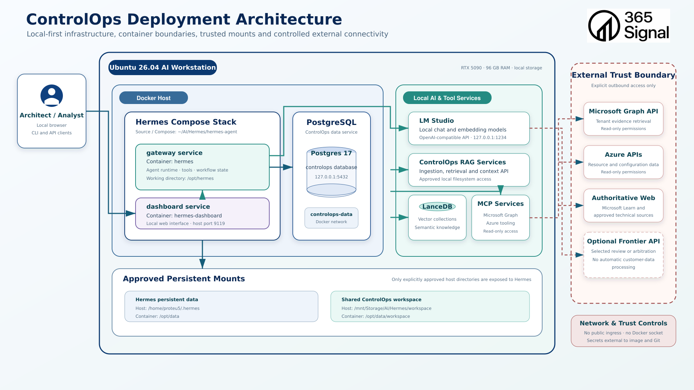
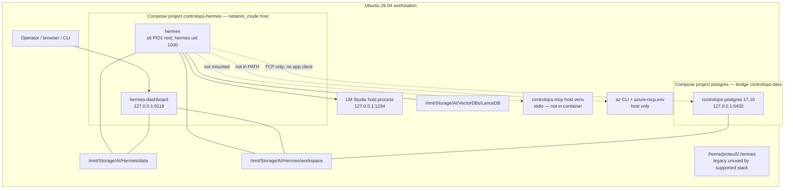

# ControlOps Deployment Architecture

Independent as-built assessment of the Linux workstation deployment.

Runtime and effective Compose take precedence over the deployment diagram
and previous documents. This review does not treat deployment hardening as
a substitute for the missing assurance transaction.

---

## Document Control

| Field | Value |
| --- | --- |
| Status | Draft — independent repository- and runtime-grounded deployment assessment |
| Version | 0.1.0 |
| Assessment date | 16 August 2026 |
| Intended audience | ControlOps architects, engineers, security reviewers and operational owners |
| Principal diagram | `docs/architecture/diagrams/05-ControlOps-Deployment-Architecture.png` |
| ControlOps commit | `c33603808fb70e071ce97c92cd55770036afc80e` (dirty) |
| Hermes source | `/home/proteu5/AI/Hermes/hermes-agent` `c998937` on `controlops-hermes-poc` (dirty) |
| Runtime verification | Read-only host/container inspection on 16 August 2026 |
| Document owner | 365signal / Jon Bruce |
| Related Codex assessment | [`05-controlops-deployment-architecture.md`](05-controlops-deployment-architecture.md) — read after inspection; not modified |

# Part I — As-Built Overview

## 1. Purpose and Two Distinct Questions

This document answers two questions and keeps them apart.

1. **Engineering now.** What actually runs, how reproducible is it, and what
   deployment work is required before the first governed assurance
   transaction can be treated as a reliable *engineering* service?
2. **Customer production later.** What additional controls would be needed
   if customer data or external users were admitted?

The immediate roadmap is **not** productionisation. It is a reliable
single-operator environment that can host:

`assessment → collection → observation → evaluation → human decision → verdict → report`

Large infrastructure changes that do not help that milestone are deferred
on purpose.

## 2. Executive Summary

ControlOps today is a **controlled single-developer-workstation proof of
concept** on Ubuntu 26.04 with an RTX 5090. It is not an integration
estate, an appliance product, or a production platform.

Two Docker Compose projects run independently:

| Project | Containers | Network |
| --- | --- | --- |
| `controlops-hermes` | `hermes`, `hermes-dashboard` | **host** |
| `postgres` | `controlops-postgres` (`postgres:17.10`) | bridge `controlops-data`, published `127.0.0.1:5432` |

LM Studio is **host-native**, not a container. LanceDB is a **filesystem
library**, not a network service. Graph MCP exists on the **host** and is
**not present in the Hermes container**.

The supported Hermes invocation is `bash scripts/controlops`, which pins
project `controlops-hermes`, env
`/home/proteu5/AI/Hermes/hermes-agent/.env.controlops`, and the two Compose
files listed in §6. Live container labels match that pair.

The deployment diagram is **stale on paths**. It still shows
`/home/proteu5/.hermes` and container `/opt/data/workspace`. The live
mounts are `/mnt/Storage/AI/Hermes/data` → `/opt/data` and
`/mnt/Storage/AI/Hermes/workspace` → `/workspace`.

Hermes can open a TCP connection to `127.0.0.1:5432` because of host
networking. **That is reachability, not application integration.** No
ControlOps agent writes to PostgreSQL.

**Immediate deployment blockers** for the first transaction are few:
choose one Compose path, give the future writer a non-superuser database
role, and snapshot PostgreSQL before agents persist governed rows. Host
networking, HA, TLS, CI/CD and Azure-native hosting are **not** blockers
for that milestone.

**Do not select a production hosting architecture now.**

## 3. Architecture Diagram versus Reality



The current file is
`docs/architecture/diagrams/05-ControlOps-Deployment-Architecture.png`.
No older similarly named PNG exists in this tree.

Host facts the diagram gets right: Ubuntu 26.04, RTX 5090, large RAM,
Postgres 17 on loopback, dashboard on 9119, LM Studio on 1234, no Docker
socket.

Material diagram errors versus this inspection:

| Diagram | Live |
| --- | --- |
| Hermes persistent data `~/.hermes` | `/mnt/Storage/AI/Hermes/data` |
| Shared workspace container path `/opt/data/workspace` | `/workspace` |
| “ControlOps RAG Services” as a service | Batch/CLI + filesystem LanceDB; no RAG process |
| “MCP Services” next to RAG | Host `stdio` binary; not in Hermes |
| Arrow Hermes → PostgreSQL as if integrated | TCP reachable only; no app client |
| “Approved persistent mounts” implying least mount | All three binds are **read-write** |
| External Graph/Azure as current retrieval | Not invoked from Hermes |

### As-built reality (this review)



## 4. Current Deployment Classification

**Controlled single-developer-workstation proof of concept.**

Justification: one host, one operator boundary, two Compose projects, an
externally managed local model server, absolute host paths, dirty Git
trees, and no environment separation. Docker and a healthy Postgres do
not make this an integration or production estate.

# Part II — Physical and Compose Reality

## 5. Physical Host

| Item | Observation |
| --- | --- |
| OS | Ubuntu 26.04 LTS (`7.0.0-29-generic`), x86_64 |
| CPU | 32 threads |
| RAM | ~90 GiB total, ~73 GiB available at inspection |
| GPU | NVIDIA GeForce RTX 5090, 32607 MiB, driver 595.84 |
| GPU use | `llama-server` ~28304 MiB; LM Studio helper ~788 MiB |
| Root FS | ext4 NVMe, 1.8 T, 4% used — Docker root lives here |
| ControlOps / LanceDB / models | `/mnt/Storage` **fuseblk** (NTFS) 3.7 T, 6% used |
| Docker storage | overlayfs, `/var/lib/docker` |

Capacity is **sufficient for the current engineering workload** (local
27B-class chat, embeddings, three containers). Workstation horsepower is
not evidence of production capacity.

NTFS/FUSE on `/mnt/Storage` suppresses Unix executable bits (already
noted in the Hermes runbook: invoke `bash scripts/controlops`). It also
means POSIX permissions on workspace/LanceDB are weaker than they look.

## 6. Supported Compose Invocation

Authoritative command:

```text
bash /mnt/Storage/AI/Hermes/workspace/scripts/controlops <start|stop|...>
```

Pinned by `scripts/lib/controlops-common.sh`:

| Knob | Value |
| --- | --- |
| Project | `controlops-hermes` |
| Env file | `/home/proteu5/AI/Hermes/hermes-agent/.env.controlops` |
| Base Compose | `/home/proteu5/AI/Hermes/hermes-agent/docker-compose.yml` |
| Overlay | `/mnt/Storage/AI/Hermes/workspace/ops/compose.controlops.yaml` |

Live labels on `hermes` and `hermes-dashboard` match those two files
exactly.

### Files that are **not** in the live model

| File | Risk |
| --- | --- |
| `hermes-agent/compose.override.yaml` | Untracked. Would mount workspace at `/opt/data/workspace` if someone ran `docker compose` from the Hermes directory **without** `-f`. Not loaded by `scripts/controlops`. |
| `hermes-agent/docker-compose.controlops.yml` | Legacy overlay; runbook says it is unsupported. Content is close to the workspace overlay. |
| `hermes-agent/docker-compose.windows.yml` | Historical Windows |
| Upstream default `~/.hermes:/opt/data` | Overridden by the workspace overlay |

**Operator-error risk is real:** starting Compose from
`hermes-agent/` can attach the wrong workspace path or the unused
`~/.hermes` data tree. Lifecycle tooling protects only callers of
`scripts/controlops`.

PostgreSQL is a **second** Compose project:
`/mnt/Storage/AI/Hermes/workspace/platform/postgres/compose.yaml`,
working directory `platform/postgres`, Docker project name `postgres`.

## 7. Docker Topology

### Project `controlops-hermes`

| Service | Container | Network | Restart | Healthcheck |
| --- | --- | --- | --- | --- |
| gateway | `hermes` | host | unless-stopped | none |
| dashboard | `hermes-dashboard` | host | unless-stopped | none |

Image `hermes-agent` (built 25 July 2026, ~946 MB). Privileged = false.
No added/dropped capabilities. Writable root filesystem. No CPU/memory
limits. User in image config: `root` (s6). No Docker socket mount.

### Project `postgres`

| Service | Container | Network | Restart | Healthcheck |
| --- | --- | --- | --- | --- |
| postgres | `controlops-postgres` | `controlops-data` (bridge) | unless-stopped | `pg_isready` — **healthy** |

Published `127.0.0.1:5432`. `no-new-privileges:true`. Named volume
`controlops-postgres-data`. Init dir mounted **read-only**. Password
secret mounted **read-only**. Backups dir mounted read-write.

Hermes and Postgres **do not share a Compose project or a Docker
network**. Because Hermes uses the host namespace, it can reach the
published loopback port. A probe from inside `hermes` opened
`127.0.0.1:5432` successfully. There is still **no application
connection** (no client, DSN, or writes from agents).

## 8. Hermes Image and Runtime

Dockerfile is multi-stage: pinned `uv` and Node 22 digest stages, Debian
13.4 runtime, `uv.lock` / `package-lock.json` present. Application code
is **baked** under `/opt/hermes` (immutable in the image). PID 1 is
s6-overlay `/init`.

Privilege model, observed:

- Container starts as **root** (required for s6 and `usermod` remap).
- `hermes` Unix user is remapped to `HERMES_UID/GID` 1000.
- Gateway and dashboard **application** processes run as `hermes`.
- Supervisors and some `sleep infinity` helpers remain **root**.

This is **not** a “non-root container.” It is root PID 1 with dropped
application processes.

Changing Hermes source does **not** change the running container until
`scripts/controlops rebuild`. Runtime state is the `/opt/data` bind, not
the image. ControlOps agent files are bind-mounted via `/workspace`.

The image includes `docker-cli`. Without a socket that is inert, but it
widens the image attack surface.

Hermes deployment provides: gateway, dashboard, LM Studio invocation,
tools, sessions, profiles, logs, persistent profile state.

It does **not** coordinate assessment state, PostgreSQL persistence, RAG,
Graph/Azure collection, human decision, reporting or publication. Those
are process gaps, not Docker failures.

## 9. PostgreSQL Deployment

| Item | Live |
| --- | --- |
| Image / version | `postgres:17` → **17.10** (Debian) |
| Database / user | `controlops` / `controlops_admin` (**superuser**) |
| Persistence | Docker volume `controlops-postgres-data` on ext4 |
| Init | `/docker-entrypoint-initdb.d` from `platform/postgres/init` **RO** — first boot only |
| Later migrations | Manual `psql` |
| Backups | Three dumps under `platform/postgres/backups/`; newest 3 Aug 2026; **no restore test** |
| Monitoring | Docker healthcheck only; no resource limits |
| Secrets | File `~/.config/controlops/postgres/postgres_password` mode `0600` |

Deployment pattern is the strongest of the three stacks. Logical schema
gaps (empty `evidence` / `assurance`) are **not** deployment defects.

Before agents persist governed rows: add a **non-superuser** role and
take a fresh dump. That is a small deployment task, not a hosting
redesign.

## 10. LM Studio

Host-native AppImage (`proteu5` user), **not** systemd, **not** Docker.
Listener `127.0.0.1:1234`. ControlOps start/restart/rebuild **refuse** if
`/v1/models` fails.

Configured chat model in the validator profile:
`lmstudio-community/qwen3.6-35b-a3b`. At inspection the loaded
`llama-server` was serving a Qwen 3.8 27B GGUF from
`/mnt/Storage/AI/Models/...` on a high GPU layer count. Embeddings
models are advertised on `/v1/models`. `LM_API_KEY` in Compose is the
literal `lm-studio`.

No TLS. Loopback only. Lifecycle is **manual**.

Keeping LM Studio host-native is **acceptable and sensible** for the
engineering phase: it owns the GPU, ControlOps already has an explicit
availability contract, and containerising it would not advance the
assurance transaction.

## 11. LanceDB and RAG Deployment

| Item | Live |
| --- | --- |
| Host path | `/mnt/Storage/AI/VectorDBs/LanceDB` |
| Gateway | `/opt/data/lancedb` **read-write** |
| Dashboard | **not mounted** |
| Service? | No. No RAG listener on :8000 |
| Execution | Host/Linux venv scripts; not Hermes |
| Backup | None observed |

Historical `/run/media/...` and `E:\` paths are stale defaults, not the
live store. They are not current deployment faults unless someone runs
ingest without `.env`.

Hermes **can write** the corpus through the mount. That is acceptable for
the PoC and should be narrowed before automated agents run unattended.

## 12. Graph MCP and Azure Tooling

| Layer | Graph MCP | Azure |
| --- | --- | --- |
| Installed | Host venv binary `.../controlops-graph-mcp/bin/controlops-mcp` | Host `/usr/bin/az`; `~/.config/controlops/azure-mcp.env` exists (mode `0600`) |
| Configured for Hermes | Doctor checks the **host** path | No Azure MCP in inventory |
| Callable from Hermes | **No** — path absent in container | **No** — `az` not in container |
| Authenticated | Not verified | Not verified (do not treat env-file presence as a live login) |
| Verified read-only | Not verified | Not verified |
| Process/listener | None | None |

Classification: **host-installed; not Hermes-callable; not verified.**

This is an **integration boundary**, not proof that the host tooling is
absent. It is **not** an immediate blocker if the first assurance slice
is documentary. It **is** a blocker for a tenant-collection slice.

## 13. Persistence Map

| Asset | Host | Container | Survives recreate / reboot | Git | Backup / restore |
| --- | --- | --- | --- | --- | --- |
| Hermes image code | image layers | `/opt/hermes` | recreate: no (until rebuild) | Hermes repo | rebuild from source |
| Hermes persistent data | `/mnt/Storage/AI/Hermes/data` | `/opt/data` | yes / yes | no | none tested |
| ControlOps source | `/mnt/Storage/AI/Hermes/workspace` | `/workspace` | yes / yes | yes (dirty) | Git |
| Generated reports | under `agents/.../tests` | same mount | yes / yes | mostly untracked | none |
| Postgres data | Docker volume on ext4 | `/var/lib/postgresql/data` | yes / yes | no | dumps exist; restore untested |
| Postgres dumps | `platform/postgres/backups/` | `/backups` | yes / yes | no | not scheduled |
| LanceDB | `/mnt/Storage/AI/VectorDBs/LanceDB` | `/opt/data/lancedb` | yes / yes | no | none |
| RAG artefacts | `/mnt/Storage/AI/RAG/MultimodalIngest` | not mounted | yes / yes | partial | none |
| LM Studio models | `/mnt/Storage/AI/Models`, `~/.lmstudio` | — | yes / yes | no | re-download |
| Postgres password | `~/.config/controlops/postgres/postgres_password` | `/run/secrets/...` RO | yes / yes | no | file copy |
| Azure env | `~/.config/controlops/azure-mcp.env` | not mounted | yes / yes | no | file copy |
| Legacy Hermes tree | `~/.hermes` | not used | yes / yes | no | unused by supported stack |

Minimum recoverable state before agents write governed rows: Git of
ControlOps + a **fresh Postgres dump** + the password file. LanceDB can
be rebuilt slowly; do not treat it as the system of record.

## 14. Path Truth

| Path | Role |
| --- | --- |
| `/mnt/Storage/AI/Hermes/workspace` | **Active** ControlOps source; container `/workspace` |
| `/mnt/Storage/AI/Hermes/data` | **Active** Hermes persistent data; container `/opt/data` |
| `/opt/data` | Container view of the data bind |
| `/workspace` | Container view of the ControlOps repo |
| `/home/proteu5/AI/Hermes/hermes-agent` | **Active** Hermes *source* and Compose working dir; **not** mounted |
| `/home/proteu5/.hermes` | **Legacy** default data tree; not the live ControlOps mount |
| `/opt/data/workspace` | **Legacy / mistaken** path used by `compose.override.yaml` and the PNG |
| `/run/media/proteu5/Storage/...` | **Legacy** RAG default; does not exist |
| `E:\...` | **Historical** Windows; comments and old scripts only |

`service-inventory.md` and `scripts/controlops` match the live mounts.
The **PNG does not**. Upstream `docker-compose.yml` comments still talk
about `~/.hermes`.

## 15. Security Boundaries

### Directly enforced / observed

- No Docker socket in Hermes.
- Not privileged.
- Postgres: loopback publish, `no-new-privileges`, RO init and secret.
- Dashboard and LM Studio bound to `127.0.0.1`.
- Password and Azure env files mode `0600`, outside Git.
- Application processes uid 1000.

### Not enforced (despite appearing “contained”)

- Host networking: no Compose network policy; any host-local port is
  reachable from Hermes.
- Writable image root; no cap-drop.
- Workspace, data and LanceDB mounts are **read-write**.
- Image contains `docker-cli`.
- Hermes starts as root.
- NTFS mount does not provide Unix DAC as on ext4.

### Application / prompt policy (not kernel isolation)

- `HERMES_WRITE_SAFE_ROOT=/opt/data:/workspace`
- Validator denylist (Graph/Azure write, docker_socket, cron, git_commit)
- `customer_data_allowed: false`
- Approved Learn domains
- Human-review instructions

### Target-state (not present)

Workload identity, tenant isolation, egress policy, TLS, managed secrets,
central authorisation.

Host networking is **acceptable for this single-user PoC with no customer
data**, because LM Studio is loopback on the host and the ControlOps
start gate already depends on it. Changing to bridge **now** would be
unnecessary work before the first transaction. It would **not** remain
acceptable for multi-user or customer use.

Broad RW mounts are acceptable for a single operator. Narrow them before
unattended coding-agent workflows write governed state (especially
LanceDB and `.git`).

## 16. Secrets

| Secret | Location | In Git? | Notes |
| --- | --- | --- | --- |
| Postgres password | host file → Docker secret | no | `0600` |
| `.env.controlops` | Hermes repo dir, `0600` | gitignored (keys are UID/GID only) | |
| Postgres `.env` | workspace `platform/postgres/.env` | gitignored | non-secret keys |
| `LM_API_KEY` | Compose literal `lm-studio` | yes (not a real secret) | |
| Azure env | `~/.config/controlops/azure-mcp.env` | no | **not mounted** into Hermes |
| Graph credentials | not verified; do not assume | — | |
| External model keys | fallback commented out | — | not enabled |

No rotation, no inventory product, no evidence secrets are in image
layers. Central secret management is a **production/integration** item,
not a PoC blocker.

This review does not reproduce secret values.

## 17. Health, Resources, Logs

| Component | Docker health | Lifecycle probe | Functional |
| --- | --- | --- | --- |
| Postgres | yes, healthy | n/a | `psql` works |
| Hermes gateway | **none** | start waits for process + dashboard HTTP | running |
| Dashboard | **none** | HTTP in `controlops` | 200 |
| LM Studio | n/a | `/v1/models` required for start | 200 |
| RAG | n/a | directory exists | no service |
| Graph MCP | n/a | host binary exists | not callable |

No container CPU/memory/PID/GPU limits. Agent tool-call budgets are
policy, not cgroup limits. Instrument before imposing arbitrary caps.

Logging today: `docker logs`, s6 logs under `/opt/data/logs/gateways/`,
validator Markdown run logs, Postgres container logs. An operator
**cannot** trace
`assessment → agent → model → tool → database → decision`
because that transaction does not exist.

Minimum correlated audit for the milestone: one `assessment_id` in
Hermes session metadata, validator report, and Postgres rows. Not an
observability platform.

## 18. Backup, Reproducibility, Git, CI, Environments

**Backup.** Postgres dumps exist and are stale relative to later pilot
reviews. No LanceDB or Hermes-data backup. Restore untested.
“Can probably reconstruct” ≠ “has been restored.”

**Code topology.** Two Git repos + a locally built image + lockfiles.
Absolute paths and UID 1000 are baked into scripts. Another Linux
workstation could approximate the *topology* with effort.

**Operational state** is **not** reproducible from Git: LanceDB corpus,
Postgres volume, LM Studio models, `~/.config/controlops`, dirty trees,
untracked migrations `010`–`012`, untracked test outputs.

**Git/release.** Neither repo is a clean baseline. Image created 25 July;
Hermes source has moved. Runtime cannot be tied to one digest + commit
pair without recording those IDs at rebuild time.

**CI/CD.** Operational smoke test and SQL validation scripts exist; no
observed build/promote pipeline. Next promotion model:
`development → clean integration`. Not production CI.

**Environment separation.** None. One workstation. The first transaction
should be built **here**, after a Postgres snapshot, then **copied** into
a second local integration estate once the schema exists. Do not rent
cloud merely to obtain a second folder.

**Customer isolation.** Intentionally absent. Do not design tenancy now.

**External models.** Not enabled. Do not make them a dependency of the
first local transaction.

# Part III — Roadmap

## 19. Coding-Agent Operating Boundary

When Cursor/Codex implement the transaction:

| May change | Must not change without explicit human ask |
| --- | --- |
| ControlOps workspace (`agents/`, `platform/postgres/`, `scripts/`, `docs/`) | Hermes upstream source and Dockerfile |
| New SQL in `init/` + `validation/` | Live `DELETE`/`DROP`, `compose down -v`, image rebuilds |
| Agent contracts in this repo | Host secrets, Azure env, LM Studio |

- Keep ControlOps-owned overlays in the ControlOps workspace (already
  true for `ops/compose.controlops.yaml`).
- Do not let agents “fix” the deployment by editing
  `compose.override.yaml` or `~/.hermes`.
- Apply migrations via reviewed `psql`, after a dump.
- Do not auto-commit. Do not run destructive Docker/SQL.
- Treat generated evidence and architecture drafts as untracked until
  reviewed.
- Human review remains mandatory for schema and security-relevant diffs.

## 20. Immediate versus Deferred

### Must fix before implementing the transaction

1. Operators use **only** `bash scripts/controlops` (avoid the Hermes-dir
   auto-override).
2. Create a **non-superuser** DB role for the future writer.
3. Take a **fresh Postgres dump** labelled as pre-transaction.

### Fix while implementing

4. Migration/validation pair for the new assessment tables (reuse the
   existing SQL discipline).
5. Put `assessment_id` into report headers and DB rows.
6. Stop in-place review UPDATEs if the slice touches the pilot.
7. If the writer is an agent, keep writes inside
   `agents/controlops-msft-validator` plus the new tables — not LanceDB
   and not `.git`.

### Can wait until clean integration

8. Mount Graph MCP (or a tiny proxy) **only if** the slice becomes
   tenant-scoped.
9. Hermes Docker healthchecks.
10. Second local estate; pin image digest to Hermes commit.
11. Resource limits after measurement.
12. Narrow LanceDB to read-only for the gateway if agents should not
    ingest.

### Can wait until production design

13. Remove host networking.
14. TLS, ingress auth, HA, managed secrets, tenancy, egress policy.
15. Azure-native / hybrid hosting.
16. Central observability platform.
17. Containerising LM Studio.

Host networking, missing Hermes healthchecks, no CI, no TLS, and no HA
are **not** blockers for the first transaction.

## 21. Clean Integration Milestone

The environment becomes a **repeatable integration environment** when:

- one Compose invocation is the only documented start path;
- ControlOps and Hermes working trees used for the slice are clean
  (or the exact dirty set is recorded);
- image digest + both Git SHAs are written down;
- Postgres can be restored from a named dump;
- one assessment transaction has been run twice from those IDs and
  produced the same verdict row;
- Graph MCP remains out of scope **or** is mounted and one read is
  recorded.

That is still one workstation. It is not production.

## 22. Production Evolution (Not Selected)

Credible later classes: hardened single-node appliance; hybrid
private-model + managed data plane; Azure-native.

**Do not pick a winner now.** Customer isolation, residency and model
processing boundaries are undecided. Selecting Azure-native today would
be fashion, not architecture.

## 23. Dangerous Premature Infrastructure

- Kubernetes, service mesh, Kafka, data lake.
- Containerising LM Studio for symmetry.
- Replacing host networking before a second user exists.
- Multi-region HA.
- Building a RAG microservice.
- Giving Hermes the Docker socket so it can “manage itself.”

## 24. Recommended Deployment Roadmap

1. Freeze the supported Compose path; delete or rename the untracked
   `compose.override.yaml` once a human decides (this review does not).
2. Non-superuser role + dump.
3. Implement the assurance transaction in the ControlOps repo.
4. Record image/git IDs; optionally rebuild Hermes once from a clean
   commit.
5. Stand up a second local data directory as “integration.”
6. Only then discuss appliance vs Azure.

## 25. Overall Deployment Verdict

The workstation is a **capable, locally looped, two-stack PoC**. Postgres
is the most conventionally deployed piece. Hermes is a host-networked
agent runtime with dropped-privilege app processes. LM Studio is a
manual GPU service with an explicit start gate. RAG and Graph MCP are
host-side neighbours.

Deployment is **good enough to build the first transaction** after a
dump and a DB role. It is **not** good enough to call a service, and
nowhere near customer production.

### Required closing answers

**Current deployment classification.** Controlled single-developer
workstation PoC.

**Current physical topology.** Host LM Studio + two Compose projects
(Hermes host-net, Postgres bridge/loopback) + filesystem LanceDB + host
MCP/Azure binaries.

**Supported Hermes deployment.** `scripts/controlops` → project
`controlops-hermes` → base `docker-compose.yml` + workspace
`ops/compose.controlops.yaml` + `.env.controlops`.

**Path truth.** Active: `/mnt/Storage/AI/Hermes/{workspace,data}` and
`/mnt/Storage/AI/VectorDBs/LanceDB`. Legacy: `~/.hermes`,
`/opt/data/workspace`, `/run/media/...`.

**Reproducibility.** Topology: approximately. Operational state: no.

**Security boundary.** Enforced: no socket, loopback listeners, secret
file modes, non-privileged, app uid 1000. Policy: denylists and prompts.
Not enforced: host-net isolation, mount RO, cap-drop.

**Graph MCP.** Host `stdio` binary; Hermes cannot invoke it.

**Azure tooling.** Host CLI + env file; not in Hermes; no demonstrated
integration.

**RAG deployment.** Filesystem store + batch/CLI. Not a service.

**PostgreSQL deployment.** Strongest operational pattern of the three
stacks; first-boot init; manual later SQL; untested restore.

**LM Studio.** Host-native is the right choice for this phase.

**Immediate blockers.** Wrong-Compose risk; superuser-only DB; stale
backups before writes. Not host networking.

**Non-blockers / defer.** TLS, HA, CI, tenancy, Azure-native, RAG API,
removing host net.

**Coding-agent readiness.** Modify ControlOps repo only; no Hermes
upstream; no secret/Docker-destructive commands; human review of SQL.

**Clean integration milestone.** See §21.

**Production readiness.** Identity, isolation, ingress, secrets, HA,
tested DR, environment separation, tenant collection controls.

**Production hosting decision.** **Do not select now.**

## 26. Comparison with Codex 05

**Strong agreements.** Workstation PoC, not production; two Compose
projects; host networking; no Docker socket; LM Studio external; Postgres
strongest; diagram path drift; do not pick hosting yet.

**Point-in-time.** This review: LM Studio HTTP 200 and a 27B model
resident on the GPU (~28 GiB). Codex 05 previously recorded an
unavailable LM Studio endpoint at one inspection. That is a snapshot
difference, not a design disagreement.

**Path/configuration.** This review emphasises the **untracked
`compose.override.yaml`** (`/opt/data/workspace`) as an operator foot-gun
and confirms live labels use only the two supported files. Codex 05
noted stale PNG paths; this review treats that as the main diagram
defect.

**Security classification.** Aligned: root PID 1 + hermes uid 1000; do
not call it a non-root container. This review adds: image contains
`docker-cli`; NTFS/FUSE weakens mount DAC; Hermes **TCP-reaches**
Postgres — still not integration.

**Operational findings sharpened.** GPU memory almost fully occupied by
llama-server; dashboard does not mount LanceDB; Azure env exists on host
but is not mounted; image date (25 July) vs dirty Hermes tree.

**Roadmap priority.** Codex 05 discusses removing host networking as a
later hardening item. This review **explicitly deprioritises** that
before the first transaction. Convergence on “Postgres dump + role
before writes” and “no hosting choice now.”

## 27. Related Documents

| Document | Use |
| --- | --- |
| [Codex 05](05-controlops-deployment-architecture.md) | Compared after inspection; not modified |
| [Cursor-01](Cursor-01-controlops-contextual-architecture.md) | Context only |
| [Cursor-04](Cursor-04-controlops-end-to-end-assurance-process-and-reality-assessment.md) | Process gap this deployment must enable, not replace |

## 28. Document History

| Version | Date | Description |
| --- | --- | --- |
| 0.1.0 | 16 August 2026 | Independent as-built deployment assessment from live Docker/host inspection. Immediate roadmap scoped to enabling one assurance transaction. |
